<div class="content">

Before we start programming, we will go through some principles of web development by examining an example application at <https://fullstack-exampleapp.herokuapp.com/>.
Another version of the application can be found at <https://fullstack-example.now.sh>. You are free to use either one. 

The applications are there only to demonstrate some basic concepts of the course, and are by no means examples of <i>how</i>  web applications should be made. 
In the contrary, they demonstrate some old techniques of web development, which can even be seen as <i>bad practice</i> nowadays. 

Coding in the recommended style begins in [part 1](/osa1).

Use the Chrome browser <i>now and all throughout the course</i>.

Open the [example application](https://fullstack-exampleapp.herokuapp.com/) on your browser. Sometimes this takes a while. 

**The 1st rule of web development**: Always keep the developer console open on your browser. With mac, the console can be opened by pressing _alt_ _cmd_ and _i_ simultaneously. 
With windows the console opens by pressing _F12_ or _ctrl_ _shift_ and _i_ simultaneously. 

Before continuing, find out how to open the developer console on your computer (google if necessary) and remember to <i>always</i> keep it open when developing web applications. 

The console looks as follows: 
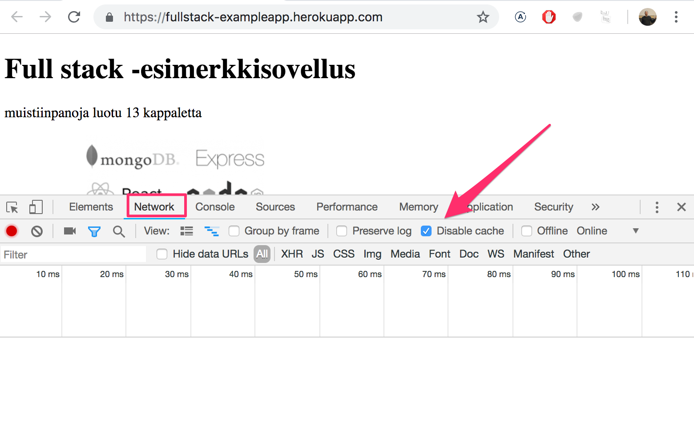

Ensure that the <i>Network</i> tab is open, and activate <i>Disable cache</i> as shown. <i>Preserve log</i> can also be useful. It saves the logs printed by the application when the page is reloaded. 

**NB:** The most important tab is the <i>Console</i>. However, in the introduction we will be using the <i>Network</i> tab quite a bit.

### HTTP GET

The server and the web browser communicate with each other using the [HTTP](https://developer.mozilla.org/fi/docs/Web/HTTP) protocol. The Network tab shows how the browser and the server communicate.

When you reload the page (press the F5 key or the &#8634; symbol on your browser), the console shows that two events have happened:

- The browser fetches the contents of the page <i>fullstack-exampleapp.herokuapp.com/</i> from the server
- And downloads the image<i>kuva.png</i>

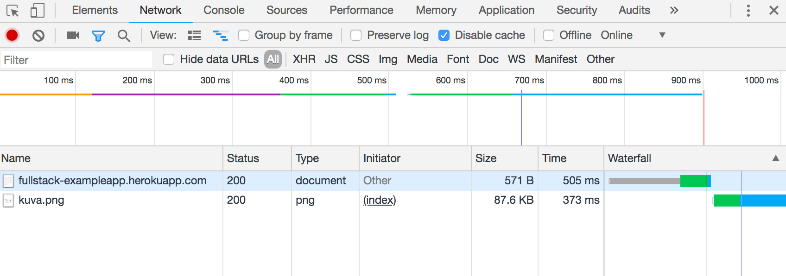

On a small screen you might have to widen the console window to see these. 

Clicking the first event reveals more information on what's happening: 

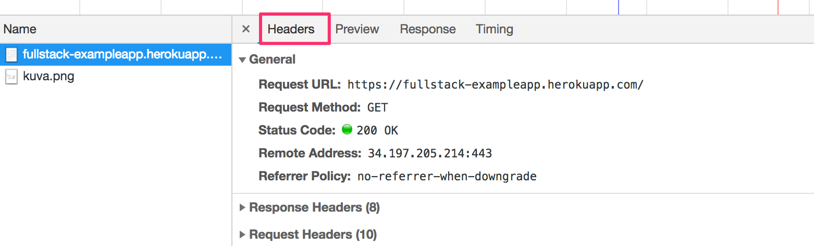

The upper part ,<i>General</i>, shows that the browser did a request to the address <i>https://fullstack-exampleapp.herokuapp.com/</i> using the  [GET](https://developer.mozilla.org/en-US/docs/Web/HTTP/Methods/GET) method, and that the request was successfull, because the server response had the [Status code](https://en.wikipedia.org/wiki/List_of_HTTP_status_codes) 200. 

The request and the server response have serveral [headers](https://en.wikipedia.org/wiki/List_of_HTTP_header_fields):

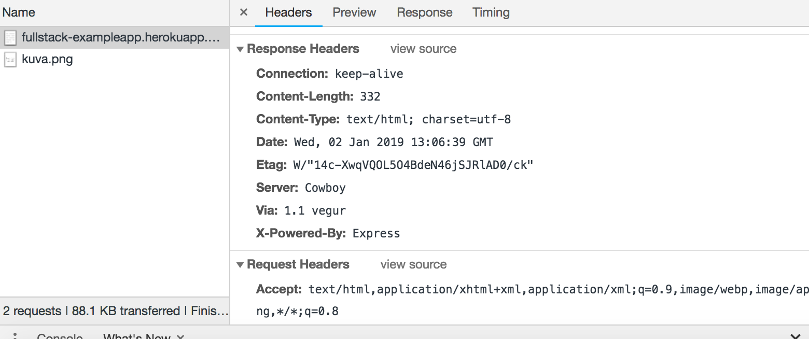


The <i>Response headers</i> on top tell us e.g the size of the response in bytes, and the exact time of the response. An important header [Content-Type](https://developer.mozilla.org/en-US/docs/Web/HTTP/Headers/Content-Type) tells us that the response is a text file in [utf-8](https://en.wikipedia.org/wiki/UTF-8)-format, contents of which have been formatted with HTML. This way the browser knows the response to be a regular [HTML](https://en.wikipedia.org/wiki/HTML)-page, and to render it to the browser 'like a web page'.

<i>Response</i> tab shows the response data, a regular HTML-page. The <i>body</i> section determines the structure of the page rendered to the screen: 

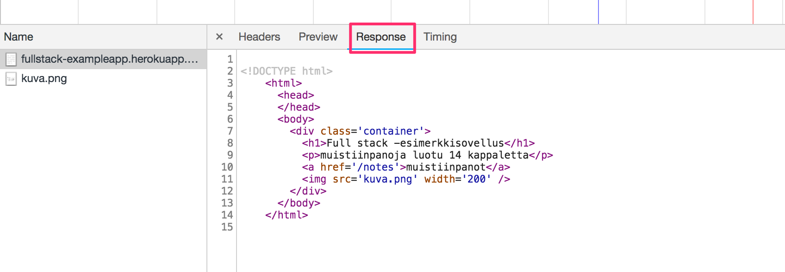

The page contains a [div](https://developer.mozilla.org/en-US/docs/Web/HTML/Element/div) element, which in turn contains a header, a link to the page <i>notes</i>, and an [img](https://developer.mozilla.org/en-US/docs/Web/HTML/Element/img) tag, and displays the amount of notes created.

Because of the img tag, the browser does a second <i>HTTP-request</i> to fetch the image <i>kuva.png</i> from the server. The details of the request are as follows: 

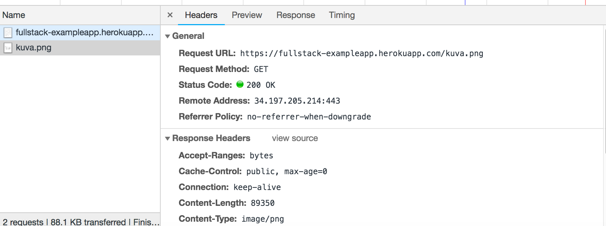

The request was made to the address <https://fullstack-exampleapp.herokuapp.com/kuva.png> and it's type is HTTP GET. The response headers tell us that the response size is 89350 bytes, and it's [Content-type](https://developer.mozilla.org/en-US/docs/Web/HTTP/Headers/Content-Type) is <i>image/png</i>, so it is a png image. Browser uses this information to render the image correctly to the screen. 

The chain of events caused by opening the page https://fullstack-exampleapp.herokuapp.com/ on a browser form the following [sequence diagram](https://github.com/mluukkai/ohjelmistotekniikka-kevat2019/blob/master/web/materiaali.md#sekvenssikaaviot)

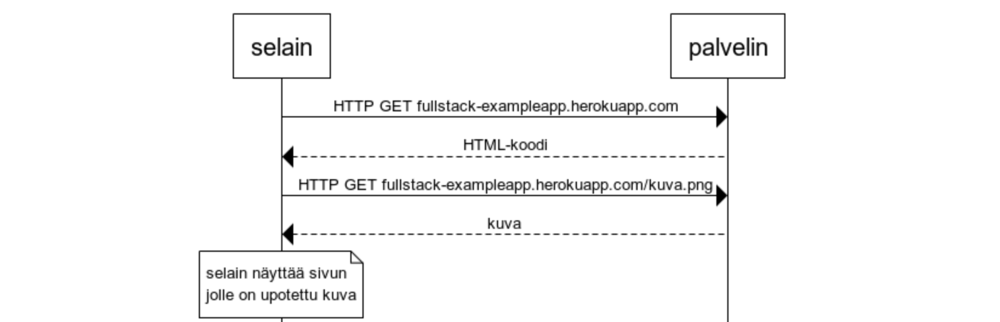

First, the browser does a HTTP GET request to the server to fetch the HTML code of the page. The <i>img</i> tag in the HTML prompts the browser to fetch the image <i>kuva.png</i>. The browser renders the HTML page and the image to the screen. 

Even though it is difficult to notice, the HTML page begins to render before the image has been fetched from the server. 

### Traditional web applications

The homepage of the example application works like a <i>traditional web application</i>. When entering the page, browser fetches the HTML document detailing the structure and the textual content of the page from the server.

The server has formed this document somehow. The document can be a <i>static</i> text file saved into the server's directory. The server can also form the HTML documents <i>dynamically</i>  according to the application code, using for example data from a database. 
The HTML code of the example application has been formed dynamically, because it contains information on the amount of created notes. 

The HTML code of the homepage is as follows: 

```js
const getFrontPageHtml = noteCount => {
  return `
    <!DOCTYPE html>
    <html>
      <head>
      </head>
      <body>
        <div class="container">
          <h1>Full stack -esimerkkisovellus</h1>
          <p>muistiinpanoja luotu ${noteCount} kappaletta</p>
          <a href="/notes">muistiinpanot</a>
          
        </div>
      </body>
    </html>
  `
}

app.get('/', (req, res) => {
  const page = getFrontPageHtml(notes.length)
  res.send(page)
})
```
You don't have to understand the code just yet. 

The content of the HTML page has been saved as a template string, or a string which allows for evaluating, for example, variables in the midst of it. The dynamically changing part of the homepage, the amount of saved notes (in the code <em>noteCount</em>), is replaced by the current amount of notes (in the code <em>notes.length</em>) in the template string.

Writing HTML in the midst of the code is of course not smart, but for old-school PHP-programmers it was a normal practice.

In traditional web applications the browser is "dumb". It only fetches HTML data from the server, and all application logic is on the server. A server can be created for example using Java Spring like on the course [Web-palvelinohjelmointi](https://courses.helsinki.fi/fi/tkt21007/119558639), Python Flask like on the course [tietokantasovellus](https://materiaalit.github.io/tsoha-18/) or  [Ruby on Railsilla](http://rubyonrails.org/).
The example uses [Express](https://expressjs.com/) from Node.js. 
This course will use Node.js and Express to create web servers. 

### Running application logic on the browser

Keep the developer console open. Empty the console by clicking the &empty; symbol. 
Now when you go to the [notes](https://fullstack-exampleapp.herokuapp.com/notes) page, the browser does 4 HTTP requests: 

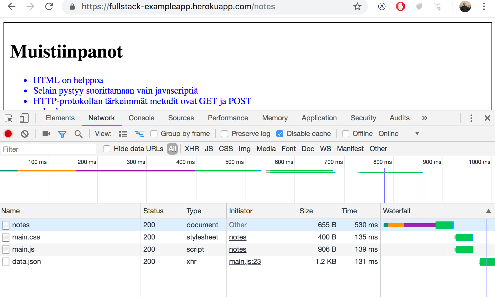

All of the requests have <i>different</i> types. The first request's type is <i>document</i>. It is the HTML code of the page, and it looks as follows: 

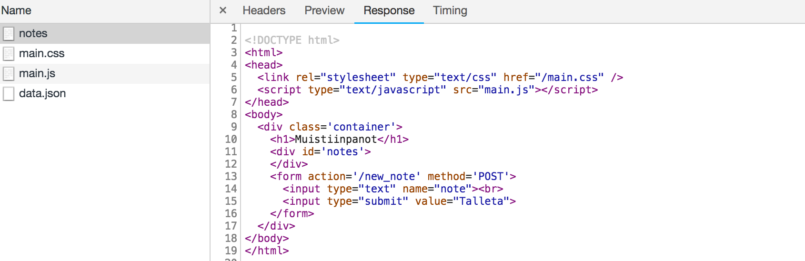

When we compare the page shown on the browser and the HTML code returned by the server, we notice that the code does not contain the list of notes. 
The [head](https://developer.mozilla.org/en-US/docs/Web/HTML/Element/head)-section of the HTML contains a [script](https://developer.mozilla.org/en-US/docs/Web/HTML/Element/script)-tag, which causes the browser to fetch a JavaScript file called <i>main.js</i>.

The JavaScript code looks as follows:

```js
var xhttp = new XMLHttpRequest()

xhttp.onreadystatechange = function() {
  if (this.readyState == 4 && this.status == 200) {
    const data = JSON.parse(this.responseText)
    console.log(data)

    var ul = document.createElement('ul')
    ul.setAttribute('class', 'notes')

    data.forEach(function(note) {
      var li = document.createElement('li')

      ul.appendChild(li)
      li.appendChild(document.createTextNode(note.content))
    })

    document.getElementById('notes').appendChild(ul)
  }
)

xhttp.open('GET', '/data.json', true)
xhttp.send()
```
The details of the code are not important right now, but some code has been included to spice up the images and the text. We will properly start coding in [part 1](/osa1). The sample code in this part is actually not relevant at all to the coding techniques of this course. 

> Some might wonder why xhttp-object is used instead of the modern fetch. This is due to not wanting to go into promises at all yet, and the code having a secondary role in this part. We will return to modern ways to make requests to the server in part 2. 

Immediately after fetching the <i>script</i> tag, the browser begins to execute the code. 

The last two lines define that the the browser does a HTTP GET request to the servers address <i>/data.json</i>:

```js
xhttp.open('GET', '/data.json', true)
xhttp.send()
```
This is the down-most request shown on the Network tab. 

We can try going to the address <https://fullstack-exampleapp.herokuapp.com/data.json> straight from the browser:

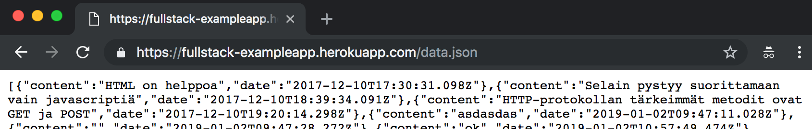

There we find the notes in [JSON](https://en.wikipedia.org/wiki/JSON) "raw data". 
By default, the browser is not too good at displaying JSON-data. Plugins can be used to handle the formatting. Install for example [JSONView](https://chrome.google.com/webstore/detail/jsonview/chklaanhfefbnpoihckbnefhakgolnmc) to Chrome, and reload the page. The data is now much more nicely formatted. 

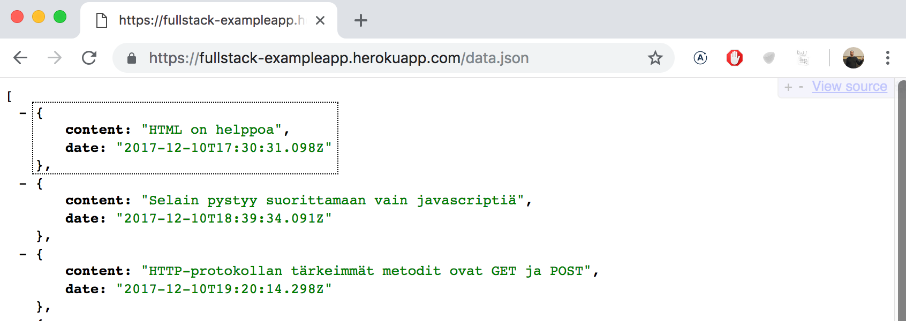

So, the JavaScript code of the notes page above downloads the JSON-data containing the notes, and forms a bullet-point list from the note contents: 

This is done by the following code: 

```js
const data = JSON.parse(this.responseText)
console.log(data)

var ul = document.createElement('ul')
ul.setAttribute('class', 'notes')

data.forEach(function(note) {
  var li = document.createElement('li')

  ul.appendChild(li)
  li.appendChild(document.createTextNode(note.content))
})

document.getElementById('notes').appendChild(ul)
```
The code first creates an unordered list with an [ul](https://developer.mozilla.org/en-US/docs/Web/HTML/Element/ul)-tag...

```js
var ul = document.createElement('ul')
ul.setAttribute('class', 'notes')
```
...and then adds one [li](https://developer.mozilla.org/en-US/docs/Web/HTML/Element/li)-tag for each note. Only the <i>content</i> field of each note becomes the contents of the li-tag. The timestamps found in the raw data are not used for anything here. 

```js
data.forEach(function(note) {
  var li = document.createElement('li')

  ul.appendChild(li)
  li.appendChild(document.createTextNode(note.content))
})
```
Now open the <i>Console</i>-tab on your developer console:


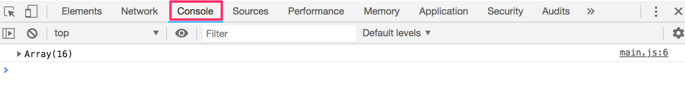

By clicking the little triangle at the beginning of the line, you can expand the text on the console.

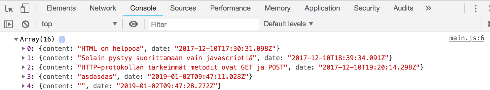

This output on the console is caused by <em>console.log</em> command in the code:

```js
const data = JSON.parse(this.responseText)
console.log(data)
```

So after receiving data from the server, the code prints it to the console. 

The <i>Console</i> tab and the <em>console.log</em> command will become very familiar to you during the course. 


### Event handlers and Callback functions

The structure of the code is a bit odd:


```js
var xhttp = new XMLHttpRequest()

xhttp.onreadystatechange = function() {
  // koodi, joka käsittelee palvelimen vastauksen
}

xhttp.open('GET', '/data.json', true)
xhttp.send()
```
The request to the server is sent on the last line, but the code to handle the response can be found further up. Whats going on? 

On this line,

```js
xhttp.onreadystatechange = function () {
```
an <i>event handler</i> for event <i>onreadystatechange</i> is defined for the <em>xhttp</em> object doing the request. When the state of the object changes, the browser calls the event handler function. The function code checks that the [readyState](https://developer.mozilla.org/en-US/docs/Web/API/XMLHttpRequest/readyState) equals 4 (which depicts the situation <i>The operation is complete</i> ) and that the HTTP status code of the response is 200. 


```js
xhttp.onreadystatechange = function() {
  if (this.readyState == 4 && this.status == 200) {
    // koodi, joka käsittelee palvelimen vastauksen
  }
)
```
The mechanism of invoking event handlers is very common in JavaScript. Event handler functions are called [callback](https://developer.mozilla.org/en-US/docs/Glossary/Callback_function) functions. The application code does not invoke the functions itself, but the runtime environment - the browser, invokes the function at an appropriate time, when the <i>event</i> has occurred. 

### Document Object Model or DOM

We can think of HTML-pages as implicit tree structures.

<pre>
html
  head
    link
    script
  body
    div
      h1
      div
        ul
          li
          li
          li
      form
        input
        input
</pre>

The same treelike structure can be seen on the console tab <i>Elements</i>.

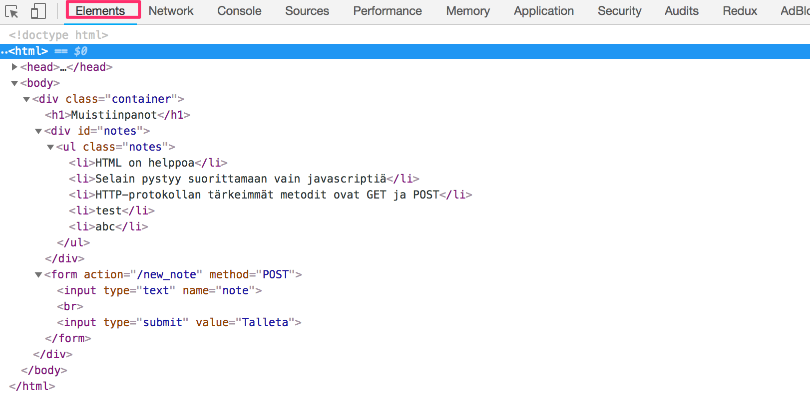

The functioning of the browser is based on the idea of depicting HTML elements as a tree. 

Document Object Model, or [DOM](https://en.wikipedia.org/wiki/Document_Object_Model) is an Application Programming Interface, (an <i>API</i>), which enables programmatic modification of the <i>element trees</i> corresponding to web-pages.

The JavaScript code introduced in the previous chapter used the DOM-API to add a list of notes to the page. 

The following code creates a new node to the variable <em>ul</em>, and adds some child nodes to it: 

```js
var ul = document.createElement('ul')

data.forEach(function(note) {
  var li = document.createElement('li')

  ul.appendChild(li)
  li.appendChild(document.createTextNode(note.content))
})
```
Finally, the tree branch of the <em>ul</em> variable is connected to its proper place in the HTML tree of the whole page: 

```js
document.getElementById('notes').appendChild(ul)
```

### manipulating the document-object from console

The topmost node of the DOM tree of a HTML document is called the <em>document</em>. You can access this object from the Console-tab: 

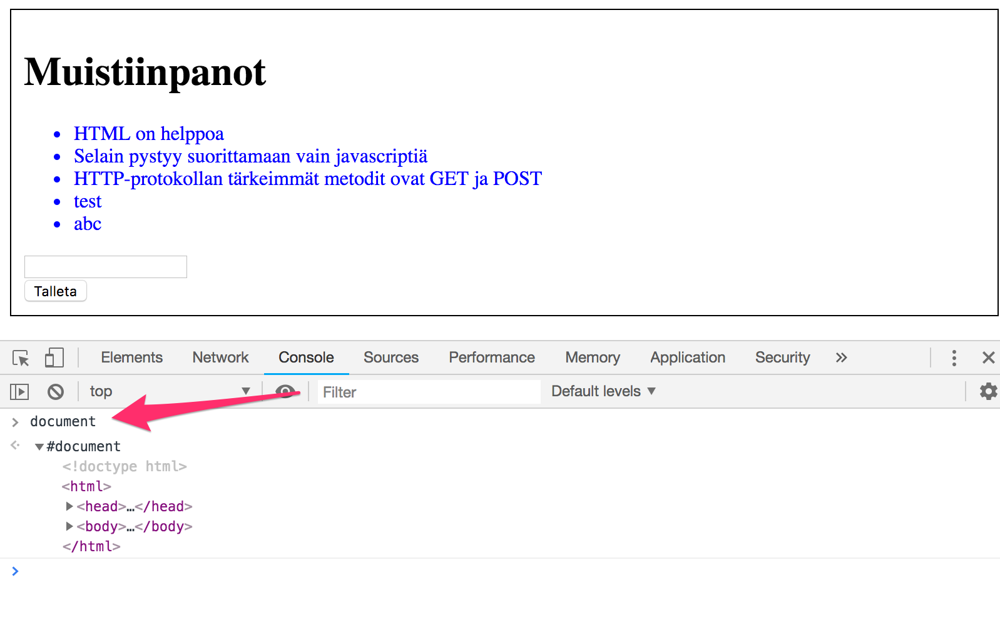

We can perform various operations on a web-page using the DOM-API and utilizing the <em>document</em> object. 

Let's add a new note to the page from the console. 

First, we'll get the list of notes from the page. The list is in the first ul-element of the page: 


```js
lista = document.getElementsByTagName('ul')[0]
```

Then create a new li-element and add some text content to it:

```js
uusi = document.createElement('li')
uusi.textContent = 'Sivun manipulointi konsolista on helppoa'
```

And add the new li-element to the list:

```js
lista.appendChild(uusi)
```

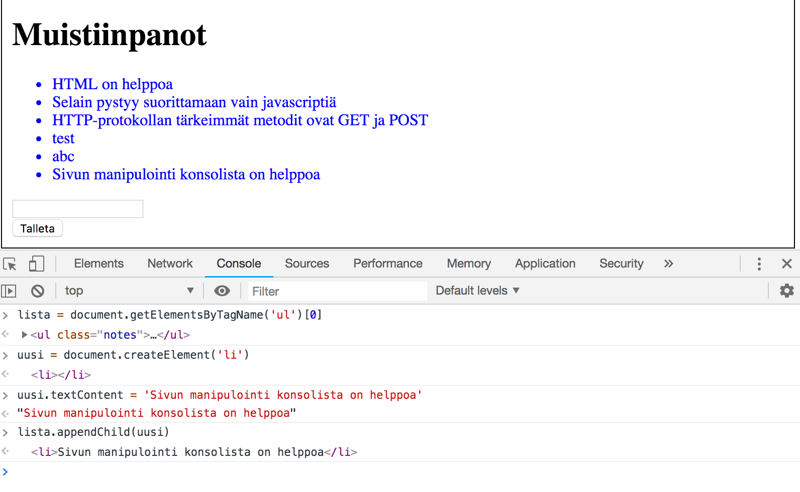

Even though the page updates on your browser, the changes are not permanent. If the page is reloaded, the new note will dissappear, because the changes were not pushed to the server. The JavaScript code the browser fetches will always create the list of notes based on JSON-data from address <https://fullstack-exampleapp.herokuapp.com/data.json>.

<!-- Vaikka selaimen näyttämä sivu päivittyy, ei muutos ole lopullinen. Jos sivu uudelleenladataan, katoaa uusi muistiinpano, sillä muutos ei mennyt palvelimelle asti. Selaimen lataama Javascript luo muistiinpanojen listan aina palvelimelta osoitteesta <https://fullstack-exampleapp.herokuapp.com/data.json> haettavan JSON-muotoisen raakadatan perusteella. -->

### CSS

The <i>head</i> element of the HTML code of the Notes page contains a [link](https://developer.mozilla.org/en-US/docs/Web/HTML/Element/link) tag, which determines that the browser must fetch a [CSS](https://developer.mozilla.org/en-US/docs/Web/CSS) style sheet from the address [main.css](https://fullstack-exampleapp.herokuapp.com/main.css).

<!-- Muistiinpanojen sivun HTML-koodin <i>head</i>-osio sisältää [link](https://developer.mozilla.org/en-US/docs/Web/HTML/Element/link)-tagin, joka määrittelee, että selaimen tulee ladata palvelimelta osoitteesta [main.css](https://fullstack-exampleapp.herokuapp.com/main.css) sivulla käytettävä [CSS](https://developer.mozilla.org/en-US/docs/Web/CSS)-tyylitiedosto. -->

Cascading Style Sheets, or CSS, is a markup language used to determine the appearance of web applications. 

<!-- Cascading Style Sheets eli CSS on kieli, jonka avulla web-sovellusten ulkoasu määritellään. -->

The fetched CSS-file looks as follows: 

<!-- Ladattu css-tiedosto näyttää seuraavalta: -->

```css
.container {
  padding: 10px;
  border: 1px solid; 
}

.notes {
  color: blue;
}
```
The file defines two [class selectors](https://developer.mozilla.org/en-US/docs/Web/CSS/Class_selectors). These are used to select certain parts of the page and to define styling rules to style them. 

<!-- Tiedosto määrittelee kaksi [luokkaselektoria](https://developer.mozilla.org/en-US/docs/Web/CSS/Class_selectors), joiden avulla valitaan tietty sivun alue ja määritellään alueelle sovellettavat tyylisäännöt. -->

A class selector definition always starts with a period, and contains the name of the class. 

<!-- Luokkaselektori alkaa aina pisteellä ja sisältää luokan nimen. -->

The classes are [attributes](https://developer.mozilla.org/en-US/docs/Web/HTML/Global_attributes/class), which can be added to HTML elements. 

<!-- Luokat ovat [attribuutteja](https://developer.mozilla.org/en-US/docs/Web/HTML/Global_attributes/class) joita voidaan liittää HTML-elementeille. -->

CSS attributes can be examined on the <i>elements</i> tab on the console:  

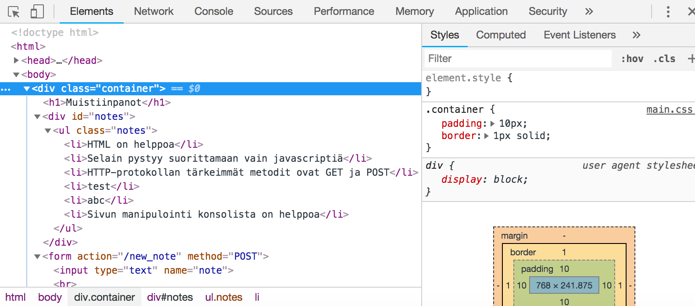

<!-- sovelluksen uloimmalle <i>div</i>-elementille on siis liitetty luokka <i>container</i>. Muistiinpanojen listan sisältävä <i>ul</i>-elementin sisällä oleva lista sisältää luokan <i>notes</i>. -->

The outermost <i>div</i> element has the class <i>container</i>. The <i>ul</i> element containing the list of notes has the class <i>notes</i>.

<!-- CSS-säännön avulla on määritelty, että <i>container</i>-luokan sisältävä elementti ympäröidään yhden pikselin paksuisella [border](https://developer.mozilla.org/en-US/docs/Web/CSS/border):illa. Elementille asetetaan myös 10 pikselin [padding](https://developer.mozilla.org/en-US/docs/Web/CSS/padding), jonka ansiosta elementin sisällön ja elementin ulkorajan väliin jätetään hieman tilaa. -->

The CSS rule defines, that element with the <i>container</i> class will be outlined with one pixel wide [border](https://developer.mozilla.org/en-US/docs/Web/CSS/border). It also sets 10 pixel [padding](https://developer.mozilla.org/en-US/docs/Web/CSS/padding) to the element. This sets some empty space between the element content and the border. 

<!-- Toinen määritelty CSS-sääntö asettaa muistiinpanojen kirjainten värin siniseksi. -->

The second CSS rule sets the text color of the notes blue. 

<!-- HTML-elementeillä on muitakin attribuutteja kuin luokkia. Muistiinpanot sisältävä <i>div</i>-elementti sisältää [id](https://developer.mozilla.org/en-US/docs/Web/HTML/Global_attributes/id)-attribuutin. Javascript-koodi hyödyntää attribuuttia elementin etsimiseen. -->

HTML elements can also have other attributes than classes. The <i>div</i> element containing the notes has an [id](https://developer.mozilla.org/en-US/docs/Web/HTML/Global_attributes/id) attribute. JavaScript code uses the id to find the element. 

<!-- Konsolin <i>Elements</i>-välilehdellä on mahdollista manipuloida elementtien tyylejä: -->

The <i>Elements</i> tab of the console can be used to change the styles of the elements. 

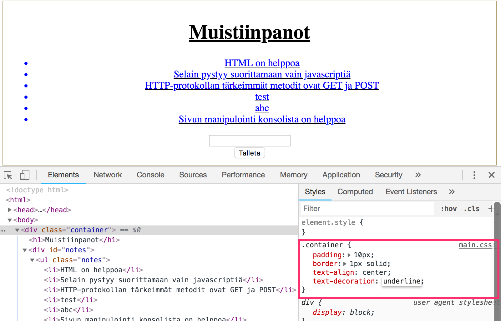

<!-- Tehdyt muutokset eivät luonnollisestikaan jää voimaan kun selaimen sivu uudelleenladataan, eli jos muutokset halutaan pysyviksi, tulee ne konsolissa tehtävien kokeilujen jälkeen tallettaa palvelimella olevaan tyylitiedostoon. -->

Changes made on the console will not be permanent. If you want to make lasting changes, they must be saved to the CSS style sheet on the server. 


### Loading a page containing JavaScript - revised

<!-- Kerrataan vielä mitä tapahtuu kun selaimessa avataan sivu https://fullstack-exampleapp.herokuapp.com/notes -->
Let's revise what happens when the page https://fullstack-exampleapp.herokuapp.com/notes is opened on the browser. 

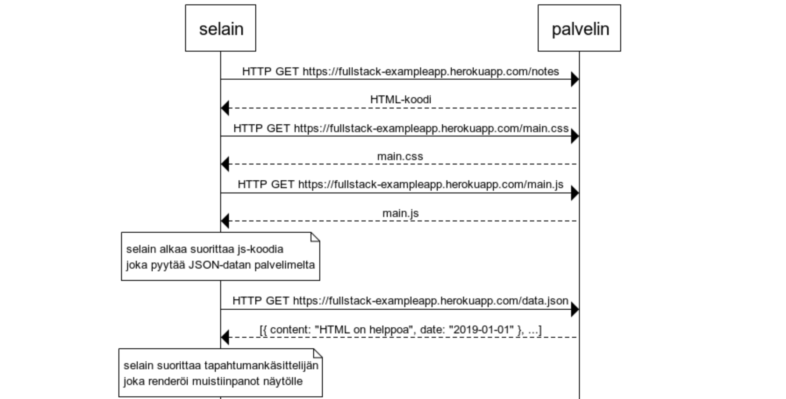

<!-- - selain hakee palvelimelta sivun sisällön ja rakenteen määrittelevän HTML-koodin HTTP GET -pyynnöllä -->
<!-- - HTML-koodi saa aikaan sen, että selain hakee sivun tyylit määrittelevän tiedoston <i>main.css</i> -->
<!-- - sekä Javascript-koodia sisältävän tiedoston <i>main.js</i> -->
<!-- - selain alkaa suorittaa hakemaansa Javascript-koodia, joka tekee HTTP GET -pyynnön muistiinpanot json-muotoisena raakadatana palauttavaan osoitteeseen https://fullstack-exampleapp.herokuapp.com/data.json -->
<!-- - datan saapuessa selain suorittaa <i>tapahtumankäsittelijän</i>, joka renderöi DOM-apia hyväksikäyttäen muistiinpanot ruudulle -->

- The browser fetches the HTML code defining the content and the structure of the page from the server using a HTTP GET request.
- Links in the HTML code cause the browser to also fetch the CSS style sheet <i>main.css</i>...
- ...and a JavaScript code file <i>main.js</i>
- The browser executes the JavaScript code. The code makes a HTTP GET request to the address https://fullstack-exampleapp.herokuapp.com/data.json, which 
  returns the notes as JSON  data. 
- When the data has been fetched, the browser executes an <i>event handler</i>, which renders the notes to the page using the DOM-API. 

### Forms and HTTP POST

<!-- Tutkitaan seuraavaksi sitä, miten uusien muistiinpanojen luominen tapahtuu. Tätä varten muistiinpanojen sivu sisältää lomakkeen eli [form-elementin](https://developer.mozilla.org/en-US/docs/Learn/HTML/Forms/Your_first_HTML_form). -->
Next let's examine how adding a new note is done. 

The Notes page contains a [form-element](https://developer.mozilla.org/en-US/docs/Learn/HTML/Forms/Your_first_HTML_form)

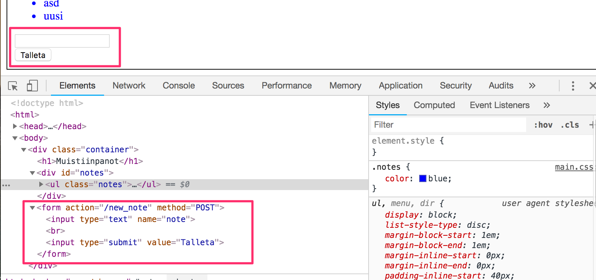


<!-- Kun lomakkeen painiketta painetaan, lähettää selain lomakkeelle syötetyn datan palvelimelle. Avataan <i>Network</i>-välilehti ja katsotaan miltä lomakkeen lähettäminen näyttää: -->
When the button on the form is clicked, the browser will send the user input to the server. Let's open the <i>Network</i> tab and see what submitting the form looks like: 

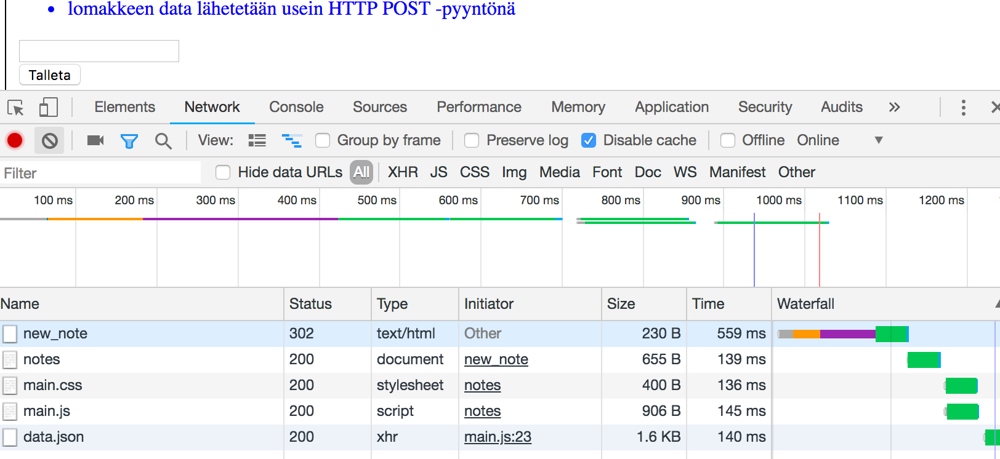

<!-- Lomakkeen lähettäminen aiheuttaa yllättäen yhteensä <i>viisi</i> HTTP-pyyntöä. Näistä ensimmäinen vastaa lomakkeen lähetystapahtumaa. Tarkennetaan siihen: -->
Surprisingly, submitting the form causes altogether <i>five</i> HTTP requests. 
The first one is the form submit event. Let's zoom into it: 

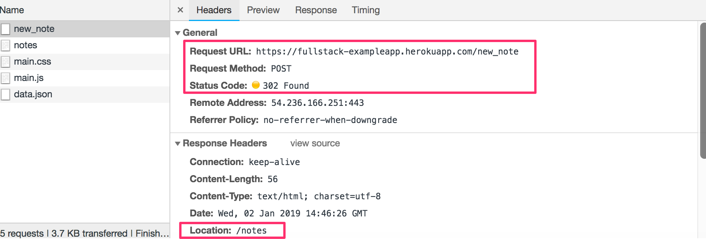

<!-- Kyseessä on siis [HTTP POST](https://developer.mozilla.org/en-US/docs/Web/HTTP/Methods/POST) -pyyntö ja se on tehty palvelimen osoitteeseen <i>new\_note</i>. Palvelin vastaa pyyntöön HTTP-statuskoodilla 302. Kyseessä on ns. [uudelleenohjauspyyntö](https://en.wikipedia.org/wiki/URL_redirection) eli redirectaus, minkä avulla palvelin kehottaa selainta tekemään automaattisesti uuden HTTP GET -pyynnön headerin <i>Location</i> kertomaan paikkaan, eli osoitteeseen <i>notes</i>. -->
It is a [HTTP POST](https://developer.mozilla.org/en-US/docs/Web/HTTP/Methods/POST) request to the server address <i>new\_note</i>. The server responds with HTTP status code 302. This is an [URL redirect](https://en.wikipedia.org/wiki/URL_redirection), with which the server asks the browser to do a new HTTP GET request to the address defined in the header's <i>Location</i> - the address <i>notes</i>.

<!-- Selain siis lataa uudelleen muistiinpanojen sivun. Sivunlataus saa aikaan myös kolme muuta HTTP-pyyntöä: tyylitiedoston (main.css), Javascript-koodin (main.js) ja muistiinpanojen raakadatan (data.json) lataamisen. -->
So, the browser reloads the Notes page. The reload causes three more HTTP requests: fetching the style sheet (main.css), the JavaScript code (main.js) and the raw data of the notes (data.json). 

<!-- Network-välilehti näyttää myös lomakkeen mukana lähetetyn datan: -->
The network tab also shows the data submitted with the form: 

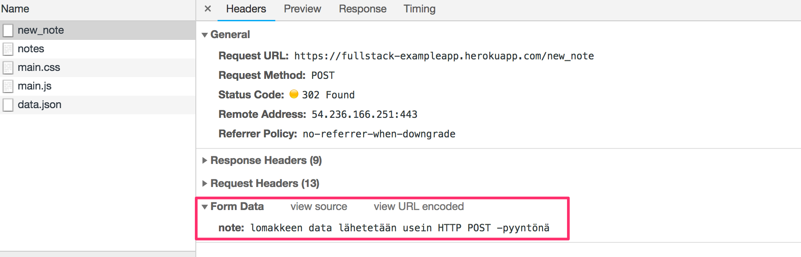

<!-- Lomakkeen lähettäminen tapahtuu HTTP POST -pyyntönä ja osoitteeseen <i>new_note</i> form-tagiin määriteltyjen attribuuttien <i>action</i>  ja <i>method</i>  ansiosta: -->
The Form tag has attributes <i>action</i> and <i>method</i>, which define that submitting the form is done as a HTTP POST request to the address <i>new_note</i>. 

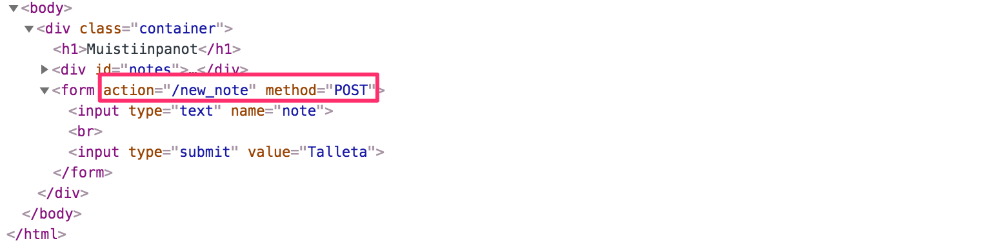

<!-- POST-pyynnöstä huolehtiva palvelimen koodi on yksinkertainen (huom: tämä koodi on siis palvelimella eikä näy selaimen lataamassa Javascript-tiedostossa): -->
The code on the server responsible for the POST request is simple (NB: this code is on the server, and not on the JavaScript code fetched by the browser):

```js
app.post('/new_note', (req, res) => {
  notes.push({
    content: req.body.note,
    date: new Date(),
  })

  return res.redirect('/notes')
})
```

<!-- POST-pyyntöihin liitettävä data lähetetään pyynnön mukana "runkona" eli [bodynä](https://developer.mozilla.org/en-US/docs/Web/HTTP/Methods/POST). Palvelin saa POST-pyynnön datan pyytämällä sitä pyyntöä vastaavan olion <em>req</em> kentästä <em>req.body</em>. -->
Data is sent as the [body](https://developer.mozilla.org/en-US/docs/Web/HTTP/Methods/POST) of the POST-request. 


<!-- Tekstikenttään kirjoitettu data on kentässä <i>note</i>, eli palvelin viittaa siihen <em>req.body.note</em>. -->
The server can access the data by accessing the <em>req.body</em> field of the request object <em>req</em>.

<!-- Palvelin luo uutta muistiinpanoa vastaavan olion ja laittaa sen muistiinpanot sisältävään taulukkoon nimeltään <em>notes</em>: -->
The Server creates a new note object, and adds it to an array called <em>notes</em>.

```js
notes.push({
  content: req.body.note,
  date: new Date(),
})
```

<!-- Muistiinpano-olioilla on siis kaksi kenttää, varsinaisen sisällön kuvaava <i>content</i> ja luomishetken kertova <i>date</i>. -->
<!-- Palvelin ei talleta muistiinpanoja tietokantaan, joten uudet muistiinpanot katoavat aina Herokun uudelleenkäynnistäessä palvelun. -->
The Note objects have two fields: <i>content</i> containing the actual content of the note, and <i>date</i> containing the date and time the note was created. 
The server does not save new notes to a database, so new notes dissappear when Heroku restarts the service. 

### AJAX

<!-- Sovelluksen muistiinpanojen sivu noudattaa vuosituhannen alun tyyliä ja se "käyttää AJAX:ia", eli on silloisen kehityksen aallonharjalla. -->
The Notes page of the application follows the noughties style of web development and "uses Ajax", so it is on the forefront of web technology for the early 2000's. 

<!-- [AJAX](<https://en.wikipedia.org/wiki/Ajax_(programming)>) (Asynchronous Javascript and XML) on termi, joka lanseerattiin vuoden 2005 helmikuussa kuvaamaan selainten kehityksen mahdollistamaa vallankumouksellista tapaa, missä HTML-sivulle sisällytetyn Javascriptin avulla oli mahdollista ladata sivulle lisää sisältöä lataamatta itse sivua uudelleen. -->
[AJAX](<https://en.wikipedia.org/wiki/Ajax_(programming)>) (Asynchronous Javascript and XML) is a term which was launched in February 2005 to 
describe the new revolutionary way browser development enabled fetching new content to webpages using JavaScript included in the HTML without having to rerender the page. 

<!-- Ennen AJAX:in aikakautta jokainen sivu toimi aiemmassa luvussa olevan [perinteisen web-sovelluksen](/osa0#perinteinen-web-sovellus) tapaan, eli oleellisesti ottaen kaikki sivuilla näytettävä data tuli palvelimen generoimassa HTML-koodissa. -->
Before the AJAX era, all web pages worked like the [traditional web application](/osa0#perinteinen-web-sovellus) we saw earlier in this chapter. 
All of the data shown on the page was fetched with the HTML-code generated by the server. 

<!-- Muistiinpanojen sivu siis lataa näytettävän datan AJAX:illa. Lomakkeen lähetys sen sijaan tapahtuu perinteisen web-lomakkeen lähetysmekanismin kautta. -->
The Notes page uses AJAX to fetch the notes data. Submitting the form still uses the traditional mechanism of submitting web-forms. 

<!-- Sovelluksen urlit heijastavat vanhaa huoletonta aikaa. JSON-muotoinen data haetaan urlista <https://fullstack-exampleapp.herokuapp.com/data.json> ja uuden muistiinpanon tiedot lähetetään urliin <https://fullstack-exampleapp.herokuapp.com/new_note>. Nykyään näin valittuja urleja ei pidettäisi ollenkaan hyvinä, ne eivät noudata ns. [RESTful](https://en.wikipedia.org/wiki/Representational_state_transfer#Applied_to_Web_services)-apien yleisesti hyväksyttyjä konventioita. Käsittelemme asiaa tarkemmin [osassa 3](/osa3). -->
The application URLs reflect the old, carefree times. JSON data is fetched from the url <https://fullstack-exampleapp.herokuapp.com/data.json> and new notes are sent to the url <https://fullstack-exampleapp.herokuapp.com/new_note>.  
Nowadays urls like these would not be good at all, as they don't follow the generally acnowledged conventions of [RESTful](https://en.wikipedia.org/wiki/Representational_state_transfer#Applied_to_Web_services) APIs, which we'll look into more in [part 3](/osa3)

<!-- AJAXiksi kutsuttu asia on arkipäiväistynyt, ja muuttunut itsestäänselvyydeksi. Koko termi on hiipunut unholaan ja nuori polvi ei ole sitä edes ikinä kuullut. -->
The thing called AJAX is now so commonplace it's taken for granted. The term has faded into oblivion, and the new generations have never even heard of it. 

### Single page app

<!-- Esimerkkisovelluksemme pääsivu toimii perinteisten web-sivujen tapaan: kaikki sovelluslogiikka on palvelimella ja selain ainoastaan renderöi palvelimen lähettämää HTML-koodia. -->
In our example app, the home page works like a traditional web-page: All of the logic is on the server, and the browser only renders the HTML as instructed. 

<!-- Muistiinpanoista huolehtivassa sivussa osa sovelluslogiikasta, eli olemassaolevien muistiinpanojen HTML-koodin generointi on siirretty selaimen vastuulle. Selain hoitaa tehtävän suorittamalla palvelimelta lataamansa Javascript-koodin. Selaimella suoritettava koodi hakee ensin muistiinpanot palvelimelta JSON-muotoisena raakadatana ja lisää sivulle muistiinpanoja edustavat HTML-elementit [DOM-apia](/osa0#document-object-model-eli-dom) hyödyntäen. -->

The Notes page gives some of the responsibility, generating the HTML code for existing notes, to the browser. The browser tackles this task by executing the JavaScript code it fetched from the server. The code fetches the notes from the server as JSON-data, and adds HTML elements for displaying the notes to the page using the [DOM-API](/osa0#document-object-model-eli-dom).

<!-- Viimeisten vuosien aikana on noussut esiin tyyli tehdä web-sovellukset käyttäen [Single-page application](https://en.wikipedia.org/wiki/Single-page_application) (SPA) -tyyliä, missä sovelluksilla ei enää ole esimerkkisovelluksemme tapaan erillisiä, palvelimen sille lähettämiä sivuja, vaan sovellus koostuu ainoastaan yhdestä palvelimen lähettämästä HTML-sivusta, jonka sisältöä manipuloidaan selaimessa suoritettavalla Javascriptillä. -->
In recent years, the [Single-page application](https://en.wikipedia.org/wiki/Single-page_application) (SPA) style of creating web-applications has emerged. SPA style websites don't fetch all of their pages separately from the server like our sample application does, but are composed of one HTML page fetched from the server, contents of which are manipulated with JavaScript running on the browser.

<!-- Sovelluksemme muistiinpanosivu muistuttaa jo hiukan SPA-tyylistä sovellusta, sitä se ei kuitenkaan vielä ole, sillä vaikka muistiinpanojen renderöintilogiikka on toteutettu selaimessa, käyttää sivu vielä perinteistä mekanisimia uusien muistiinpanojen luomiseen, eli se lähettää uuden muistiinpanon tiedot lomakkeen avulla ja palvelin pyytää <i>uudelleenohjauksen</i> avulla selainta lataamaan muistiinpanojen sivun uudelleen. -->
The Notes page of our application bears some resemblance to SPA-style apps, but it's not quite there yet. Even though the logic for rendering the notes is run on the browser, the page still uses the traditional way of adding new notes. The data is sent to the server with form submit, and the server instructs the browser to reload the Notes page with a <i>redirect</i>.

<!-- Osoitteesta <https://fullstack-exampleapp.herokuapp.com/spa> löytyy sovelluksen single page app -versio. -->
<!-- Sovellus näyttää ensivilkaisulta täsmälleen samalta kuin edellinen versio. -->
<!-- HTML-koodi on lähes samanlainen, erona on ladattava Javascript-tiedosto (<i>spa.js</i>) ja pieni muutos form-tagin määrittelyssä: -->
A single page app version of our example application can be found from <https://fullstack-exampleapp.herokuapp.com/spa>.
At first glance, the application looks exactly the same as the previous one. 
The HTML code is almost identical, but the JavaScript file is different (<i>spa.js</i>) and there is a small change in the form-tag is defined: 

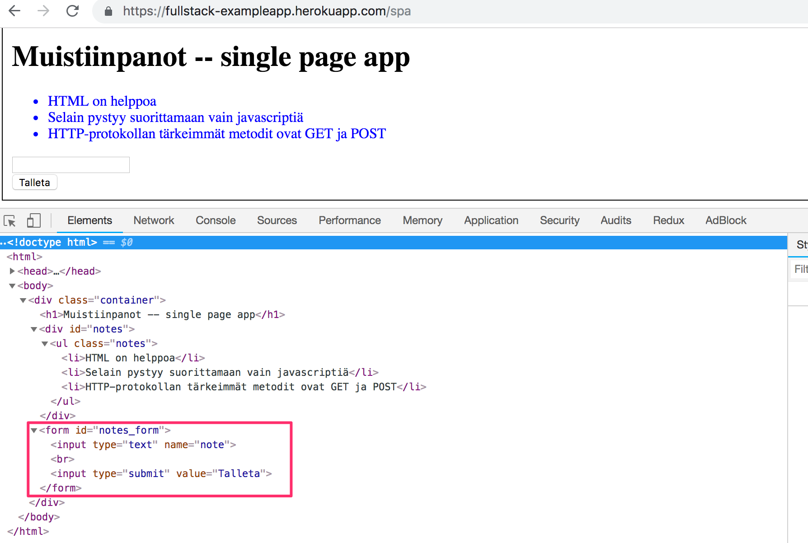

<!-- Lomakkeelle ei ole nyt määritelty ollenkaan <i>action</i>- eikä <i>method</i>-attribuutteja, jotka määräävät minne ja miten selain lähettää lomakkeelle syötetyn datan. -->
The form has no <i>action</i> or <i>method</i> attributes to define how and where to send the input data. 

<!-- Avaa nyt <i>Network</i>-välilehti ja tyhjennä se &empty;-symbolilla. Kun luot uuden muistiinpanon, huomaat, että selain lähettää ainoastaan yhden pyynnön palvelimelle: -->
Open the <i>Network</i>-tab and empty it by clicking the &empty; symbol. When you now create a new note, you'll notice that the browser sends only one request to the server. 

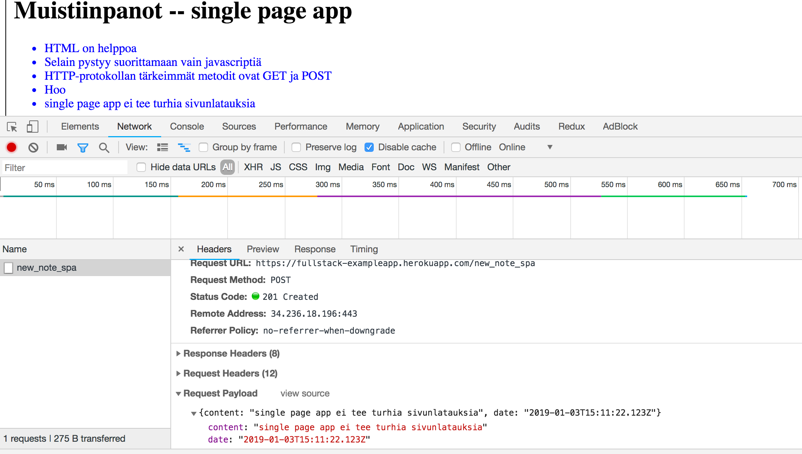

<!-- Pyyntö kohdistuu osoitteeseen <i>new\_note\_spa</i>, on tyypiltään POST ja se sisältää JSON-muodossa olevan uuden muistiinpanon, johon kuuluu sekä sisältö (<i>content</i>), että aikaleima (<i>date</i>): -->
The POST request to the address <i>new\_note\_spa</i> contains the new note as JSON-data containing both the content of the note (<i>content</i>) and the timestamp (<i>date</i>): 

```js
{
  content: "single page app ei tee turhia sivunlatauksia",
  date: "2019-01-03T15:11:22.123Z"
}
```

<!-- Pyyntöön liitetty headeri <i>Content-Type</i> kertoo palvelimelle, että pyynnön mukana tuleva data on JSON-muotoista: -->
The <i>Content-Type</i> header of the request tells the server, that the included data is represented in the JSON format. 

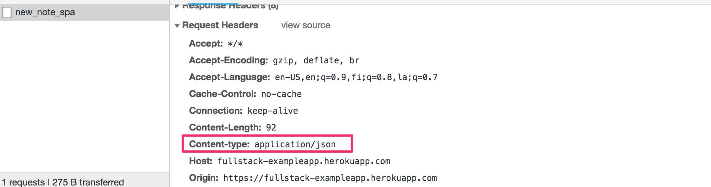

<!-- Ilman headeria palvelin ei osaisi parsia pyynnön mukana tulevaa dataa oiken. -->
Without this header, the server would not know how to correctly parse the data. 

<!-- Palvelin vastaa kyselyyn statuskoodilla [201 created](https://httpstatuses.com/201). Tällä kertaa palvelin ei pyydä uudelleenohjausta kuten aiemmassa versiossamme. the definition of Selain pysyy samalla sivulla ja muita HTTP-pyyntöjä ei suoriteta. -->
The server responds with statuscode [201 created](https://httpstatuses.com/201). This time the server does not ask for a redirect, the browser stays on the same page, and it sends no further HTTP-requests. 

<!-- Ohjelman single page app -versiossa lomakkeen tietoja ei lähetetä selaimen normaalin lomakkeiden lähetysmekanismin avulla, lähettämisen hoitaa selaimen lataamassa Javascript-tiedostossa määritelty koodi. Katsotaan hieman koodia vaikka yksityiskohdista ei tarvitse nytkään välittää liikaa. -->
The SPA version of the app does not send the form data the traditional way, but instead uses the JavaScript code it fetched from the server. 
We'll look into this code a bit, even though understanding all the details of it is not important just yet. 

```js
var form = document.getElementById('notes_form')
form.onsubmit = function(e) {
  e.preventDefault()

  var note = {
    content: e.target.elements[0].value,
    date: new Date(),
  )

  notes.push(note)
  e.target.elements[0].value = ''
  redrawNotes()
  sendToServer(note)
)
```

<!-- Komennolla <em>document.getElementById('notes\_form')</em> koodi hakee sivulta lomake-elementin ja rekisteröi sille <i>tapahtumankäsittelijän</i> hoitamaan tilanteen, missä lomake "submitoidaan", eli lähetetään. Tapahtumankäsittelijä kutsuu heti metodia <em>e.preventDefault()</em> jolla se estää lomakkeen lähetyksen oletusarvoisen toiminnan. Oletusarvoinen toiminta aiheuttaisi lomakkeen lähettämisen ja sivun uudelleen lataamisen, sitä emme single page -sovelluksissa halua tapahtuvan. -->
The command <em>document.getElementById('notes\_form')</em> instructs the code to fetch the form-element from the page, and to register an <i>event handler</i> to handle the form submit event. The event handler immediately calls the method <em>e.preventDefault()</em> to prevent the default handling of form submit. The default method would send the data to server and cause a redirect, which we don't want to happen. 


<!-- Tämän jälkeen se luo muistiinpanon, lisää sen muistiinpanojen listalle komennolla <em>notes.push(note)</em>, piirtää ruudun sisällön eli muistiinpanojen listan uudelleen ja lähettää uuden muistiinpanon palvelimelle. -->
Then the event handler creates a new note, adds it to the notes list with the command <em>notes.push(note)</em>, rerenders the note list on the page and sends the new note to the server. 

<!-- Palvelimelle muistiinpanon lähettävä koodi seuraavassa: -->
The code for sending the note to the server is as follows: 

```js
var sendToServer = function(note) {
  var xhttpForPost = new XMLHttpRequest()
  // ...

  xhttpForPost.open('POST', '/new_note_spa', true)
  xhttpForPost.setRequestHeader(
    'Content-type', 'application/json'
  )
  xhttpForPost.send(JSON.stringify(note))
)
```

<!-- Koodissa siis määritellään, että kyse on HTTP POST -pyynnöstä, määritellään headerin <i>Content-type</i> avulla lähetettävän datan tyypiksi JSON, ja lähetetään data JSON-merkkijonona. -->
The code determines, that the data is to be send with a HTTP POST request and the data type is to be JSON. The data type is determined with a <i>Content-type</i> header. Then the data is sent as JSON-string. 

<!-- Sovelluksen koodi on nähtävissä osoitteessa <https://github.com/mluukkai/example_app>. Kannattaa huomata, että sovellus on tarkoitettu ainoastaan kurssin käsitteistöä demonstroivaksi esimerkiksi, koodi on osin tyyliltään huonoa ja siitä ei tule ottaa mallia omia sovelluksia tehdessä. Sama koskee käytettyjä urleja, single page app -tyyliä noudattavan sivun käyttämä uusien muistiinpanojen kohdeosoite <i>new\_note\_spa</i> ei noudata nykyisin suositeltavia käytäntöjä. -->
The application code is available at <https://github.com/mluukkai/example_app>. 
It's worth to remember, that the application is only ment to demonstrate the concepts of the course. The code is partially bad style, and should not be used as an example when coding your own applications. The same is true for the URLs used. The URL <i>new\_note\_spa</i> new notes are sent to does not follow the current best practices. 

### Javascript-libraries

<!-- Kurssin esimerkkisovellus on tehty ns. [vanilla Javascriptillä](https://medium.freecodecamp.org/is-vanilla-javascript-worth-learning-absolutely-c2c67140ac34) eli käyttäen pelkkää DOM-apia ja Javascript-kieltä sivujen rakenteen manipulointiin. -->
The sample app is done with so called [vanilla Javascript](https://medium.freecodecamp.org/is-vanilla-javascript-worth-learning-absolutely-c2c67140ac34) using only the DOM-API and JavaScript to manipulate the structure of the pages. 

<!-- Pelkän Javascriptin ja DOM-apin käytön sijaan Web-ohjelmoinnissa hyödynnetään yleensä kirjastoja, jotka sisältävät DOM-apia helpommin käytettäviä työkaluja sivujen muokkaamiseen. Eräs tälläinen kirjasto on edelleenkin hyvin suosittu [JQuery](https://jquery.com/). -->
Instead of using just JavaScript and the DOM-API, different libraries containing easier to use tools than the DOM-API are often used to manipulate pages. One of these libraries is the ever-so-popular [JQuery](https://jquery.com/).

<!-- JQuery on kehitetty aikana, jolloin web-sivut olivat vielä suurimmaksi osaksi perinteisiä, eli palvelin muodosti HTML-sivuja, joiden toiminnallisuutta rikastettiin selaimessa JQueryllä kirjoitetun Javascript-koodin avulla. Yksi syy JQueryn suosion taustalla oli niin sanottu cross-browser yhteensopivuus, eli kirjasto toimi selaimesta ja selainvalmistajasta riippumatta samalla tavalla, eikä sitä käyttäessä ollut enää tarvetta kirjoittaa selainversiospesifisiä ratkaisuja. Nykyisin perus JQueryn käyttö ei ole enää yhtä perusteltua kuin aikaisemmin, sillä vanillaJS on kehittynyt paljon ja käytetyimmät selaimet tukevat yleisesti ottaen hyvin perustoiminnallisuuksia. -->
JQuery was developed back when web-pages mainly followed the traditional style of the server generating HTML pages, functionality of which was enhanced on the browser using JavaScript written with JQuery. One of the reasons for the success of JQuery was so called cross-browser compatibility. The library worked regardless of the browser or the company who made it, so there was no need for browser specific solutions. Nowadays using JQuery is not as justified, as VanillaJS has advanced a lot, and the most popular browsers generally support basic functionalities well. 

<!-- Single page app -tyylin noustua suosioon on ilmestynyt useita JQueryä "modernimpia" tapoja sovellusten kehittämiseen. Ensimmäisen aallon suosikki oli [BackboneJS](http://backbonejs.org/). Googlen kehittämä [AngularJS](https://angularjs.org/) nousi 2012 tapahtuneen [julkaisun](https://github.com/angular/angular.js/blob/master/CHANGELOG.md#100-temporal-domination-2012-06-13) jälkeen erittäin nopeasti lähes de facto -standardin asemaan modernissa web-sovelluskehityksessä. -->
The rise of the single page app brought serveral more "modern" ways of web development than JQuery. The favourite of the first wave of developers was [BackboneJS](http://backbonejs.org/). After it's launch (https://github.com/angular/angular.js/blob/master/CHANGELOG.md#100-temporal-domination-2012-06-13) in 2012 Googles [AngularJS](https://angularjs.org/) quicly became almost the de facto standard of modern web development. 

<!-- Angularin suosio kuitenkin romahti siinä vaiheessa kun Angular-tiimi [ilmoitti](https://jaxenter.com/angular-2-0-announcement-backfires-112127.html) lokakuussa 2014, että version 1 tuki lopetetaan ja Angular 2 ei tule olemaan taaksepäin yhteensopiva ykkösversion kanssa. Angular 2 ja uudemmat versiot eivät ole saaneet kovin innostunutta vastaanottoa. -->
However, the popularity of Angular plummeted after the Angluar team [announced](https://jaxenter.com/angular-2-0-announcement-backfires-112127.html) in October 2014 that support for version 1 will end, and Angular 2 will not be backwards compatible with the first version. Angular 2 and the newer versions have not gotten too warm of a welcome. 

<!-- Nykyisin suosituin tapa toteuttaa web-sovellusten selainpuolen logiikka on Facebookin kehittämä [React](https://reactjs.org/)-kirjasto. Tulemme tutustumaan kurssin aikana Reactiin ja sen kanssa yleisesti käytettyyn [Redux](https://github.com/reactjs/redux)-kirjastoon. -->
Currently the most popular tool for implementing the browser side logic of web-applications is Facebook's [React](https://reactjs.org/)-library. 
During this course, we will get familiar with React and the [Redux](https://github.com/reactjs/redux)-library, which are frequently used together. 

<!-- Reactin asema näyttää tällä hetkellä vahvalta, mutta Javascript-maailma ei lepää koskaan. Viime aikoina kiinnostusta on alkanut herättää mm. uudempi tulokas [VueJS](https://vuejs.org/). -->
The status of React seems strong, but the world of JavaScript is ever changing. Recently for example a newcomer [VueJS](https://vuejs.org/) has been capturing some interest. 

### Full stack -web development

<!-- Mitä tarkoitetaan kurssin nimellä <i>Full stack -websovelluskehitys</i>? Full stack on hypenomainen termi; kaikki puhuvat siitä, mutta kukaan ei oikein tiedä, mitä se tarkoittaa tai ainakaan mitään yhteneväistä määritelmää termille ei ole. -->
What does the name of the course, <i>Full stack web development</i>, mean? Full stack is a buzzword, and everyone talks about it while no one really knows what it actually means. Or at least no agreed upon definition exists for the term. 

<!-- Käytännössä kaikki websovellukset sisältävät (ainakin) kaksi "kerrosta", ylempänä, eli lähempänä loppukäyttäjää olevan selaimen ja alla olevan palvelimen. Palvelimen alapuolella on usein vielä tietokanta. Näin websovelluksen <i>arkkitehtuurin</i> voi ajatella muodostavan pinon, englanniksi <i>stack</i>. -->
Practically all web applications have (at least) two "layers": the browser at the top layer, being closer to the end user, and the server at the bottom layer. Often there is also a database layer below the server. We can therefore think of the <i>architecture</i> of a web application as a kind of a <i>stack</i> of layers. 

<!-- Websovelluskehityksen yhteydessä puhutaan usein myös "frontista" ([frontend](https://en.wikipedia.org/wiki/Front_and_back_ends)) ja "backistä" ([backend](https://en.wikipedia.org/wiki/Front_and_back_ends)). Selain on frontend ja selaimessa suoritettava Javascript on frontend-koodia. Palvelimella taas pyörii backend-koodi. -->
Often we also talk about the [frontend](https://en.wikipedia.org/wiki/Front_and_back_ends) and the [backend](https://en.wikipedia.org/wiki/Front_and_back_ends). The browser is the frontend, and JavaScript run on the browser is frontend code. The server on the other hand is the backend. 

<!-- Tämän kurssin kontekstissa full stack -sovelluskehitys tarkoittaa sitä, että fokus on kaikissa sovelluksen osissa, niin frontendissä kuin backendissä sekä taustalla olevassa tietokannassa. Myös palvelimen käyttöjärjestelmä ja sen ohjelmistot lasketaan usein osaksi stackia, niihin emme kuitenkaan tällä kurssilla puutu. -->
In the context of this course, full stack web development means that we focus on all parts of the application: the frontend, the backend and the database. Sometimes the software on the server and its operating system are seen as parts of the stack, but we won't go into those. 

<!-- Ohjelmoimme myös palvelinpuolta, eli backendia Javascriptilla, käyttäen [Node.js](https://nodejs.org/en/)-suoritusympäristöä. Näin full stack -sovelluskehitys saa vielä uuden ulottuvuuden, kun voimme käyttää samaa ohjelmointikieltä pinon useammassa kerroksessa. Full stack -sovelluskehitys ei välttämättä edellytä sitä, että kaikissa "sovelluspinon" kerroksissa on käytössä sama kieli (Javascript). -->
We will code the backend with JavaScript, using [Node.js](https://nodejs.org/en/) runtime environment. Using the same programming language on multiple layers of the stack gives full stack web development a whole new dimension. However it's not a requirement of full stack web development to use the same programming language (JavaScript) for all layers of the stack. 

<!-- Aiemmin on ollut yleisempää, että sovelluskehittäjät ovat erikoistuneet tiettyyn sovelluksen osaan, esim. backendiin. Tekniikat backendissa ja frontendissa ovat saattaneet olla hyvin erilaisia. Full stack -trendin myötä on tullut tavanomaiseksi, että sovelluskehittäjä hallitsee riittävästi kaikkia sovelluksen tasoja ja tietokantaa. Usein full stack -kehittäjän on myös omattava riittävä määrä konfiguraatio- ja ylläpito-osaamista, jotta kehittäjä pystyy operoimaan sovellustaan esim. pilvipalveluissa. -->
It used to be more common for developers to specialize in one layer of the stack, for example the backend. Technologies on the backend and the frontend were quite different. With the Full stack trend, it has become common for developers to be proficient on all layers of the application and the database. Oftentimes, full stack developers must also have enough configuration and administration skills to operate their application for example in the cloud. 

### Javascript fatigue

<!-- Full stack -sovelluskehitys on monella tapaa haastavaa. Asioita tapahtuu monessa paikassa ja mm. debuggaaminen on oleellisesti normaalia työpöytäsovellusta hankalampaa. Javascript ei toimi aina niin kuin sen olettaisi toimivan (verrattuna moniin muihin kieliin) ja sen suoritusympäristöjen asynkroninen toimintamalli aiheuttaa monenlaisia haasteita. Verkon yli tapahtuva kommunikointi edellyttää HTTP-protokollan tuntemusta. On tunnettava myös tietokantoja ja hallittava palvelinten konfigurointia ja ylläpitoa. Hyvä olisi myös hallita riittävästi CSS:ää, jotta sovellukset saataisiin edes siedettävän näköisiksi. -->
Full stack web development is challenging in many ways. Things are happening in many places at once, and  debugging is quite a bit harder than with regular desktop applications. JavaScript does not always work like you'd expect it to (compared to many other languages) and the asynchronous way its runtime environments work causes all sorts of challenges. Communicating in the web requires knowledge of the HTTP-protocol. One must also handle databases and server administration and configuration. It would also be good to know enough CSS to make applications at least somewhat presentable. 

<!-- Oman haasteensa tuo vielä se, että Javascript-maailma etenee koko ajan todella kovaa vauhtia eteenpäin. Kirjastot, työkalut ja itse kielikin ovat jatkuvan kehityksen alla. Osa alkaa kyllästyä nopeaan kehitykseen ja sitä kuvaamaan on lanseerattu termi [Javascript](https://medium.com/@ericclemmons/javascript-fatigue-48d4011b6fc4) [fatigue](https://auth0.com/blog/how-to-manage-javascript-fatigue/) eli [Javascript](https://hackernoon.com/how-it-feels-to-learn-javascript-in-2016-d3a717dd577f)-väsymys. -->
The world of JavaScript develops fast, which brings its own set of challenges. Tools, libraries and the language itself are under constant development. Some are starting to get tired of the constant changes, and have launched to term for it: [Javascript](https://medium.com/@ericclemmons/javascript-fatigue-48d4011b6fc4) [fatigue](https://auth0.com/blog/how-to-manage-javascript-fatigue/).

<!-- Javascript-väsymys tulee varmasti iskemään myös tällä kurssilla. Onneksi nykyään on olemassa muutamia tapoja loiventaa oppimiskäyrää, ja voimme aloittaa keskittymällä konfiguraation sijaan koodaamiseen. Konfiguraatioita ei voi välttää, mutta seuraavat viikot voimme edetä iloisin mielin vailla pahimpia konfiguraatiohelvettejä. -->
You will catch the JavaScript fatigue during this course. Lucky for us, there are a few ways to lower the learning curve, and we can start with coding instead of configuration. We can't avoid configuration completely, but the next few weeks we can merrily push ahead avoiding the worst of the configuration hells. 

</div>

<div class="tasks"> 
  <h3>Exercises</h3>

<!-- Tehtävät palautetaan GitHubin kautta ja merkitsemällä tehdyt tehtävät [palautussovellukseen](https://studies.cs.helsinki.fi/fullstackopen2019/).

Voit palauttaa kurssin kaikki tehtävät samaan repositorioon, tai käyttää useita repositorioita. Jos palautat eri osien tehtäviä samaan repositorioon, käytä järkevää hakemistojen nimentää. Jos käytät privaattirepositorioa tehtävien palautukseen liitä repositoriolle collaboratoriksi _mluukkai_

Eräs varsin toimiva hakemistorakenne palautusrepositoriolle on seuraava -->
The exercises are submitted via GitHub, and by marking the exercises as done in the [submission system](https://studies.cs.helsinki.fi/fullstackopen2019/).

You can submit all of the exercises into the same repository, or use multiple different repositories. If you submit exercises from different parts into the same repository, name your directories well. If you use a private repository to submit the exercises, add _mluukkai_ as a contributor to it.

One good way to name the directories in your submission repository is as follows: 

```
part0
part1
  kurssitiedot
  unicafe
  anekdootit
part2
  puhelinluettelo
  maiden_tiedot
```

<!-- Eli kutakin osaa kohti on oma hakemistonsa, joka vielä jakautuu tehtäväsarjat (kuten osan 1 unicafe) sisältäviin hakemistoihin. -->
So each part has it's own directory, which contains a directory for each exercise set (like the unicafe exercises in part 1). 

<!-- Tehtävät palautetaan **yksi osa kerrallaan**. Kun olet palauttanut osan tehtävät, et voi enää palauttaa saman osan tekemättä jättämiäsi tehtäviä. -->
The exercises are submitted **one part at a time**. When you have submitted the exercises for a part, you can no longer submit any missed exercises for that part. 

  <h4>0.1: HTML</h4>

<!-- Kertaa HTML:n perusteet lukemalla Mozillan tutoriaali [HTML:stä](https://developer.mozilla.org/en-US/docs/Learn/Getting_started_with_the_web/HTML_basics). 

<i>Tätä tehtävää ei palauteta githubiin, riittää että luet tutoriaalin.</i> -->
Revise the basics of HTML by reading this tutorial from Mozilla: [HTML tutorial](https://developer.mozilla.org/en-US/docs/Learn/Getting_started_with_the_web/HTML_basics). 

<i>This exercise is not submitted to GitHub, it's enough to just read the tutorial</i>

  <h4>0.2: CSS</h4>

<!-- Kertaa CSS:n perusteet lukemalla Mozillan tutoriaali [CSS:stä](https://developer.mozilla.org/en-US/docs/Learn/Getting_started_with_the_web/CSS_basics).

<i>Tätä tehtävää ei palauteta githubiin, riittää että luet tutoriaalin.</i> -->
Revise the basics of CSS by reading this tutorial from Mozilla: [CSS tutorial](https://developer.mozilla.org/en-US/docs/Learn/Getting_started_with_the_web/CSS_basics).

<i>This exercise is not submitted to GitHub, it's enough to just read the tutorial</i>

  <h4>0.3: HTML forms</h4>

 <!-- Tutustu HTML:n lomakkeiden perusteisiin lukemalla Mozillan tutoriaali [Your first form](https://developer.mozilla.org/en-US/docs/Learn/HTML/Forms/Your_first_HTML_form). -->

<!-- <i>Tätä tehtävää ei palauteta githubiin, riittää että luet tutoriaalin.</i> -->

Learn about the basics of HTML forms by reading Mozilla's tutorial [Your first form](https://developer.mozilla.org/en-US/docs/Learn/HTML/Forms/Your_first_HTML_form).

<i>This exercise is not submitted to GitHub, it's enough to just read the tutorial</i>

  <h4>0.4: new note</h4>

<!-- Luvussa [Javascriptia sisältävän sivun lataaminen - kertaus](/osa0/web_sovelluksen_toimintaperiaatteita#javascriptia-sisaltavan-sivun-lataaminen-kertaus) kuvataan [sekvenssikaavion](https://github.com/mluukkai/ohjelmistotekniikka-kevat2019/blob/master/web/materiaali.md#sekvenssikaaviot) avulla sivun <https://fullstack-exampleapp.herokuapp.com/notes> avaamisen aikaansaama tapahtumasarja.

Kaavio on luotu [websequencediagrams](https://www.websequencediagrams.com)-palvelussa, seuraavasti: -->

In chapter [Loading a page containing JavaScript - revised](/osa0/web_sovelluksen_toimintaperiaatteita#javascriptia-sisaltavan-sivun-lataaminen-kertaus) the chain of events caused by opening the page <https://fullstack-exampleapp.herokuapp.com/notes> is depicted as a [sequence diagram](https://github.com/mluukkai/ohjelmistotekniikka-kevat2019/blob/master/web/materiaali.md#sekvenssikaaviot) (NB: the link is in Finnish). 

The diagram was made using [websequencediagrams](https://www.websequencediagrams.com) service as follows: 

```
selain->palvelin: HTTP GET https://fullstack-exampleapp.herokuapp.com/notes
palvelin-->selain: HTML-koodi
selain->palvelin: HTTP GET https://fullstack-exampleapp.herokuapp.com/main.css
palvelin-->selain: main.css
selain->palvelin: HTTP GET https://fullstack-exampleapp.herokuapp.com/main.js
palvelin-->selain: main.js

note over selain:
selain alkaa suorittaa js-koodia
joka pyytää JSON-datan palvelimelta
end note

selain->palvelin: HTTP GET https://fullstack-exampleapp.herokuapp.com/data.json
palvelin-->selain: [{ content: "HTML on helppoa", date: "2019-01-01" }, ...]

note over selain:
selain suorittaa tapahtumankäsittelijän
joka renderöi muistiinpanot näytölle
end note
```

<!-- **Create a similar diagram**, joka kuvaa mitä tapahtuu tilanteesta, missä käyttäjä luo uuden muistiinpanon ollessaan sivulla <https://fullstack-exampleapp.herokuapp.com/notes>, eli kirjoittaa tekstikenttään jotain ja painaa nappia <i>tallenna</i>. -->

<!-- Kirjoita tarvittaessa palvelimella tai selaimessa tapahtuvat operaatiot sopivina kommentteina kaavion sekaan. -->

<!-- Kaavion ei ole pakko olla sekvenssikaavio. Mikä tahansa järkevä kuvaustapa käy. -->

<!-- Kaikki oleellinen tämän ja seuraavien kolmen tehtävän tekemiseen liittyvä informaatio on selitettynä [tämän osan](../osa0) tekstissä. Näiden tehtävien ideana on, että luet tekstin vielä kerran ja mietit tarkkaan mitä missäkin tapahtuu. Ohjelman [koodin](https://github.com/mluukkai/example_app) lukemista ei näissä tehtävissä edellytetä, vaikka sekin on toki mahdollista. -->
**Create a similar diagram** depicting the situation where the user creates a new note on page <https://fullstack-exampleapp.herokuapp.com/notes> by writing something into the text field and clicking the <i>submit</i> button. 

If necessary, show operations on the browser or on the server as comments on the diagram.

The diagram does not have to be a sequence diagram. Any sensible way of presenting the events is fine. 

All necessary information for doing this, and the next three exercises, can be found from the text of [this part](../osa0).
The idea of these exercises is to read the text through once more, and to think through what is going on where. Reading the application [code](https://github.com/mluukkai/example_app) is not necessary, but it is of course possible. 

  <h4>0.5: Single page app</h4>
<!-- Tee kaavio tilanteesta, missä käyttäjä menee selaimella osoitteeseen <https://fullstack-exampleapp.herokuapp.com/spa> eli muistiinpanojen [single page app](../osa0/#single-page-app)-versioon -->

Create a diagram depicting the situation where the user goes to the [single page app](../osa0/#single-page-app) version of the notes app at <https://fullstack-exampleapp.herokuapp.com/spa>.

  <h4>0.6: New note</h4>

<!-- Tee kaavio tilanteesta, missä käyttäjä luo uuden muistiinpanon single page -versiossa. -->
Create a diagram depicting the situation, where user creates a new note using the single page -version of the app. 

<!-- Tämä oli osan viimeinen tehtävä ja on aika pushata vastaukset githubiin merkata tehdyt tehtävät [palautussovellukseen](https://studies.cs.helsinki.fi/fullstackopen2019/). -->
This was the last exercise, and it's time to push your answers to GitHub and mark the exercises as done in the [submission application](https://studies.cs.helsinki.fi/fullstackopen2019/).

</div>
