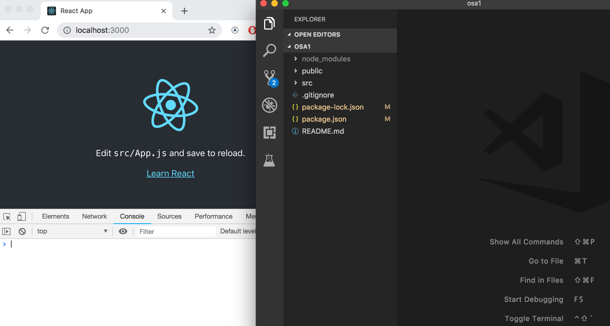
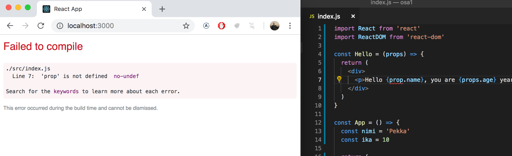
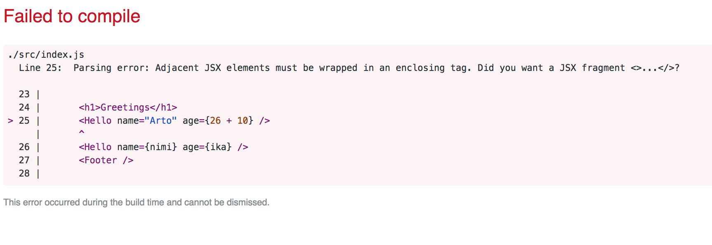

<div class="content">

<!-- [//]: # (Alamme nyt tutustua kurssin ehkä tärkeimpään teemaan, [React](https://reactjs.org/)-kirjastoon. Tehdään heti yksinkertainen React-sovellus ja tutustutaan samalla Reactin peruskäsitteistöön.) -->

We will now start getting familiar with probably the most important topic of this course, namely the [React](https://reactjs.org/)-library. Let's start off with making a simple React application as well as getting to know the core concepts of React.

<!-- [//]: # (Ehdottomasti helpoin tapa päästä alkuun on [create-react-app](https://github.com/facebookincubator/create-react-app)-nimisen työkalun käyttö. <i>create-react-app</i> on mahdollista asentaa omalle koneelle, mutta asennukseen ei ole tarvetta jos Noden mukana asentunut <i>npm</i>-työkalu on versioltaan vähintään <i>5.3</i>. Tällöin npm:n mukana asentuu komento </i>npx</i>, joka mahdollistaa create-react-app:in käytön asentamatta sitä erikseen. Npm:n version saa selville komennolla <em>npm -v</em>.) -->

The easiest way to get started by far is using a tool called [create-react-app](https://github.com/facebookincubator/create-react-app). It is possible to install <i>create-react-app</i> on your machine, but it is not necessary if the <i>npm</i> tool that was installed along with Node has a version number of at least <i>5.3</i>.

<!-- [//]: # (Luodaan sovellus nimeltään <i>osa1</i> ja mennään sovelluksen sisältämään hakemistoon:) -->

Let's create an application called <i>part1</i> and navigate to its directory.

```bash
$ npx create-react-app osa1
$ cd osa1
```

<!-- [//]: # (Kaikki tässä (ja jatkossa) annettavat merkillä <em>$</em> alkavat komennot on kirjoitettu terminaaliin eli komentoriville. Merkkiä <em>$</em> ei tule kirjoittaa, sillä se edustaa komentokehoitetta.) -->

Every command, here and in the future, starting with the character <em>$</em> is typed into a terminal prompt, aka the command-line. The character <em>$</em> is not to be typed out because it represents the prompt.

<!-- [//]: # (Sovellus käynnistetään seuraavasti) -->

The application is run as follows

```bash
$ npm start
```

<!-- [//]: # (Sovellus käynnistyy oletusarvoisesti localhostin porttiin 3000, eli osoitteeseen <http://localhost:3000>) -->

By default, the application runs in localhost port 3000 with the address <http://localhost:3000>

<!-- [//]: # (Chromen pitäisi aueta automaattisesti. Avaa konsoli **välittömästi**. Avaa myös tekstieditori siten, että näet koodin ja web-sivun samaan aikaan ruudulla:) -->

Chrome should launch automatically. Open the console **immediately**. Also open a text editor so that you can view the code as well as the web-page at the same time on the screen:



<!-- [//]: # (Sovelluksen koodi on hakemistossa <i>src</i>. Yksinkertaistetaan valmiina olevaa koodia siten, että tiedoston <i>index.js</i> sisällöksi tulee:) -->

The code of the application resides in the <i>src</i> folder. Let's simplify the default code such that the contents of the file <i>index.js</i> looks like:

```js
import React from 'react'
import ReactDOM from 'react-dom'

const App = () => (
  <div>
    <p>Hello world</p>
  </div>
)

ReactDOM.render(<App />, document.getElementById('root'))
```

<!-- [//]: <> (Tiedo stot <i>App.js</i>, <i>App.css</i>, <i>App.test.js</i>, <i>logo.svg</i> ja <i>serviceWorker.js</i> voi poistaa sillä niitä emme sovelluksessamme nyt tarvitse.) -->

The files <i>App.js</i>, <i>App.css</i>, <i>App.test.js</i>, <i>logo.svg</i> and <i>serviceWorker.js</i> may be deleted as they are not needed in our application right now.

### Component

<!-- [//]: # (Tiedosto <i>index.js</i> määrittelee nyt React-[komponentin](https://reactjs.org/docs/components-and-props.html) nimeltään <i>App</i> ja viimeisen rivin komento) -->

The file <i>index.js</i> now defines a React-[component](https://reactjs.org/docs/components-and-props.html) with the name <i>App</i> and the command on the final line

```js
ReactDOM.render(<App />, document.getElementById('root'))
```

<!-- renderöi komponentin sisällön tiedoston <i>public/index.html</i> määrittelemään <i>div</i>-elementtiin, jonka <i>id:n</i> arvona on 'root'. -->

renders its contents into the <i>div</i>-element, defined in the file <i>public/index.html</i>, having the <i>id</i> value 'root'.

<!-- Tiedosto <i>public/index.html</i> on oleellisesti ottaen tyhjä, voit kokeilla lisätä sinne HTML:ää. Reactilla ohjelmoitaessa yleensä kuitenkin kaikki renderöitävä sisältö määritellään Reactin komponenttien avulla. -->

By default the file <i>public/index.html</i> is empty. You can try adding some HTML into the file. However, when using React, all content that needs to be rendered is usually defined as React components.

<!-- Tarkastellaan vielä tarkemmin komponentin määrittelevää koodia: -->

Let's take a closer look at the code defining the component:

```js
const App = () => (
  <div>
    <p>Hello world</p>
  </div>
)
```

<!-- Kuten arvata saattaa, komponentti renderöityy <i>div</i>-tagina, jonka sisällä on <i>p</i>-tagin sisällä oleva teksti <i>Hello world</i>. -->

As you probably guessed, the component will be rendered as a <i>div</i>-tag, which wraps a <i>p</i>-tag containing the text <i>Hello world</i>.

<!-- Teknisesti ottaen komponentti on määritelty Javascript-funktiona. Seuraava siis on funktio (joka ei saa yhtään parametria): -->

Technically the component is defined as a Javascript function. The following is a function (which does not receive any parameters):

```js
() => (
  <div>
    <p>Hello world</p>
  </div>
)
```

<!-- joka sijoitetaan vakioarvoiseen muuttujaan <i>App</i> -->

which is then assigned to a constant variable <i>App</i>

```js
const App = ...
```

<!-- Javascriptissa on muutama tapa määritellä funktioita. Käytämme nyt Javascriptin hieman uudemman version [EcmaScript 6:n](http://es6-features.org/#Constants) eli ES6:n [nuolifunktiota](https://developer.mozilla.org/en-US/docs/Web/JavaScript/Reference/Functions/Arrow_functions) (arrow functions). -->

There are a few ways to define functions in Javascript. Here we will use [arrow functions](https://developer.mozilla.org/en-US/docs/Web/JavaScript/Reference/Functions/Arrow_functions), which are described in a newer version of Javascript known as [EcmaScript 6](http://es6-features.org/#Constants), also called ES6.

<!-- Koska funktio koostuu vain yhdestä lausekkeesta, on käytössämme lyhennysmerkintä, joka vastaa oikeasti seuraavaa koodia: -->

Because the function consist of only a single expression we have used a shorthand, which represents this piece of code:

```js
const App = () => {
  return (
    <div>
      <p>Hello world</p>
    </div>
  )
}
```

<!-- eli funktio palauttaa sisältämänsä lausekkeen arvon. -->

In other words, the function returns the value of the expression.

<!-- Komponentin määrittelevä funktio voi sisältää mitä tahansa Javascript-koodia. Muuta komponenttisi seuraavaan muotoon ja katso mitä konsolissa tapahtuu: -->

The function defining the component may contain any kind of Javascript code. Modify your component to be as follows and observe what happens in the console:

```js
const App = () => {
  console.log('Hello from komponentti')
  return (
    <div>
      <p>Hello world</p>
    </div>
  )
}
```

<!-- Komponenttien sisällä on mahdollista renderöidä myös dynaamista sisältöä. -->

It is also possible to render dynamic content inside of a component.

<!-- Muuta komponentti muotoon: -->

Modify the component as follows:

```js
const App = () => {
  const now = new Date()
  const a = 10
  const b = 20

  return (
    <div>
      <p>Hello world, it is {now.toString()}</p>
      <p>
        {a} plus {b} is {a + b}
      </p>
    </div>
  )
}
```

<!-- Aaltosulkeiden sisällä oleva Javascript-koodi evaluoidaan ja evaluoinnin tulos upotetaan määriteltyyn kohtaan komponentin tuottamaa HTML-koodia. -->

Any Javascript code within the curly braces is evaluated and the result of this evaluation is embedded into the defined place in the HTML produced by the component.

### JSX

<!-- Näyttää siltä, että React-komponentti palauttaa HTML-koodia. Näin ei kuitenkaan ole. React-komponenttien ulkoasu kirjoitetaan yleensä [JSX](https://reactjs.org/docs/introducing-jsx.html):ää käyttäen. Vaikka JSX näyttää HTML:ltä, kyseessä on kuitenkin tapa kirjoittaa Javascriptiä. React komponenttien palauttama JSX käännetään konepellin alla Javascriptiksi. -->

It seems like React components are returning HTML markup. However, this is not the case. The layout of React components is mostly written using [JSX](https://reactjs.org/docs/introducing-jsx.html). Although JSX looks like HTML, we are actually dealing with a way to write Javascript. Under the hood JSX returned by React components is compiled into Javascript.

<!-- Käännösvaiheen jälkeen ohjelmamme näyttää seuraavalta: -->

After compiling our application looks like this:

```js
import React from 'react'
import ReactDOM from 'react-dom'

const App = () => {
  const now = new Date()
  const a = 10
  const b = 20
  return React.createElement(
    'div',
    null,
    React.createElement(
      'p', null, 'Hello world, it is ', now.toString()
    ),
    React.createElement(
      'p', null, a, ' plus ', b, ' is ', a + b
    )
  )
}

ReactDOM.render(
  React.createElement(App, null),
  document.getElementById('root')
)
```

<!-- Käännöksen hoitaa [Babel](https://babeljs.io/repl/). Create-react-app:illa luoduissa projekteissa käännös on konfiguroitu tapahtumaan automaattisesti. Tulemme tutustumaan aiheeseen tarkemmin kurssin [osassa 7](/osa7). -->

The compiling is handled by [Babel](https://babeljs.io/repl/). Projects created with *create-react-app* are configured to compile automatically. We will learn more about this topic in [part 7](/part7) of this course.

<!-- Reactia olisi myös mahdollista kirjoittaa "suoraan Javascriptinä" käyttämättä JSX:ää. Kukaan täysijärkinen ei kuitenkaan niin tee. -->

It is also possible to write React as "pure Javascript" without using JSX. Although, nobody with a sound mind would actually do so.

<!-- Käytännössä JSX on melkein kuin HTML:ää sillä erotuksella, että mukaan voi upottaa helposti dynaamista sisältöä kirjoittamalla sopivaa Javascriptiä aaltosulkeiden sisälle. Idealtaan JSX on melko lähellä monia palvelimella käytettäviä templating-kieliä kuten Java Springin yhteydessä käytettävää thymeleafia. -->

In practice, JSX is much like HTML with the distinction that with JSX you can easily embed dynamic content by writing appropriate Javascript within curly braces. The idea of JSX is quite similar to many templating languages, such as Thymeleaf used along Java Spring, which are used on servers.

<!-- JSX on "XML:n kaltainen", eli jokainen tagi tulee sulkea. Esimerkiksi rivinvaihto on tyhjä elementti, joka voidaan kirjottaa HTML:ssä seuraavasti -->

JSX is "XML-like", which means that every tag needs to be closed. For example, a newline is an empty element, which in HTML can be written as follows:

```html
<br>
```

<!-- mutta JSX:ää kirjoittaessa tagi on pakko sulkea: -->

but when writing JSX, the tag needs to be closed:

```html
<br />
```

### Multiple components

<!-- Muutetaan sovellusta seuraavasti (yläreunan importit jätetään <i>esimerkeistä</i> nyt ja jatkossa pois, niiden on kuitenkin oltava koodissa jotta ohjelma toimisi): -->

Let's modify the application as follows (NB: imports at the top of the file are left out in these <i>examples</i>, now and in the future. They are still needed for the code to work):

```js
// highlight-start
const Hello = () => {
  return (
    <div>
      <p>Hello world</p>
    </div>
  )
}
// highlight-end

const App = () => {
  return (
    <div>
      <h1>Greetings</h1>
      <Hello /> // highlight-line
    </div>
  )
}

ReactDOM.render(<App />, document.getElementById('root'))
```

<!-- Olemme määritelleet uuden komponentin <i>Hello</i>, jota käytetään komponentista <i>App</i>. Komponenttia voidaan luonnollisesti käyttää monta kertaa: -->

We have defined a new component <i>Hello</i>, which is used from the component <i>App</i>. Naturally, a component can be used multiple times:

```js
const App = () => {
  return (
    <div>
      <h1>Greetings</h1>
      <Hello />
      // highlight-start
      <Hello />
      <Hello />
      // highlight-end
    </div>
  )
}
```

<!-- Komponenttien tekeminen Reactissa on helppoa ja komponentteja yhdistelemällä monimutkaisempikin sovellus on mahdollista pitää kohtuullisesti ylläpidettävänä. Reactissa filosofiana onkin koostaa sovellus useista, pieneen asiaan keskittyvistä uudelleenkäytettävistä komponenteista. -->

Writing components with React is easy, and by combining components, even a more complex application can be kept fairly maintainable. In deed, a core philosophy of React is composing applications from many specialized reusable components.

<!-- Vahva konventio on myös se, että sovelluksen ylimpänä oleva <i>juurikomponentti</i> on nimeltään <i>App</i>. Tosin kuten [osassa 6](/osa6) tulemme näkemän on tilanteita, joissa komponentti <i>App</i> ei ole suoraan juuressa, vaan se kääritään sopivan apukomponentin sisään.   -->

Another strong convention is the idea of a <i>root component</i> called <i>App</i> at the top of the component tree of the application. Nevertheless, as we will find in [part 6](/part6), there are situations where the component <i>App</i> is not exactly the root, but is wrapped within an appropriate utility component.

### props: passing data to components

<!-- Komponenteille on mahdollista välittää dataa [propsien](https://reactjs.org/docs/components-and-props.html) avulla. -->

It is possible to pass data to components using so called [props](https://reactjs.org/docs/components-and-props.html).

<!-- Muutetaan komponenttia <i>Hello</i> seuraavasti -->

Let's modify the component <i>Hello</i> as follows

```js
const Hello = (props) => { // highlight-line
  return (
    <div>
      <p>Hello {props.name}</p> // highlight-line
    </div>
  )
}
```

<!-- komponentin määrittelevällä funktiolla on nyt parametri <i>props</i>. Parametri saa arvokseen olion, jonka kenttinä ovat kaikki eri "propsit", jotka komponentin käyttäjä määrittelee. -->

Now the function defining the component has a parameter <i>props</i>. As an argument the parameter receives an object, which has fields corresponding to all the "props" the user of the component defines.

<!-- Propsit määritellään seuraavasti: -->

The props are defined as follows:

```js
const App = () => {
  return (
    <div>
      <h1>Greetings</h1>
      <Hello name="Arto" /> // highlight-line
      <Hello name="Pekka" /> // highlight-line
    </div>
  )
}
```

<!-- Propseja voi olla mielivaltainen määrä ja niiden arvot voivat olla "kovakoodattuja" merkkijonoja tai Javascript-lausekkeiden tuloksia. Jos propsin arvo muodostetaan Javascriptillä, tulee se olla aaltosulkeissa. -->

There can be an arbitrary amount of props and their values can be "hard coded" strings or results of Javascript expressions. If the value of the prop is achieved using Javascript it must be wrapped with curly braces.

<!-- Muutetaan koodia siten, että komponentti <i>Hello</i> käyttää kahta propsia: -->

Let's modify the code so that the component <i>Hello</i> uses two props:

```js
const Hello = (props) => {
  return (
    <div>
      <p>
        Hello {props.name}, you are {props.age} years old // highlight-line
      </p>
    </div>
  )
}

const App = () => {
  const nimi = 'Pekka' // highlight-line
  const ika = 10       // highlight-line

  return (
    <div>
      <h1>Greetings</h1>
      <Hello name="Arto" age={26 + 10} /> // highlight-line
      <Hello name={nimi} age={ika} />     // highlight-line
    </div>
  )
}
```

<!-- Komponentti <i>App</i> lähettää propseina muuttujan arvoja, summalausekkeen evaluoinnin tuloksen ja normaalin merkkijonon. -->

The props sent by the component <i>App</i> are the values of the variables, the result of the evaluation of the sum expression and a regular strings.

<!-- ### Muutamia huomioita -->

### Some notes

<!-- React on konfiguroitu antamaan varsin hyviä virheilmoituksia. Kannattaa kuitenkin edetä ainakin alussa **todella pienin askelin** ja varmistaa, että jokainen muutos toimii halutulla tavalla. -->

React has been configured to generate quite good error messages. Despite this, you should, at least in the beginning, advance in **very small steps** and make sure that every change works as desired.

<!-- **Konsolin tulee olla koko ajan auki**. Jos selain ilmoittaa virheestä, ei kannata kirjoittaa sokeasti lisää koodia ja toivoa ihmettä tapahtuvaksi, vaan tulee yrittää ymmärtää virheen syy ja esim. palata edelliseen toimivaan tilaan: -->

**The console should always be open**. If the browser reports about errors, it is not advisable to continue blindly writing more code, hoping for miracles. You should instead try to understand the cause of the error and, for example, go back to the previous working state:



<!-- Kannattaa myös muistaa, että React-koodissakin on mahdollista ja kannattavaa lisätä koodin sekaan sopivia konsoliin tulostavia <em>console.log()</em>-komentoja. Tulemme hieman [myöhemmin](#react-sovellusten-debuggaus) tutustumaan muutamiin muihinkin tapoihin debugata Reactia. -->

It is good to remember that in React it possible and worthwhile to write <em>console.log()</em> commands (which print to the console) within your code.

<!-- Kannattaa pitää mielessä, että **React-komponenttien nimien tulee alkaa isolla kirjaimella**. Jos yrität määritellä komponentin seuraavasti: -->

Also keep in mind that **React component names must be capitalized**. If you try defining a component as follows

```js
const footer = () => {
  return (
    <div>
      greeting app created by 
      <a href="https://github.com/mluukkai">mluukkai</a>
    </div>
  )
}
```

<!-- ja ottaa se käyttöön -->

and use it like this

```js
const App = () => {
  return (
    <div>
      <h1>Greetings</h1>
      <Hello name="Arto" age={26 + 10} />
      <footer /> // highlight-line
    </div>
  )
}
```

<!-- sivulle ei kuitenkaan ilmesty näkyviin Footer-komponentissa määriteltyä sisältöä, vaan React luo sivulle ainoastaan tyhjän <i>footer</i>-elementin. Jos muutat komponentin nimen alkamaan isolla kirjaimella, React luo sivulle <i>div</i>-elementin, joka määriteltiin Footer-komponentissa. -->

the page is not going to display the content defined within the Footer component, and instead React only creates an empty <i>footer</i> element. If you change the first letter of the component name to a capital letter, then React creates a <i>div</i>-element defined in the Footer component, which is rendered on the page.

<!-- Kannattaa myös pitää mielessä, että React-komponentin sisällön tulee (yleensä) sisältää **yksi juurielementti**. Eli jos yrittäisimme määritellä komponentin <i>App</i> ilman uloimmaista <i>div</i>-elementtiä: -->

Take note that (usually) the content of a React component needs to contain **one root element**. If we, for example, try to define the component <i>App</i> without the outermost <i>div</i>-element:

```js
const App = () => {
  return (
    <h1>Greetings</h1>
    <Hello name="Arto" age={26 + 10} />
    <Footer />
  )
}
```

<!-- seurauksena on virheilmoitus: -->

the result is an error message.



<!-- Juurielementin käyttö ei ole ainoa toimiva vaihtoehto, myös <i>taulukollinen</i> komponentteja on validi tapa: -->

Using a root element is not the only working option. An <i>array</i> of components is also a valid solution:

```js
const App = () => {
  return [
    <h1>Greetings</h1>,
    <Hello name="Arto" age={26 + 10} />,
    <Footer />
  ]
}
```

<!-- Määritellessä sovelluksen juurikomponenttia, tämä ei kuitenkaan ole järkevää ja näyttää koodissakin pahalta. -->

However, when defining the root component of the application this is not a very wise thing to do, and it makes the code look a bit ugly.

<!-- Juurielementin pakollisesta käytöstä on se seuraus, että sovelluksen DOM-puuhun tulee "ylimääräisiä" div-elementtejä. Tämä on mahdollista välttää käyttämällä [fragmentteja](https://reactjs.org/docs/fragments.html#short-syntax), eli ympäröimällä komponentin palauttamat elementit tyhjällä elementillä: -->

The consequence of the obligatory nature of the root element is "extra" div-elements in the DOM-tree. This can be avoided by using [fragments](https://reactjs.org/docs/fragments.html#short-syntax), wrapping the elements returned by the component with an empty element:

```js
const App = () => {
  const name = 'Pekka'
  const age = 10

  return (
    <>
      <h1>Greetings</h1>
      <Hello name="Arto" age={26 + 10} />
      <Hello name={name} age={age} />
      <Footer />
    </>
  )
}
```

<!-- Nyt käännös menee läpi ja Reactin generoimaan DOM:iin ei tule ylimääräistä div-elementtiä. -->

Now the compilation is successful and the DOM generated by React no longer contains an extra div-element.

</div>

<div class="tasks">
  <h3>Exercises </h3>

<!-- Tehtävät palautetaan GitHubin kautta ja merkitsemällä tehdyt tehtävät [palautussovellukseen](https://studies.cs.helsinki.fi/fullstackopen2019/). -->

Exercises are submitted through GitHub and by marking completed exercises in the [submission application](https://studies.cs.helsinki.fi/fullstackopen2019/).

<!-- Voit palauttaa kurssin kaikki tehtävät samaan repositorioon, tai käyttää useita repositorioita. Jos palautat eri osien tehtäviä samaan repositorioon, käytä järkevää hakemistojen nimentää.  Jos käytät privaattirepositorioa tehtävien palautukseen liitä repositoriolle collaboratoriksi _mluukkai_ -->

You may submit all the exercises of this course into the same repository, or using multiple repositories. If you submit exercises of different parts into the same repository, please use a sensible naming scheme for the directories.

<!-- Eräs varsin toimiva hakemistorakenne palautusrepositoriolle on seuraava -->

One very functional file  structure for the submission repository is as follows:

```
osa0
osa1
  kurssitiedot
  unicafe
  anekdootit
osa2
  puhelinluettelo
  maiden_tiedot
```

<!-- Eli kutakin osaa kohti on oma hakemistonsa, joka vielä jakautuu tehtäväsarjat (kuten osan 1 unicafe) sisältäviin hakemistoihin.  -->

For each part of the course there is a directory, which further branches into directories containing a series of exercises, like "unicafe" for part 1.

<!-- Kunkin tehtäväsarjan ohjelmasta kannattaa palauttaa kaikki sovelluksen sisältämät tiedostot (paitsi hakemisto <i>node\_modules</i>). -->

For each web application for a series of exercises, it is recommended to submit all files relating to that application, except for the directory <i>node\_modules</i>).

<!-- Tehtävät palautetaan **yksi osa kerrallaan**. Kun olet palauttanut osan tehtävät, et voi enää palauttaa saman osan tekemättä jättämiäsi tehtäviä. -->

The exercises are submitted **one part at a time**. When you have submitted the exercises for a part of the course you can no longer submit undone exercises for the same part.

<!-- Huomaa, että tässä osassa on muitakin tehtäviä kuin allaolevat, eli <i>älä tee palautusta</i> ennen kun olet tehnyt osan tehtävistä kaikki mitkä haluat palauttaa. -->

Note that in this part, there are more exercises besides those found below. <i>Do not submit your work</i> until you have completed the exercises you want to submit for the part.

  <!-- <h4>1.1: kurssitiedot, step1</h4> -->
  
  <h4>1.1: course information, step1</h4>

<!-- <i>Tässä tehtävässä aloitettavaa ohjelmaa kehitellään eteenpäin muutamassa seuraavassa tehtävässä. Tässä ja kurssin aikana muissakin vastaantulevissa tehtäväsarjoissa ohjelman lopullisen version palauttaminen riittää, voit toki halutessasi tehdä commitin jokaisen tehtävän jälkeisestä tilanteesta, mutta se ei ole välttämätöntä.</i> -->

<i>The application that we will start working on in this exercise will be further developed in a few of the following exercises. In this and other upcoming exercise sets in this course, it is enough to only submit the final state of the application. If desired, you may also create a commit for each exercise of the series, but this is entirely optional.</i>

<!-- Luo create-react-app:illa uusi sovellus. Muuta <i>index.js</i> muotoon -->

Use create-react-app to initialize a new application. Modify <i>index.js</i> to match the following

```js
import React from 'react'
import ReactDOM from 'react-dom'

const App = () => {
  const course = 'Half Stack -sovelluskehitys'
  const part1 = 'Reactin perusteet'
  const exercises1 = 10
  const part2 = 'Tiedonvälitys propseilla'
  const exercises2 = 7
  const part3 = 'Komponenttien tila'
  const exercises3 = 14

  return (
    <div>
      <h1>{course}</h1>
      <p>
        {part1} {exercises1}
      </p>
      <p>
        {part2} {exercises2}
      </p>
      <p>
        {part3} {exercises3}
      </p>
      <p>yhteensä {exercises1 + exercises2 + exercises3} tehtävää</p>
    </div>
  )
}

ReactDOM.render(<App />, document.getElementById('root'))
```

<!-- ja poista ylimääräiset tiedostot (App.js, App.css, App.test.js, logo.svg, serviceWorker.js). -->

and remove extra files (App.js, App.css, App.test.js, logo.svg, serviceWorker.js).

<!-- Koko sovellus on nyt ikävästi yhdessä komponentissa. Refaktoroi sovelluksen koodi siten, että se koostuu kolmesta uudesta komponentista: <i>Header</i>, <i>Content</i> ja <i>Total</i>. Kaikki data pidetään edelleen komponentissa <i>App</i>, joka välittää tarpeelliset tiedot kullekin komponentille <i>props:ien</i> avulla. <i>Header</i> huolehtii kurssin nimen renderöimisestä, <i>Content</i> osista ja niiden tehtävämääristä ja <i>Total</i> tehtävien yhteismäärästä. -->

Unfortunately, the entire application is in the same component. Refactor the code so that it consists of three new components: <i>Header</i>, <i>Content</i> ja <i>Total</i>. All data still resides in the <i>App</i> component, which passes the necessary data to each component using <i>props</i>. <i>Header</i> takes care of rendering the name of the course, <i>Content</i> renders the parts and their number of exercises and <i>Total</i> renders the total amount of exercises.

<!-- Komponentin <i>App</i> runko tulee olemaan suunnilleen seuraavanlainen: -->

The <i>App</i> component's body will approximately be as follows:

```js
const App = () => {
  // const-määrittelyt

  return (
    <div>
      <Header course={course} />
      <Content ... />
      <Total ... />
    </div>
  )
}
```

<!-- **VAROITUS** create-react-app tekee projektista automaattisesti git-repositorion, ellei sovellusta luoda jo olemassaolevan repositorion sisälle. Todennäköisesti **et halua** että projektista tulee repositorio, joten suorita projektin juuressa komento _rm -rf .git_. -->

**WARNING** create-react-app automatically makes the project a git repository unless the application is created within an already existing repository. Most likely you **do not want** the project becoming a repository, so run the command _rm -rf .git_ in the root of the project.

<!-- <h4>1.2: kurssitiedot, step2</h4> -->

<h4>1.2: course information, step2</h4>

<!-- Refaktoroi vielä komponentti <i>Content</i> siten, että se ei itse renderöi yhdenkään osan nimeä eikä sen tehtävälukumäärää vaan ainoastaan kolme <i>Part</i>-nimistä komponenttia, joista kukin siis renderöi yhden osan nimen ja tehtävämäärän. -->

Refactor the <i>Content</i> component so that it does not render any names of parts or their number of exercises by itself. Instead it only renders three <i>Part</i> components of which each renders the name and number of exercises of one part.

```js
const Content = ... {
  return (
    <div>
      <Part .../>
      <Part .../>
      <Part .../>
    </div>
  )
}
```

<!-- Sovelluksemme tiedonvälitys on tällä hetkellä todella alkukantaista, sillä se perustuu yksittäisiin muuttujiin. Tilanne paranee pian. -->

Our application passes on information in quite a primitive way at the moment, since it is based on individual variables. This situation will improve soon.

</div>
