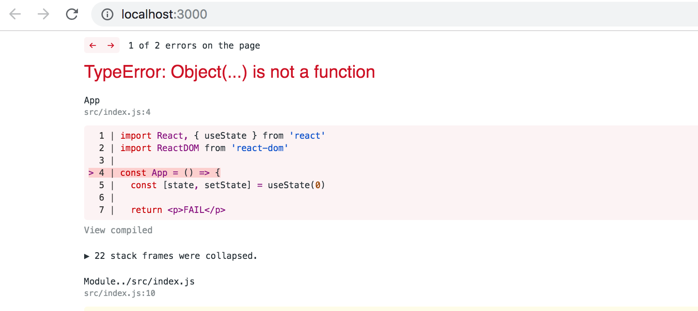

<div class="content">

<!-- Palataan jälleen Reactin pariin. -->
Let's go back to working with React.

<!-- Sovelluksemme jäi seuraavaan tilaan -->

We left our application in the following state:

```js
const Hello = (props) => {
  return (
    <div>
      <p>
        Hello {props.name}, you are {props.age} years old
      </p>
    </div>
  )
}

const App = () => {
  const nimi = 'Pekka'
  const ika = 10

  return (
    <div>
      <h1>Greetings</h1>
      <Hello name="Arto" age={26 + 10} />
      <Hello name={nimi} age={ika} />
    </div>
  )
}
```

<!-- ### Komponenttien apufunktiot -->
### Component helper functions

<!-- Laajennetaan komponenttia <i>Hello</i> siten, että se antaa arvion tervehdittävän henkilön syntymävuodesta: -->
Let's expand our <i>Hello</i> component so that it guesses the age of the person being greeted:

```js
const Hello = (props) => {
  // highlight-start
  const bornYear = () => {
    const yearNow = new Date().getFullYear()
    return yearNow - props.age
  }
  // highlight-end

  return (
    <div>
      <p>
        Hello {props.name}, you are {props.age} years old
      </p>
      <p>So you were probably born {bornYear()}</p> // highlight-line
    </div>
  )
}
```

<!-- Syntymävuoden arvauksen tekevä logiikka on erotettu omaksi funktiokseen, jota kutsutaan komponentin renderöinnin yhteydessä. -->
The logic for guessing the year of birth is separated into its own function that is called when the component is rendered.

<!-- Tervehdittävän henkilön ikää ei metodille tarvitse välittää parametrina, sillä funktio näkee sen sisältävälle komponentille välitettävät propsit. -->

The person's age does not have to passed as a parameter to the function since it can directly access all of the props that are passed to the component.

<!-- Teknisesti ajatellen syntymävuoden selvittävä funktio on määritelty komponentin toiminnan määrittelevän funktion sisällä. Esim. Javalla ohjelmoitaessa metodien määrittely toisen metodin sisällä ei onnistu. Javascriptissa taas funktioiden sisällä määritellyt funktiot on hyvin yleisesti käytetty tekniikka. -->
If we examine our current code closely, we'll notice that the helper function is actually defined inside of another function that defines the behavior of our component. In Java-programming defining a method inside of another method is not possible, but in JavaScript defining functions within functions is a commonly used technique.

<!-- ### Destrukturointi -->
### Destructuring

<!-- Ennen kuin siirrymme eteenpäin, tarkastellaan erästä pientä, mutta käyttökelpoista ES6:n mukanaan tuomaa uutta piirrettä Javascriptissä, eli muuttujaan sijoittamisen yhteydessä tapahtuvaa [destrukturointia](https://developer.mozilla.org/en-US/docs/Web/JavaScript/Reference/Operators/Destructuring_assignment). -->
Before we move onward, we will take a look at a small but useful feature of the JavaScript language that was added in the ES6 specification, that allows us to [destructure](https://developer.mozilla.org/en-US/docs/Web/JavaScript/Reference/Operators/Destructuring_assignment) values from objects and arrays upon assignment.

<!-- Jouduimme äskeisessä koodissa viittaamaan propseina välitettyyn dataan hieman ikävästi muodossa _props.name_ ja _props.age_. Näistä _props.age_ pitää toistaa komponentissa kahteen kertaan. -->

In our previous code we had to reference the data passed to our component as _props.name_ and _props.age_. Out of these two expressions we had to repeat _props.age_ twice in our code.

Since <i>props</i> is an object

```js
props = {
  name: 'Arto Hellas',
  age: 35,
}
```

<!-- voimme suoraviivaistaa komponenttia siten, että sijoitamme kenttien arvot muuttujiin _name_ ja _age_, jonka jälkeen niitä on mahdollista käyttää koodissa suoraan: -->
we can streamline our component by assigning the values of the properties directly into two variables _name_ and _age_ which we can then use in our code:

```js
const Hello = (props) => {
  // highlight-start
  const name = props.name
  const age = props.age
  // highlight-end

  const bornYear = () => new Date().getFullYear() - age

  return (
    <div>
      <p>Hello {name}, you are {age} years old</p>
      <p>So you were probably born {bornYear()}</p>
    </div>
  )
}
```

<!-- Huomaa, että olemme myös hyödyntäneet nuolifunktion kompaktimpaa kirjoitustapaa metodin _bornYear_ määrittelyssä. Kuten aiemmin totesimme, jos nuolifunktio koostuu ainoastaan yhdestä komennosta, ei funktion runkoa tarvitse kirjoittaa aaltosulkeiden sisään ja funktio palauttaa ainoan komentonsa arvon. -->

Note that we've also utilized the more compact syntax for arrow functions when defining the _bornYear_ function. As mentioned earlier, if an arrow function consists of a single command then the function body does not need to be written inside of curly braces. In this more compact form the function simply returns the result of the single command.

<!-- Seuraavat ovat siis vaihtoehtoiset tavat määritellä sama funktio: -->
To recap, the two function definitions shown below are equivalent:
```js
const bornYear = () => new Date().getFullYear() - age

const bornYear = () => {
  return new Date().getFullYear() - age
}
```

<!-- Destrukturointi tekee apumuuttujien määrittelyn vielä helpommaksi, sen avulla voimme "kerätä" olion oliomuuttujien arvot suoraan omiin yksittäisiin muuttujiin: -->

Destructuring makes the assignment of variables even easier, since we can use it to extract and gather the values of an object's properties into separate variables:

```js
const Hello = (props) => {
    // highlight-start
  const { name, age } = props
    // highlight-end
  const bornYear = () => new Date().getFullYear() - age

  return (
    <div>
      <p>Hello {name}, you are {age} years old</p>
      <p>So you were probably born {bornYear()}</p>
    </div>
  )
}
```

<!-- Eli koska -->
If the object we are destructuring has the values
```js
props = {
  name: 'Arto Hellas',
  age: 35,
}
```

<!-- saa <em>const { name, age } = props</em> aikaan sen, että muuttuja _name_ saa arvon 'Arto Hellas' ja muuttuja _age_ arvon 35. -->

the expression <em>const { name, age } = props</em> assigns the values 'Arto Hellas' to _name_ and 35 to _age_.

<!-- Voimme viedä destrukturoinnin vielä askeleen verran pidemmälle -->
We can take destructuring a step further:
```js
const Hello = ({ name, age }) => { // highlight-line
  const bornYear = () => new Date().getFullYear() - age

  return (
    <div>
      <p>
        Hello {name}, you are {age} years old
      </p>
      <p>So you were probably born {bornYear()}</p>
    </div>
  )
}
```

<!-- Destrukturointi tehdään nyt suoraan sijoittamalla komponentin saamat propsit muuttujiin _name_ ja _age_. -->
The props that are passed to the component are now directly destructured into the variables _name_ and _age_.

<!-- Eli sensijaan että props-olio otettaisiin vastaan muuttujaan <i>props</i> ja sen kentät sijoitettaisiin tämän jälkeen muuttujiin _name_ ja _age_ -->
This means that instead of assigning the entire props object into a variable called <i>props</i> and then assigning its properties into the variables _name_ and _age_

```js
const Hello = (props) => {
  const { name, age } = props
```

<!-- sijoitamme destrukturoinnin avulla propsin kentät suoraan muuttujiin kun määrittelemme komponettifunktion saaman parametrin: -->

we assign the values of the properties directly to variables by destructuring the props object that is passed to the component function as a parameter:

```js
const Hello = ({ name, age }) => {
```

<!-- ### Sivun uudelleenrenderöinti -->
### Page re-rendering

<!-- Toistaiseksi tekemämme sovellukset ovat olleet sellaisia, että kun niiden komponentit on kerran renderöity, niiden ulkoasua ei ole enää voinut muuttaa. Entä jos haluaisimme toteuttaa laskurin, jonka arvo kasvaa esim. ajan kuluessa tai nappien painallusten yhteydessä? -->

So far all of our applications have been such that their appearance remains the same after the initial rendering. What if we wanted to create a counter where the value increased as a function of time or after clicking a button?

<!-- Aloitetaan seuraavasta rungosta: -->
Let's start with the following body:

```js
const App = (props) => {
  const {counter} = props
  return (
    <div>{counter}</div>
  )
}

let counter = 1

ReactDOM.render(
  <App counter={counter} />, 
  document.getElementById('root')
)
```

<!-- Sovelluksen juurikomponentille siis annetaan propsiksi laskuriin _counter_ arvo. Juurikomponentti renderöi arvon ruudulle. Entä laskurin arvon muuttuessa? Jos lisäämme ohjelmaan esim. komennon -->

The root component is given the value of the counter in the _counter_ prop. The root component renders the value to the screen. But what happens when the value of _counter_ changes? Even if we were to add the command

```js
counter.value += 1
```

<!-- ei komponenttia kuitenkaan renderöidä uudelleen. Voimme saada komponentin uudelleenrenderöitymään kutsumalla uudelleen metodia _ReactDOM.render_, esim. seuraavasti -->

the component won't re-render. We can get the component to re-render by calling the _ReactDOM.render_ method a second time, e.g. in the following way

```js
const App = (props) => {
  const { counter } = props
  return (
    <div>{counter}</div>
  )
}

let counter = 1

const refresh = () => {
  ReactDOM.render(<App counter={counter} />, 
  document.getElementById('root'))
}

refresh()
counter += 1
refresh()
counter += 1
refresh()
```

<!-- Copypastea vähentämään on komponentin renderöinti kääritty funktioon _refresh_. -->
The re-rendering command has been wrapped inside of the _refresh_ function to cut down on the amount of copy-pasted code.

<!-- Nyt komponentti <i>renderöityy kolme kertaa</i>, saaden ensin arvon 1, sitten 2 ja lopulta 3. 1 ja 2 tosin ovat ruudulla niin vähän aikaa, että niitä ei ehdi havaita. -->
Now the component  <i>renders three times</i>, first with the value 1, then 2 and finally 3. However, the values 1 and 2 are displayed on the screen for such a short amount of time that they can't even be witnessed.

<!-- Hieman mielenkiintoisempaan toiminnallisuuteen pääsemme tekemällä renderöinnin ja laskurin kasvatuksen toistuvasti sekunnin välein käyttäen [SetInterval](https://developer.mozilla.org/en-US/docs/Web/API/WindowOrWorkerGlobalScope/setInterval): -->
We can implement slightly more interesting functionality by re-rendering and incrementing the counter every second by using [setInterval](https://developer.mozilla.org/en-US/docs/Web/API/WindowOrWorkerGlobalScope/setInterval):

```js
setInterval(() => {
  refresh()
  counter += 1
}, 1000)
```

<!-- _ReactDOM.render_-metodin toistuva kutsuminen ei kuitenkaan ole suositeltu tapa päivittää komponentteja. Tutustutaan seuraavaksi järkevämpään tapaan. -->
Making repeated calls to the _ReactDOM.render_-method is not the recommended way to re-render components. Next, we'll introduce ourselves to a better way of accomplishing this effect.

<!-- ### Tilallinen komponentti -->
### Stateful component

<!-- Tähänastiset komponenttimme ovat olleet siinä mielessä yksinkertaisia, että niillä ei ole ollut ollenkaan omaa tilaa, joka voisi muuttua komponentin elinaikana. -->
All of our components up till now have been simple in the sense that they have not contained any state that could change during the lifecycle of the component.

<!-- Määritellään nyt sovelluksemme komponentille <i>App</i> tila Reactin [state hookin](https://reactjs.org/docs/hooks-state.html) avulla. -->
Next, let's add state to our application's <i>App</i> component with the help of React's [state hook](https://reactjs.org/docs/hooks-state.html).

<!-- Muutetaan ohjelmaa seuraavasti -->
We will change the application to the following

```js
import React, { useState } from 'react' // highlight-line
import ReactDOM from 'react-dom'

const App = (props) => {
  const [ counter, setCounter ] = useState(0) // highlight-line

// highlight-start
  setTimeout(
    () => setCounter(counter + 1),
    1000
  )
  // highlight-end

  return (
    <div>{counter}</div>
  )
}

ReactDOM.render(
  <App />, 
  document.getElementById('root')
)
```

<!-- Sovellus importaa nyt heti ensimmäisellä rivillä _useState_-funktion: -->
In the first row, the application imports the _useState_-function:

```js
import React, { useState } from 'react'
```

<!-- Komponentin määrittelevä funktio alkaa metodikutsulla -->
The function body that defines the component begins with the function call

```js
const [ counter, setCounter ] = useState(0)
```

<!-- Kutsu saa aikaan sen, että komponentille luodaan <i>tila</i>, joka saa alkuarvokseen nollan. Metodi palauttaa taulukon, jolla on kaksi alkiota. Alkiot otetaan taulukon destrukturointisyntaksilla talteen muuttujiin _counter_ ja _setCounter_. -->
The function call adds <i>state</i> to the component that gets the initial value of zero. The functio returns an array that contains two items. We assign the items to the variables _counter_ and _setCounter_ by using the destructuring assignment syntax shown earlier.

<!-- Muuttuja _counter_ pitää sisällään <i>tilan arvon</i> joka on siis aluksi nolla. Muuttuja _setCounter_ taas on viite funktioon, jonka avulla <i>tilaa voidaan muuttaa</i>. -->
The _counter_ variable is assigned the value of the current <i>state</i> which is zero initially. The variable _setCounter_ is assigned to a function that can be used to <i>modify the state</i>.

<!-- Sovellus määrittelee funktion [setTimeout](https://developer.mozilla.org/en-US/docs/Web/API/WindowOrWorkerGlobalScope/setTimeout) avulla, että tilan _counter_ arvoa kasvatetaan yhdellä sekunnin päästä: -->
The application uses the [setTimeout](https://developer.mozilla.org/en-US/docs/Web/API/WindowOrWorkerGlobalScope/setTimeout) function to increment the _counter_ state after a second has gone by:

```js
setTimeout(
  () => setCounter(counter + 1),
  1000
)
```

<!-- Kun tilaa muuttavaa funktiota _setCounter_ kutsutaan, <i>renderöi React komponentin uudelleen</i>, eli käytännössä suorittaa uudelleen komponentin määrittelevän koodin -->
When the state modifying function _setCounter_ is called <i>React re-renders the component</i>, which means that the function body of the component function gets re-executed:

```js
(props) => {
  const [ counter, setCounter ] = useState(0)

  setTimeout(
    () => setCounter(counter + 1),
    1000
  )

  return (
    <div>{counter}</div>
  )
}
```

<!-- kun koodi suoritetaan toista kertaa, funktion _useState_ kutsuminen palauttaa komponentin jo olemassaolevan tilan arvon, joka on nyt 1. Komponentin suoritus määrittelee jälleen laskuria kasvatettavaksi yhdellä sekunnin päästä ja renderöi ruudulle laskurin nykyisen arvon, joka on 1. -->
When the component function gets executed a second time, calling the _useState_ function returns the already-existing current value of the state which is now 1. Executing the function body again also makes the function call to _setState_ which will increment the _counter_ state after a second has gone by. Finally the current value of the _counter_ is rendered on the screen, which is currently 1.

<!-- Sekunnin päästä siis suoritetaan funktion _setTimeout_ parametrina ollut koodi -->
The function passed as the first parameter to the _setTimeout_ function will get invoked one second after calling the _setTimeout_ function

```js
() => setCounter(counter + 1)
```

<!-- ja koska muuttujan _counter_ arvo on 1, on koodi oleellisesti sama kuin tilan _counter_ arvoon 2 asettava -->
and because the value of the _counter_ variable is 1, the code is essentially the same as a command setting the state _counter_ value to 2

```js
() => setCounter(2)
```

<!-- Ja tämä saa jälleen aikaan sen, että komponentti renderöidään uudelleen. Tilan arvo kasvaa sekunnin päästä yhdellä ja sama jatkuu niin kauan kun sovellus on toiminnassa. -->
This again causes the component to re-render. The value of the state will be incremented again after one second, and this will continue to repeat for as long as the application is running.

<!-- Jos komponentti ei renderöidy vaikka sen omasta mielestä pitäisi, tai se renderöityy "väärään aikaan", debuggaamista auttaa joskus komponentin määrittelevään funktioon lisätty konsoliin tulostus. Esim. jos lisäämme koodiin seuraavan, -->
If the component doesn't render when you think it should, or if it renders at the "wrong time", you can debug the application by logging the values of the component's variables to the console. If we make the following additions to our code
```js
const App = (props) => {
  const [ counter, setCounter ] = useState(0)

  setTimeout(
    () => setCounter(counter + 1),
    1000
  )

  console.log('renderöidään', counter) // highlight-line

  return (
    <div>{counter}</div>
  )
}
```

<!-- on konsolista helppo seurata metodin _render_ kutsuja: -->
it's easy to follow and track the calls made to the _render_ function:


### When React stops working...

<!-- Käyttäessäsi tilan tuovaa hookia <i>useState</i>, saatat törmätä seuraavaan virheilmoitukseen: -->
When you take the <i>useState</i> hook into use, you may run into the following error message:



<!-- Syynä tälle on se, että <i>et ole asentanut</i> riittävän uutta Reactia kuten [osan 1 alussa](/osa1/reactin_alkeet) neuvottiin. -->
The reason for this is that <i>you have not installed</i> a new enough version of React, as was instructed at [the beginning of part 1](/osa1/reactin_alkeet).

``` 
rm -rf node_modules/ && npm i
```

### Event handling

<!-- Mainitsimme jo [osassa 0](/osa0) muutamaan kertaan <i>tapahtumankäsittelijät</i>, eli funktiot, jotka on rekisteröity kutsuttavaksi tiettyjen tapahtumien eli eventien yhteydessä. Esim. käyttäjän interaktio sivun elementtien kanssa aiheuttaa joukon erinäisiä tapahtumia. -->
We have already mentioned <i>event handlers</i> a few times in [part 0](/osa0), that are registered to be called when specific events occur. E.g. a user's interaction with the different elements of a web page can cause a collection of various different kind of events to be triggered.

<!-- Muutetaan sovellusta siten, että laskurin kasvaminen tapahtuukin käyttäjän painaessa [button](https://developer.mozilla.org/en-US/docs/Web/HTML/Element/button)-elementin avulla toteutettua nappia. -->
Let's change the application so that increasing the counter happens when a user clicks on a button implemented with the [button](https://developer.mozilla.org/en-US/docs/Web/HTML/Element/button)-element.

<!-- Button-elementit tukevat mm. [hiiritapahtumia](https://developer.mozilla.org/en-US/docs/Web/API/MouseEvent) (mouse events), joista yleisin on [click](https://developer.mozilla.org/en-US/docs/Web/Events/click). -->
Button-elements support so-called [mouse events](https://developer.mozilla.org/en-US/docs/Web/API/MouseEvent), out of which [click](https://developer.mozilla.org/en-US/docs/Web/Events/click) is the most common event.

<!-- Reactissa funktion rekisteröiminen tapahtumankäsittelijäksi tapahtumalle <i>click</i> [tapahtuu](https://reactjs.org/docs/handling-events.html) seuraavasti: -->
In React registering an event handler function to the <i>click</i> event [happens](https://reactjs.org/docs/handling-events.html) like this:

```js
const App = (props) => {
  const [ counter, setCounter ] = useState(0)

  // highlight-start
  const handleClick = () => {
    console.log('klicked')
  }
  // highlight-end

  return (
    <div>
      <div>{counter}</div>
      // highlight-start
      <button onClick={handleClick}>
        plus
      </button>
      // highlight-end
    </div>
  )
}
```

<!-- Eli laitetaan buttonin <i>onClick</i>-attribuutin arvoksi aaltosulkeissa oleva viite koodissa määriteltyyn funktioon _handleClick_. -->
We set the value of the button's <i>onClick</i>-attribute to be a reference to the _handleClick_ function defined in the code.

<!-- Nyt jokainen napin <i>plus</i> painallus saa aikaan sen että funktiota _handleClick_ kutsutaan, eli klikatessa konsoliin tulostuu <i>clicked</i>. -->
Now every click of the <i>plus</i> button causes the _handleClick_ function to be called, meaning that every click event will log a <i>clicked</i> message to the browser console.

<!-- Tapahtumankäsittelijäfunktio voidaan määritellä myös suoraan onClick-määrittelyn yhteydessä: -->
The event handler function can also be defined directly in the value assignment of the onClick-attribute:

```js
const App = (props) => {
  const [ counter, setCounter ] = useState(0)

  return (
    <div>
      <div>{counter}</div>
      <button onClick={() => console.log('klicked')}> // highlight-line
        plus
      </button>
    </div>
  )
}
```

<!-- Muuttamalla tapahtumankäsittelijä seuraavaan muotoon -->
By changing the event handler to the following form
```js
<button onClick={() => setCounter(counter + 1)}>
  plus
</button>
```

<!-- saamme halutun toiminnallisuuden, eli tilan _counter_ arvo kasvaa yhdellä <i>ja</i> komponentti renderöityy uudelleen. -->
we achieve the desired behavior, meaning that the value of _counter_ is increased by one <i>and</i> the component gets re-rendered.

<!-- Lisätään sovellukseen myös nappi laskurin nollaamiseen: -->
Let's also add a button for resetting the counter:

```js
const App = (props) => {
  const [ counter, setCounter ] = useState(0)

  return (
    <div>
      <div>{counter}</div>
      <button onClick={() => setCounter(counter + 1)}>
        plus
      </button>
      // highlight-start
      <button onClick={() => setCounter(0)}> 
        zero
      </button>
      // highlight-end
    </div>
  )
}
```

<!-- Sovelluksemme on valmis! -->
Our application is now ready!

<!-- Tapahtumankäsittelijöiden määrittely suoraan JSX-templatejen sisällä ei useimmiten ole kovin viisasta. Eriytetään vielä nappien tapahtumankäsittelijät omiksi komponentin sisäisiksi apufunktioikseen: -->
Defining event handlers directly inside JSX-templates is often not a wise move. Let's extract the event handler functions into the their own separate helper functions:

```js
const App = (props) => {
  const [ counter, setCounter ] = useState(0)

// highlight-start
  const increaseByOne = () =>
    setCounter(counter + 1)
  
  const setToZero = () =>
    setCounter(0)
  // highlight-end

  return (
    <div>
      <div>{counter}</div>
      <button onClick={increaseByOne}> // highlight-line
        plus
      </button>
      <button onClick={setToZero}> // highlight-line
        zero
      </button>
    </div>
  )
}
```

### Event handlers are functions

<!-- Metodit _increaseByOne_ ja _setToZero_ toimivat melkein samalla tavalla, ne asettavat uuden arvon laskurille. Tehdään koodiin yksittäinen funktio, joka sopii molempiin käyttötarkoituksiin: -->

The functions _increaseByOne_ and _setToZero_ work almost exactly the same way, they just set a new value for the counter. Let's write a new function that serves both cases.

```js
const App = (props) => {
  const [ counter, setCounter ] = useState(0)

  const setToValue = (value) => setCounter(value) // highlight-line

  return (
    <div>
      <div>{counter}</div>
      <button onClick={setToValue(counter + 1)}> // highlight-line
        plus
      </button>
      <button onClick={setToValue(0)}> // highlight-line
        zero
      </button>
    </div>
  )
}

```

<!-- Huomaamme kuitenkin että muutos hajottaa sovelluksemme täysin: -->
We realize that this change breaks our application entirely:


<!-- Mistä on kyse? Tapahtumankäsittelijäksi on tarkoitus määritellä <i>viite funktioon</i>. Kun koodissa on -->
What's causing the application to break? The event handler is supposed to define a <i>reference to a function</i>. However, in our code we've defined

```js
<button onClick={setToValue(0)}>
```

<!-- tapahtumankäsittelijäksi tulee määriteltyä <i>funktiokutsu</i>. Sekin on monissa tilanteissa ok, mutta ei nyt, nimittäin kun React renderöi metodin, se suorittaa kutsun <em>setToValue(0)</em>. Kutsu aiheuttaa komponentin tilan päivittävän funktion _setCounter_ kutsumisen. Tämä taas aiheuttaa komponentin uudelleenrenderöitymisen. Ja sama toistuu uudelleen... -->
meaning that the event handler is actually a <i>function call</i>, not a reference to the function. As a general rule there is nothing wrong with this, but in this particular case the <em>setToValue(0)</em> function is called when React renders the component. This function then makes a call to the _setCounter_ function, which in turn causes the component to be re-rendered. And this cycle goes on and one...

<!-- Tilanteeseen on kaksi ratkaisua. Ratkaisuista yksinkertaisempi on muuttaa tapahtumankäsittelyä seuraavasti -->
There's two potential solutions to this problem. The simpler solution is to change the event handlers into the form shown below

```js
const App = (props) => {
  const [ counter, setCounter ] = useState(0)

  const setToValue = (value) => setCounter(value)

  return (
    <div>
      <div>{counter}</div>
      <button onClick={() => setToValue(counter + 1)}> // highlight-line
        plus
      </button>
      <button onClick={() => setToValue(0)}> // highlight-line
        zero
      </button>
    </div>
  )
}
```

<!-- eli tapahtumankäsittelijä on määritelty <i>funktio</i>, joka kutsuu funktiota _setToValue_ sopivalla parametrilla:-->
The event hander is now a <i>function</i> that calls the _setToValue_ function with the appropriate parameter:

```js
<button onClick={() => setToValue(counter + 1)}>
```

<!-- ### Funktio joka palauttaa funktion -->
### Function that returns a function

<!-- Toinen vaihtoehto on käyttää yleistä Javascriptin ja yleisemminkin funktionaalisen ohjelmoinnin kikkaa, eli määritellä <i>funktio joka palauttaa funktion</i>: -->
The other solution is to use a common trick often seen in JavaScript and functional programming at large. The trick is to define <i>a function that returns a function</i>:

```js
const App = (props) => {
  const [ counter, setCounter ] = useState(0)

// highlight-start
  const setToValue = (value) => {
    return () => {
      setCounter(value)
    }
  }
// highlight-end  

  return (
    <div>
      <div>{counter}</div>
      <button onClick={setToValue(counter + 1)}> // highlight-line
        plus
      </button>
      <button onClick={setToValue(0)}> // highlight-line
        zero
      </button>
    </div>
  )
}
```

<!-- Jos et ole aiemmin törmännyt tekniikkaan, siihen totutteluun voi mennä tovi. -->
Getting comfortable with this technique may take some time if this is your first time using it.

<!-- Olemme siis määritelleet tapahtumankäsittelijäfunktion _setToValue_ seuraavasti: -->
We have defined the following _setToValue_ event handler function:

```js
const setToValue = (value) => {
  return () => {
    setCounter(value)
  }
}
```

<!-- Kun komponentissa määritellään tapahtumankäsittelijä kutsumalla <em>setToValue(0)</em> on lopputuloksena funktio -->
Defining the event handler by calling <em>setToValue(0)</em> results in the function

```js
() => {
  setCounter(0)
}
```

<!-- eli juuri oikeanlainen tilan nollaamisen aiheuttava funktio! -->
which is exactly the desired function for resetting the state!

<!-- Plus-napin tapahtumankäsittelijä määritellään kutsumalla <em>setToValue(counter + 1)</em>. Kun komponentti renderöidään ensimmäisen kerran, _counter_ on saanut alkuarvon 0, eli plus-napin tapahtumankäsittelijäksi tulee funktiokutsun <em>setToValue(1)</em> tulos, eli funktio -->
The event handler for the plus-button is defined by calling <em>setToValue(counter + 1)</em>. When the component is rendered for the first time, the _counter_ will have the initial value 0, meaning that the event handler for the plus-button will be the result of <em>setToValue(1)</em>:

```js
() => {
  setCounter(1)
}
```

<!-- Vastaavasti, kun laskurin tila on esim 41, tulee plus-napin tapahtumakuuntelijaksi -->
Likewise, when the state of the counter is 41 the event handler for the plus-button will be

```js
() => {
  setCounter(42)
}
```

<!-- Tarkastellaan vielä hieman funktiota _setToValue_: -->
Let's take a closer look at the _setToValue_ function:

```js
const setToValue = (value) => {
  return () => {
    setCounter(value)
  }
}
```

<!-- Koska metodi itse sisältää ainoastaan yhden komennon, eli <i>returnin</i>, joka palauttaa funktion, voidaan hyödyntää nuolifunktion tiiviimpää muotoa: -->
Because the function body only contains a single command, we can once again utilize the more compact arrow function syntax:

```js
const setToValue = (value) => () => {
  setCounter(value)
}
```

<!-- Usein tälläisissä tilanteissa kaikki kirjoitetaan samalle riville, jolloin tuloksena on "kaksi nuolta sisältävä funktio": -->
In these situations it's common to write everything onto one line, resulting in a "double arrow" function: 

```js
const setToValue = (value) => () => setCounter(value)
```

<!-- Kaksinuolisen funktion voi ajatella funktiona, jota lopullisen tuloksen saadakseen täytyy kutsua kaksi kertaa. -->
Double arrow functions can be thought of as functions that have to be called twice in order to get the final result.

<!-- Ensimmäisellä kutsulla "konfiguroidaan" varsinainen funktio, sijoittamalla osalle parametreista arvo. Eli kutsu <em>setToValue(5)</em> sitoo muuttujaan _value_ arvon 5 ja funktiosta "jää jäljelle" seuraava funktio: -->
The first function call is used to "configure" the second function, by defining some of its parameters. By calling <em>setToValue(5)</em> we assign the value 5 to _value_ and we're left with the following function:

```js
() => setCounter(5)
```

<!-- Tässä näytetty tapa soveltaa funktioita palauttavia funktioita on oleellisesti sama asia mistä funktionaalisessa ohjelmoinnissa käytetään termiä [currying](http://www.datchley.name/currying-vs-partial-application/). Termi currying ei ole lähtöisin funktionaalisen ohjelmoinnin piiristä vaan sillä on juuret [syvällä matematiikassa](https://en.wikipedia.org/wiki/Currying). -->
This way of utilizing functions that return functions is effectively the same thing as [currying](http://www.datchley.name/currying-vs-partial-application/) in functional programming. The term currying does not originate from functional programming, rather the term is deeply rooted in [mathematics](https://en.wikipedia.org/wiki/Currying).

<!-- Jo muutamaan kertaan mainittu termi <i>funktionaalinen ohjelmointi</i> ei ole välttämättä kaikille tässä vaiheessa tuttu. Asiaa avataan hiukan kurssin kuluessa, sillä React tukee ja osin edellyttää funktionaalisen tyylin käyttöä. -->
We've mentioned <i>functional programming</i> a few times now, which may not be familiar to everyone. We will explore some aspects of functional programming throughout the course, as React supports and partially requires the use of some of the styles of functional programming:

<!-- **HUOM:** muutos, missä korvasimme metodit _increaseByOne_ ja _setToZero_ metodilla _setToValue_ ei välttämättä ole järkevä, sillä erikoistuneemmat metodit ovat paremmin nimettyjä. Teimme muutoksen oikeastaan ainoastaan demonstroidaksemme _currying_-tekniikan soveltamista. -->
**NB** the change where we replaced the functions _increaseByOne_ and _setToZero_ with the function _setToValue_ is not necessarily an improvement, since specialized function have more descriptive names. The reason we made the change was mostly to demonstrate the usage of the _currying_-technique.

<!-- **HUOM2:** et välttämättä tarvitse tämän osan, etkä kenties kurssin muissakaan tehtävissä funktioita palauttavia funktioita, joten älä sekoita päätäsi asialla turhaan. -->
**NB** You don't necessarily need to use functions that return functions in any of the exercises, so don't worry too much about understanding this technique if the topic seems too confusing.

<!-- ### Tilan vieminen alikomponenttiin -->
### Passing state to child components

<!-- Reactissa suositaan pieniä komponentteja, joita on mahdollista uusiokäyttää monessa osissa sovellusta ja jopa useissa eri sovelluksissa. Refaktoroidaan koodiamme vielä siten, että yhden komponentin sijaan koostamme laskurin näytöstä ja kahdesta painikkeesta. -->
It's recommended to write React components that are small and reusable across the application and even across projects. Let's refactor our application so that it's composed of three smaller components, one component for displaying the counter and two components for buttons.

<!-- Tehdään ensin näytöstä vastaava komponentti <i>Display</i>. -->
Let's first implement a <i>Display</i> component that's responsible for displaying the value of the counter.

<!-- Reactissa parhaana käytänteenä on sijoittaa tila [mahdollisimman ylös](https://reactjs.org/docs/lifting-state-up.html) komponenttihierarkiassa, mielellään sovelluksen juurikomponenttiin <i>App</i>. -->
One best practice in React is to [lift the state up](https://reactjs.org/docs/lifting-state-up.html) as high up as possible in the component hierarchy, preferably to the <i>App</i> root component.

<!-- Jätetään sovelluksen tila, eli laskimen arvo komponenttiin <i>App</i> ja välitetään tila <i>propsien</i> avulla komponentille <i>Display</i>: -->
Let's place the application's state in the <i>App</i> component and pass it down to the <i>Display</i> component through <i>props</i>:

```js
const Display = (props) => {
  return (
    <div>{props.counter}</div>
  )
}
```

<!-- Voimme hyödyntää aiemmin mainittua [destrukturointia](https://developer.mozilla.org/en-US/docs/Web/JavaScript/Reference/Operators/Destructuring_assignment) myös metodien parametreissa. Eli koska olemme kiinnostuneita <i>propsin</i> kentästä _counter_, on edellinen mahdollista yksinkertaistaa seuraavaan muotoon: -->
We can also utilize [destructuring](https://developer.mozilla.org/en-US/docs/Web/JavaScript/Reference/Operators/Destructuring_assignment) directly in the component function's parameters. Since we're interested in the _counter_ property of the props object, it's possible to simplify the component into the following form:

```js
const Display = ({ counter }) => {
  return (
    <div>{counter}</div>
  )
}
```

<!-- Koska komponentin määrittelevä metodi ei sisällä muuta kuin returnin, voimme ilmaista sen hyödyntäen nuolifunktioiden tiiviimpää ilmaisumuotoa -->
Since the component function only consists of a single command we can also use the compact syntax for arrow functions:

```js
const Display = ({ counter }) => <div>{counter}</div>
```

<!-- Komponentin käyttö on suoraviivaista, riittää että sille välitetään laskurin tila eli _counter_: -->
Using the component is straightforward, as we only need to pass the state of the _counter_ to component:

```js
const App = (props) => {
  const [counter, setCounter] = useState(0)
  const setToValue = (value) => setCounter(value)

  return (
    <div>
      <Display counter={counter}/> // highlight-line
      <button onClick={() => setToValue(counter + 1)}>
        plus
      </button>
      <button onClick={() => setToValue(0)}>
        zero
      </button>
    </div>
  )
}
```

<!-- Kaikki toimii edelleen. Kun nappeja painetaan ja <i>App</i> renderöityy uudelleen, renderöityvät myös kaikki sen alikomponentit, siis myös <i>Display</i> automaattisesti uudelleen. -->
Everything still works. When the buttons are clicked and the <i>App</i> gets re-rendered, all of its children including the <i>Display</i> component are also re-rendered.

<!-- Tehdään seuraavaksi napeille tarkoitettu komponentti <i>Button</i>. Napille on välitettävä propsien avulla tapahtumankäsittelijä sekä napin teksti: -->
Next, let's make a <i>Button</i> component for the buttons of our application. We have to pass the event handler as well as the title of the button through the component's props:

```js
const Button = (props) => (
  <button onClick={props.handleClick}>
    {props.text}
  </button>
)
```

<!-- ja hyödynnetään taas destrukturointia ottamaan <i>props</i>:in tarpeelliset kentät suoraan: -->
and let's utilize destructuring again to unpack and assign the needed properties from the props object to variables:

```js
const Button = ({ handleClick, text }) => (
  <button onClick={handleClick}>
    {text}
  </button>
)
```

<!-- Komponentti <i>App</i> muuttuu nyt muotoon: -->
Our <i>App</i> component now looks like this:

```js
const App = (props) => {
  const [ counter, setCounter ] = useState(0)
  const setToValue = (value) => setCounter(value)


  return (
    <div>
      <Display counter={counter}/>
      // highlight-start
      <Button
        handleClick={() => setToValue(counter + 1)}
        text='plus'
      />
      <Button
        handleClick={() => setToValue(counter - 1)}
        text='minus'
      />
      <Button
        handleClick={() => setToValue(0)}
        text='zero'
      />
      // highlight-end
    </div>
  )
}
```

<!-- Koska meillä on nyt uudelleenkäytettävä nappi, sovellukselle on lisätty uutena toiminnallisuutena nappi, jolla laskurin arvoa voi vähentää. -->
Since we now have an easily reusable <i>Button</i> component, we've also implemented new functionality into our application by adding a button that can be used to decrement the counter.

<!-- Tapahtumankäsittelijä välitetään napeille propsin _handleClick_ välityksellä. Propsin nimellä ei ole sinänsä merkitystä, mutta valinta ei ollut täysin sattumanvarainen, esim. Reactin [tutoriaali](https://reactjs.org/tutorial/tutorial.html) suosittelee tätä konventiota. -->

The event handler is passed to the <i>Button</i> component through the _handleClick_ prop. The name of the prop itself is not that significant, but our naming choice wasn't completely random, e.g. React's own official [tutorial](https://reactjs.org/tutorial/tutorial.html) suggests this convention.
</div>
