<div class="content">

<!-- ### Monimutkaisempi tila -->
### Complex state

<!-- Edellisessä esimerkissä sovelluksen tila oli yksinkertainen, se koostui ainoastaan yhdestä kokonaisluvusta. Entä jos sovellus tarvitsee monimutkaisemman tilan? -->
In our previous example the application state was simple as it was comprised of a single integer. What if our application requires a more complex state?

<!-- Helpoin ja useimmiten paras tapa on luoda sovellukselle useita erillisiä tiloja tai tilan "osia" kutsumalla funktiota _useState_ useampaan kertaan. -->
In most cases the easiest and best way to accomplish this is by using the _useState_ function multiple times to create separate "pieces" of state.

<!-- Seuraavassa sovellukselle luodaan kaksi alkuarvon 0 saavaa tilaa _left_ ja _right_: -->
In the following code we create two pieces of state for the application named _left_ and _right_ that both get the initial value of 0:

```js
const App = (props) => {
  const [left, setLeft] = useState(0)
  const [right, setRight] = useState(0)

  return (
    <div>
      <div>
        {left}
        <button onClick={() => setLeft(left + 1)}>
          vasen
        </button>
        <button onClick={() => setRight(right + 1)}>
          oikea
        </button>
        {right}
      </div>
    </div>
  )
}
```

<!-- Komponentti saa käyttöönsä tilan alustuksen yhteydessä funktiot _setLeft_ ja _setRight_ joiden avulla se voi päivittää tilan osia. -->
The component gets access to the functions _setLeft_ and _setRight_ that it can use to update the two pieces of state.

<!-- Komponentin tila tai yksittäinen tilan pala voi olla minkä tahansa tyyppinen. Voisimme toteuttaa saman toiminnallisuuden tallentamalla nappien <i>vasen</i> ja <i>oikea</i> painallukset yhteen olioon -->
The component's state or a piece of its state can be of any type. We could implement the same functionality by saving the click count of both the <i>left</i> and <i>right</i> buttons into a single object
```js
{
  left: 0,
  right: 0
}
```

<!-- sovellus muuttuisi seuraavasti: -->
In this case the application would look like this:

```js
const App = (props) => {
  const [clicks, setClicks] = useState({
    left: 0, right: 0
  })

  const handleLeftClick = () => {
    const newClicks = { 
      left: clicks.left + 1, 
      right: clicks.right 
    }
    setClicks(newClicks)
  }

  const handleRightClick = () => {
    const newClicks = { 
      left: clicks.left, 
      right: clicks.right + 1 
    }
    setClicks(newClicks)
  }

  return (
    <div>
      <div>
        {clicks.left}
        <button onClick={handleLeftClick}>vasen</button>
        <button onClick={handleRightClick}>oikea</button>
        {clicks.right}
      </div>
    </div>
  )
}
```

<!-- Nyt komponentilla on siis ainoastaan yksi tila. Näppäinten painallusten yhteydessä on nyt huolehdittava <i>koko tilan</i> muutoksesta. -->
Now the component only has a single piece of state and the event handlers have to take care of changing the <i>entire application state</i>.

<!-- Tapahtumankäsittelijä vaikuttaa hieman sotkuiselta. Kun vasenta nappia painetaan, suoritetaan seuraava funktio: -->
The event handler looks a bit messy. When the left button is clicked, the following function is called:
```js
const handleLeftClick = () => {
  const newClicks = { 
    left: clicks.left + 1, 
    right: clicks.right 
  }
  setClicks(newClicks)
}
```

<!-- uudeksi tilaksi siis aseteaan seuraava olio -->
The following object is set as the new state of the application
```js
{
  left: clicks.left + 1,
  right: clicks.right
}
```

<!-- eli kentän <i>left</i> arvo on sama kuin alkuperäisen tilan kentän <i>left + 1</i> ja kentän <i>right</i> arvo on sama kuin alkuperäisen tilan kenttä <i>right</i>. -->
The new value of the <i>left</i> property is now the same as the value of <i>left + 1</i> from the previous state, and the value of the <i>right</i> property is the same as value of the <i>right</i> property from the previous state.

<!-- Uuden tilan määrittelevän olion modostaminen onnistuu hieman tyylikkäämmin hyödyntämällä kesällä 2018 kieleen tuotua [object spread](https://developer.mozilla.org/en-US/docs/Web/JavaScript/Reference/Operators/Spread_syntax) -syntaksia: -->
We can define the new state object a bit more neatly by using the [object spread](https://developer.mozilla.org/en-US/docs/Web/JavaScript/Reference/Operators/Spread_syntax)
syntax that was added to the language specification in the summer of 2018:

```js
const handleLeftClick = () => {
  const newClicks = { 
    ...clicks, 
    left: clicks.left + 1 
  }
  setClicks(newClicks)
}

const handleRightClick = () => {
  const newClicks = { 
    ...clicks, 
    right: clicks.right + 1 
  }
  setClicks(newClicks)
}
```

<!-- Merkintä vaikuttaa hieman erikoiselta. Käytännössä <em>{ ...clicks }</em> luo olion, jolla on kenttinään kopiot olion _clicks_ kenttien arvoista. Kun aaltosulkeisiin lisätään asioita, esim. <em>{ ...clicks, right: 1 }</em>, tulee uuden olion kenttä _right_ saamaan arvon 1. -->
The syntax may seem a bit strange at first. In practice <em>{ ...clicks }</em> creates a new object that has copies of all of the properties of the _clicks_ object. When we add new properties to the object, e.g. <em>{ ...clicks, right: 1 }</em>, the value of the _right_ property in the new object will be 1.

<!-- Esimerkissämme siis -->
In our example above

```js
{ ...clicks, right: clicks.right + 1 }
```

<!-- luo oliosta _clicks_ kopion, missä kentän _right_ arvoa kasvatetaan yhdellä. -->
creates a copy of the _clicks_ object where the value of the _right_ property is increased by one.

<!-- Apumuuttujat ovat oikeastaan turhat, ja tapahtumankäsittelijät voidaan määritellä seuraavasti: -->
Assigning the object to a variable in the event handlers is not necessary and we can simplify the functions to the following form:

```js
const handleLeftClick = () =>
  setClicks({ ...clicks, left: clicks.left + 1 })

const handleRightClick = () =>
  setClicks({ ...clicks, right: clicks.right + 1 })
```

<!-- Lukijalle voi tässä vaiheessa herätä kysymys miksi emme hoitaneet tilan päivitystä seuraavalla tavalla -->
Some readers might be wondering why we didn't just update the state directly like this

```js
const handleLeftClick = () => {
  clicks.left++
  setClicks(clicks)
}
```

<!-- Sovellus näyttää toimivan. Reactissa <i>ei kuitenkaan ole sallittua muuttaa tilaa suoraan</i>, sillä voi olla arvaamattomat seuraukset. Tilan muutos tulee aina tehdä asettamalla uudeksi tilaksi vanhan perusteella tehty kopio! -->
The application appears to work. However, <i>it is forbidden in React to mutate state directly</i>, since it can result in unexpected side effects. Changing state has to always be done by setting the state to a new object. If properties from the previous state object want to simply be copied, this has to be done by copying those properties into a new object.

<!-- Kaiken tilan pitäminen yhdessä oliossa on tämän sovelluksen kannalta huono ratkaisu; etuja siinä ei juuri ole, mutta sovellus monimutkaistuu merkittävästi. Onkin ehdottomasti parempi ratkaisu tallettaa nappien klikkaukset erillisiin tilan paloihin. -->
Storing all of the state in a single state object is a bad choice for this particular application; there's no apparent benefit and the resulting application is a lot more complex. In this case storing the click counters into separate pieces of state is a far more suitable choice.

<!-- On kuitenkin tilanteita, joissa jokin osa tilaa kannattaa pitää monimutkaisemman tietorakenteen sisällä. [Reactin dokumentaatiossa](https://reactjs.org/docs/hooks-faq.html#should-i-use-one-or-many-state-variables) on hieman ohjeistusta aiheeseen liityen. -->
There are situations where it can be beneficial to store a piece of application state in a more complex data structure.[The official React documentation](https://reactjs.org/docs/hooks-faq.html#should-i-use-one-or-many-state-variables) contains some helpful guidance on the topic.

<!-- ### Taulukon käsittelyä -->
### Handling arrays

<!-- Tehdään sovellukseen vielä laajennus, lisätään sovelluksen tilaan taulukko _allClicks_ joka muistaa kaikki näppäimenpainallukset. -->
Let's add a piece of state to our application containing an array _allClicks_ that remembers every click that has occurred in the application.

```js
const App = (props) => {
  const [left, setLeft] = useState(0)
  const [right, setRight] = useState(0)
  const [allClicks, setAll] = useState([]) // highlight-line

// highlight-start
  const handleLeftClick = () => {
    setAll(allClicks.concat('L'))
    setLeft(left + 1)
  }
// highlight-end  

// highlight-start
  const handleRightClick = () => {
    setAll(allClicks.concat('R'))
    setRight(right + 1)
  }
// highlight-end  

  return (
    <div>
      <div>
        {left}
        <button onClick={handleLeftClick}>vasen</button>
        <button onClick={handleRightClick}>oikea</button>
        {right}
        <p>{allClicks.join(' ')}</p> // highlight-line
      </div>
    </div>
  )
}
```

<!-- Kaikki klikkaukset siis talletetaan omaan tilan osaansa _allClicks_, joka alustetaan tyhjäksi taulukoksi -->
Every click is stored into a separate piece of state called _allClicks_ that is initialized as an empty array.

```js
const [allClicks, setAll] = useState([])
```

<!-- Kun esim. nappia <i>vasen</i> painetaan, lisätään tilan taulukkoon _allClicks_ kirjain <i>L</i>: -->
When the <i>left</i> button is clicked, we add the letter <i>L</i> to the _allClicks_ array:

```js
const handleLeftClick = () => {
  setAll(allClicks.concat('L'))
  setLeft(left + 1)
}
```

<!-- Tilan osa _allClicks_ saa nyt arvokseen taulukon, missä on entisen taulukon alkiot ja <i>L</i>. Uuden alkion liittäminen on tehty metodilla [concat](https://developer.mozilla.org/en-US/docs/Web/JavaScript/Reference/Global_Objects/Array/concat), joka toimii siten, että se ei muuta olemassaolevaa taulukkoa vaan luo <i>uuden taulukon</i>, mihin uusi alkio on lisätty. -->
The piece of state stored in _allClicks_ is now set to be an array that contains all of the items of the previous state array and the letter <i>L</i>. Adding the new item to the array is accomplished with the [concat](https://developer.mozilla.org/en-US/docs/Web/JavaScript/Reference/Global_Objects/Array/concat) method, that does not mutate the existing array but rather returns a <i>new copy of the array</i> with the item added to it.

<!-- Kuten jo aiemmin mainittiin, Javascriptissa on myös mahdollista lisätä taulukkoon metodilla [push](https://developer.mozilla.org/en-US/docs/Web/JavaScript/Reference/Global_Objects/Array/push) ja sovellus näyttäisi tässä tilanteessa toimivan myös jos lisäys hoidettaisiin siten että _allClicks_-tilaa muuteaan pushaamalla siihen alkio ja sitten päivitetään tila: -->
As mentioned previously, it's also possible in JavaScript to add items to an array with the [push](https://developer.mozilla.org/en-US/docs/Web/JavaScript/Reference/Global_Objects/Array/push) method. If we add the item by pushing it to the _allClicks_ array and then updating the state, the application would still appear to work:

```js
const handleLeftClick = () => {
  allClicks.push('L')
  setAll(allClick)
  setLeft(left + 1)
}
```

<!-- Älä kuitenkaan tee näin. Kuten jo mainitsimme, React-komponentin tilaa, eli esimerkiksi muuttujaa _allClicks_ ei saa muuttaa. Vaikka tilan muuttaminen näyttääkin toimivan joissaikin tilanteissa, voi seurauksena olla hankalasti havaittavia ongelmia. -->
Don't do this. As mentioned previously, the state of React components like _allClicks_ must not be mutated directly. Even if mutating state appears to work in some cases, it can lead to problems that are very hard to notice.

<!-- Katsotaan vielä tarkemmin, miten kaikkien painallusten historia renderöidään ruudulle: -->
Let's take a closer look at how the clicking history is rendered to the page:

```js
const App = (props) => {
  // ...

  return (
    <div>
      <div>
        {left}
        <button onClick={handleLeftClick}>vasen</button>
        <button onClick={handleRightClick}>oikea</button>
        {right}
        <p>{allClicks.join(' ')}</p> // highlight-line
      </div>
    </div>
  )
}
```

<!-- Taulukolle _allClicks_ kutsutaan metodia [join](https://developer.mozilla.org/en-US/docs/Web/JavaScript/Reference/Global_Objects/Array/join), joka muodostaa taulukosta merkkijonon, joka sisältää taulukon alkiot erotettuina parametrina olevalla merkillä, eli välilyönnillä. -->
We call the [join](https://developer.mozilla.org/en-US/docs/Web/JavaScript/Reference/Global_Objects/Array/join) method for the _allClicks_ array that joins all the items into a single string separated by the string passed as the function parameter, which in our case is an empty space.

<!-- ### Ehdollinen renderöinti -->
### Conditional rendering

<!-- Muutetaan sovellusta siten, että näppäilyhistorian renderöinnistä vastaa komponentti <i>History</i>: -->
Let's modify our application so that the rendering of the clicking history is handled by a new <i>History</i> component:

```js
const History = (props) => {
  if (props.allClicks.length === 0) {
    return (
      <div>
        sovellusta käytetään nappeja painelemalla
      </div>
    )
  }

  return (
    <div>
      näppäilyhistoria: {props.allClicks.join(' ')}
    </div>
  )
}

const App = (props) => {
  // ...

  return (
    <div>
      <div>
        {left}
        <button onClick={handleLeftClick}>vasen</button>
        <button onClick={handleRightClick}>oikea</button>
        {right}
        <History allClicks={allClicks} /> // highlight-line
      </div>
    </div>
  )
}
```

<!-- Nyt komponentin toiminta riippuu siitä, onko näppäimiä jo painettu. Jos ei, eli taulukko <em>allClicks</em> on tyhjä, renderöi komponentti "käyttöohjeen" sisältävän divin. -->
The behavior of the component depends on whether or not any buttons have been clicked. If not, meaning that the <em>allClicks</em> array is empty, the component renders a div component with some instructions.

```js
<div>sovellusta käytetään nappeja painelemalla</div>
```

<!-- ja muussa tapauksessa näppäilyhistorian: -->
and in all other cases the component renders the clicking history:

```js
<div>
  näppäilyhistoria: {props.allClicks.join(' ')}
</div>
```

<!-- Komponentin <i>History</i> ulkoasun muodostamat React-elementit siis ovat erilaisia riippuen sovelluksen tilasta, eli komponentissa on <i>ehdollista renderöintiä</i>. -->
The <i>History</i> component renders completely different React-elements depending on the state of the application, meaning that the component does <i>conditional rendering</i>.

<!-- Reactissa on monia muitakin tapoja [ehdolliseen renderöintiin](https://reactjs.org/docs/conditional-rendering.html). Katsotaan niitä tarkemmin [seuraavassa osassa](/osa2). -->
React also offers many other ways of doing [conditional rendering](https://reactjs.org/docs/conditional-rendering.html). We will take a closer look at this in [part 2](/osa2).

<!-- Muutetaan vielä sovellusta siten, että se käyttää aiemmin määrittelemäämme komponenttia _Button_ painikkeiden muodostamiseen: -->
Let's make one last modification to our application by refactoring it to use the _Button_ component that we defined earlier on:

```js
const History = (props) => {
  if (props.allClicks.length === 0) {
    return (
      <div>
        sovellusta käytetään nappeja painelemalla
      </div>
    )
  }

  return (
    <div>
        näppäilyhistoria: {props.allClicks.join(' ')}
    </div>
  )
}

// highlight-start
const Button = ({ handleClick, text }) => (
  <button onClick={handleClick}>
    {text}
  </button>
)
// highlight-end

const App = (props) => {
  const [left, setLeft] = useState(0)
  const [right, setRight] = useState(0)
  const [allClicks, setAll] = useState([])

  const handleLeftClick = () => {
    setAll(allClicks.concat('L'))
    setLeft(left + 1)
  }

  const handleRightClick = () => {
    setAll(allClicks.concat('R'))
    setRight(right + 1)
  }

  return (
    <div>
      <div>
        {left}
        // highlight-start
        <Button handleClick={handleLeftClick} text='vasen' />
        <Button handleClick={handleRightClick} text='oikea' />
        // highlight-end
        {right}
        <History allClicks={allClicks} />
      </div>
    </div>
  )
}
```

<!-- ### Vanha React -->
### Old React

<!-- Tällä kurssilla käyttämämme tapa React-komponenttien tilan määrittelyyn, eli [state hook](https://reactjs.org/docs/hooks-state.html) on siis uutta Reactia ja käytettävissä versiosta [16.8.0](https://www.npmjs.com/package/react/v/16.8.0) lähtien. Ennen hookeja Javascript-funktioina määriteltyihin React-komponentteihin ei ollut mahdollista saada tilaa ollenkaan, tilaa edellyttävät komponentit oli pakko määritellä [Class](https://reactjs.org/docs/react-component.html)-komponentteina Javascriptin luokkasyntaksia hyödyntäen. -->
In this course we use the the [state hook](https://reactjs.org/docs/hooks-state.html) to add state to our React components, which is a part of the newer versions of React and is available from version [16.8.0](https://www.npmjs.com/package/react/v/16.8.0) onward. Before the addition of hooks there was no way to add state to React functional components. Components that required state had to be defined as React [class](https://reactjs.org/docs/react-component.html) components using the JavaScript class syntax.

<!-- Olemme tällä kurssilla tehneet hieman radikaalinkin ratkaisun käyttää pelkästään hookeja ja näin ollen opetella heti alusta asti ohjelmoimaan "huomisen" Reactia. Luokkasyntaksin hallitseminen on kuitenkin sikäli tärkeää, että vaikka funktiona määriteltävät komponentit ovat Reactin tulevaisuus, on maailmassa miljardeja rivejä vanhaa Reactia, jota kenties sinäkin joudut jonain päivänä ylläpitämään. Dokumentaation ja internetistä löytyvien esimerkkien suhteen tilanne on sama, törmäät class-komponentteihin välittömästi. -->
In this course we have made the slightly radical decision to use hooks exclusively from day one, to ensure that we are learning the React style of the future. Even though functional components are the future of React, it is still important to learn the class syntax as there are billions of lines of old React code that you may end up maintaining in the future. The same applies to documentation and examples of React that you may stumble across on the internet.

<!-- Tutustummekin riittävällä tasolla class-komponentteihin hieman myöhemmin kurssilla. -->
We will get to learn more about React class components later on in the course.

<!-- ### React-sovellusten debuggaus -->
### Debugging React applications

<!-- Ohjelmistokehittäjän elämä koostuu pääosin debuggaamisesta (ja olemassaolevan koodin lukemisesta). Silloin tällöin syntyy toki muutama rivi uuttakin koodia, mutta suuri osa ajasta ihmetellään miksi joku on rikki tai miksi joku asia ylipäätään toimii. Hyvät debuggauskäytänteet ja työkalut ovatkin todella tärkeitä. -->
A large part of a developer's time is spent on debugging and reading existing code. Every now and then we do get to write a line or two of new code, but a large majority of our of time is spent on trying to figure out why something is broken or how something actually works. Good practices and tools for debugging are extremely important for this reason.

<!-- Onneksi React on debuggauksen suhteen jopa harvinaisen kehittäjäystävällinen kirjasto. -->
Lucky for us, React is an extremely developer friendly library when it comes to debugging.

<!-- Muistutetaan vielä tärkeimmästä web-sovelluskehitykseen liittyvästä asiasta: -->
Before we move on let us reminds ourselves of one of the most important rules of web development.

<!-- <h4>Web-sovelluskehityksen sääntö numero yksi</h4> -->
<h4>The first rule of web development</h4>

<!-- >  **Pidä selaimen developer-konsoli koko ajan auki.**
>
> Välilehdistä tulee olla auki nimenomaan <i>Console</i> jollei ole erityistä syytä käyttää jotain muuta välilehteä. -->
>  **Keep the browser's developer console open at all times.**
>
> The <i>Console</i> tab in particular should always be open, unless there is a specific reason to view another tab.

<!-- Pidä myös koodi ja web-sivu **koko ajan** molemmat yhtä aikaa näkyvillä. -->
Keep both your code and the web page open together **at the same time, all the time**.

<!-- Jos ja kun koodi ei käänny, eli selaimessa alkaa näkyä punaista -->
If and when your code fails to compile and your browser lights up like a Christmas tree

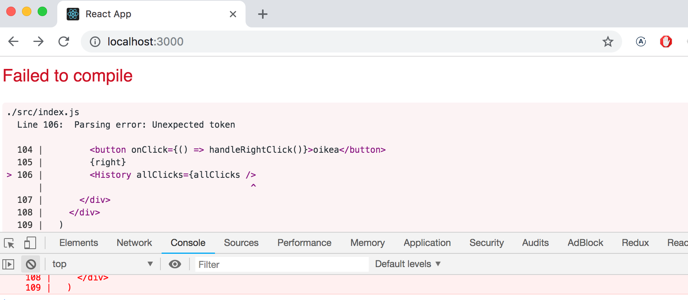

<!-- älä kirjota enää lisää koodia vaan selvitä ongelma **välittömästi**. Koodauksen historia ei tunne tilannetta, missä kääntymätön koodi alkaisi ihmeenomaisesti toimimaan kirjoittamalla suurta määrää lisää koodia, enkä usko että sellaista ihmettä nähdään tälläkään kurssilla. -->

don't write more code but rather find and fix the problem **immediately**. There has yet to be a moment in the history of coding where code that fails to compile would miraculously start working after writing large amounts of additional code. I highly doubt that such an event will occur during this course either.

<!-- Vanha kunnon printtaukseen perustuva debuggaus kannattaa aina. Eli jos esim. komponentissa -->
Old school, print based debugging is rarely a bad idea. If, e.g. the component

```js
const Button = ({ handleClick, text }) => (
  <button onClick={handleClick}>
    {text}
  </button>
)
```

<!-- olisi jotain ongelmia, kannattaa komponentista alkaa printtailla konsoliin. Pystyäksemme printtaamaan, tulee funktio muuttaa pitempään muotoon ja propsit kannattaa kenties vastaanottaa ilman destrukturointia: -->
is not working as intended, it's useful to start printing its variables out to the console. In order to do this effectively, we must transform our function into the less compact form and receive the entire props project without destructuring it immediately:

```js
const Button = (props) => { 
  console.log(props) // highlight-line
  const { handleClick, text } = props
  return (
    <button onClick={handleClick}>
      {text}
    </button>
  )
}
```

<!-- näin selviää heti onko esim. joku propsia vastaava attribuutti nimetty väärin komponenttia käytettäessä. -->
this will immediately reveal if e.g. one of the attributes has been misspelled when using the component.

<!-- **HUOM** kun käytät komentoa _console.log_ debuggaukseen, älä yhdistele asioita "javamaisesti" plussalla, eli sen sijaan että kirjoittaisit -->

**NB** when you use _console.log_ for debugging, don't combine objects in a Java-like fashion by  using a plus. Instead of writing

```js
console.log('propsin arvo on' + props)
```

<!-- erottele tulostettavat asiat pilkulla: -->
separate the the things you want to log to the console with a comma:

```js
console.log('propsin arvo on', props)
```

<!-- Jos yhdistät merkkijonoon olion, tuloksena on suhteellisen hyödytön tulostusmuoto -->
If you use Java-like way of combine a string with an object you will end up with a rather uninformative log message

```js
propsin arvo on [Object object]
```

<!-- kun taas pilkulla tulostettavat asiat erotellessa saat developer-konsoliin olion, jonka sisältöä on mahdollista tarkastella. -->
whereas the items separated by a comma will all be available in the browser console for further inspection.

<!-- Konsoliin tulostus ei ole suinkaan ainoa keino debuggaamiseen. Koodin suorituksen voi pysäyttää Chromen developer konsolin <i>debuggeriin</i> kirjoittamalla mihin tahansa kohtaa koodia komennon [debugger](https://developer.mozilla.org/en-US/docs/Web/JavaScript/Reference/Statements/debugger). -->
Logging to the console is by no means the only way of debugging our applications. You can pause the execution of your application code in the Chrome developer console's <i>debugger</i> by writing the command [debugger](https://developer.mozilla.org/en-US/docs/Web/JavaScript/Reference/Statements/debugger) anywhere in your code.

<!-- Koodi pysähtyy kun suoritus etenee sellaiseen pisteeseen, missä komento _debugger_ suoritetaan: -->
The execution will pause once it arrives at a point where the _debugger_ command gets executed:

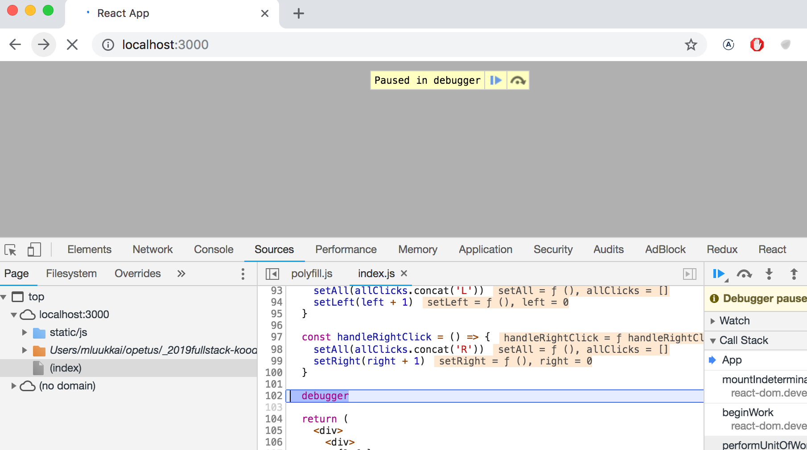

<!-- Menemällä välilehdelle <i>Console</i> on helppo tutkia muuttujien tilaa: -->
By going to the <i>Console</i>  tab it is easy to inspect the current state of variables:

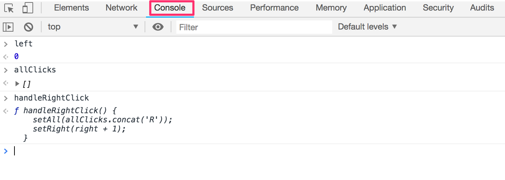

<!-- Kun bugi selviää, voi komennon _debugger_ poistaa ja uudelleenladata sivun. -->
Once the cause of the bug is discovered you can remove the _debugger_ command and refresh the page.

<!-- Debuggerissa on mahdollista suorittaa koodia tarvittaessa rivi riviltä <i>Source</i> välilehden oikealta laidalta. -->
The debugger also enables us to execute our code line by line with the controls found in the right-hand side of the <i>Source</i> tab.

<!-- Debuggeriin pääsee myös ilman komentoa _debugger_, lisäämällä <i>Source</i>-välilehdellä sopiviin kohtiin koodia <i>breakpointeja</i>. Komponentin muuttujien arvojen tarkkailu on mahdollista _Scope_-osassa: -->
You can also access the debugger with the _debugger_ command by adding break points in the <i>Sources</i> tab. Inspecting the values of the component's variable can be done in the _Scope_-section:

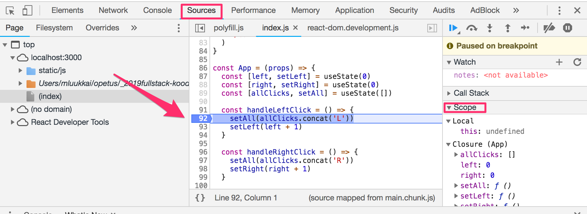

<!-- Chromeen kannattaa ehdottomasti asentaa [React developer tools](https://chrome.google.com/webstore/detail/react-developer-tools/fmkadmapgofadopljbjfkapdkoienihi) -lisäosa, joka tuo konsoliin uuden tabin _React_: -->
It is highly recommended to install the [React developer tools](https://chrome.google.com/webstore/detail/react-developer-tools/fmkadmapgofadopljbjfkapdkoienihi) extension to Chrome which adds a new _React_ tab to the developer tools.

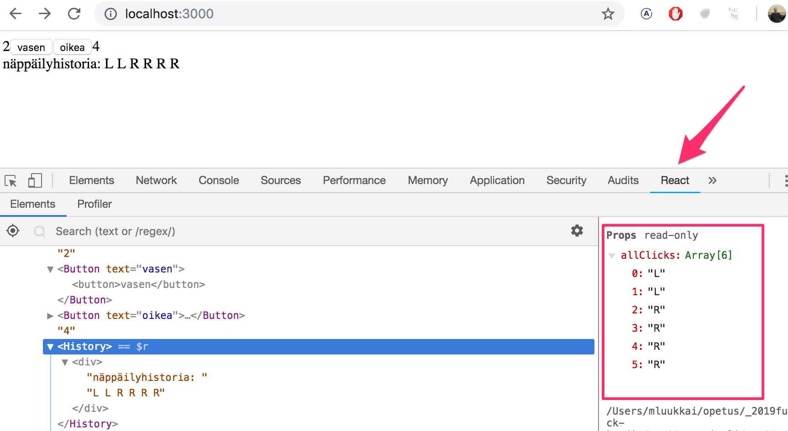

<!-- Uuden konsolitabin avulla voidaan tarkkailla sovelluksen React-elementtejä ja niiden tilaa ja propseja. -->
The new _React_ developer tools tab can be used to inspect the different React elements in the application along with their state and props.

<!-- React developer tools ei osaa toistaiseksi näyttää hookeilla muodostettua tilaa parhaalla mahdollisella tavalla. -->
Unfortunately the current version of React developer tools leaves something to be desired when displaying component state created with hooks:

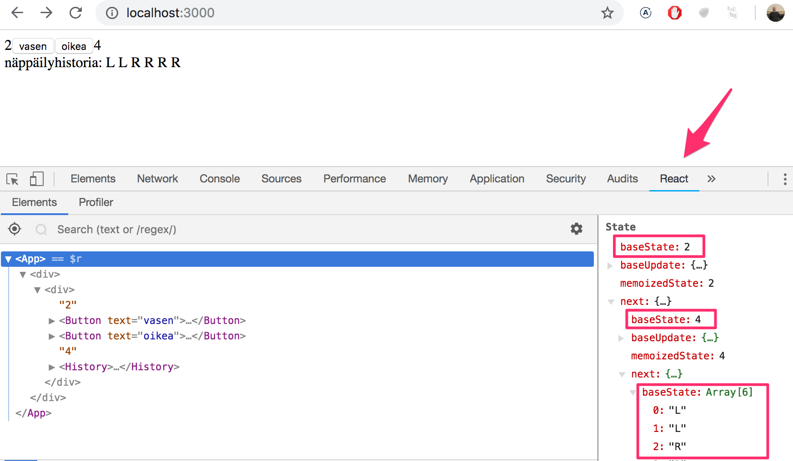

<!-- Komponentin tila on määritelty seuraavasti: -->
The component state was defined like so:

```js
const [left, setLeft] = useState(0)
const [right, setRight] = useState(0)
const [allClicks, setAll] = useState([])
```

<!-- Konsolin ylimpänä oleva <i>baseState</i> kertoo ensimmäisen _useState_-kutsun määrittelevän tilan, eli muuttujan _left_ arvon, seuraava <i>baseState</i> kertoo muuttujan _right_ arvon ja taulukon _allClicks_ arvo on alimpana. -->
The topmost <i>baseState</i> shows the current value of the first piece of state defined with the _useState_ hook which in our case is the _left_ variable. The next <i>baseState</i> shows the value of the _right_ variable and the value of the _allClicks_ array is shown last.

<!-- ### Hookien säännöt -->
### Rules of Hooks

<!-- Jotta hookeilla muodostettu sovelluksen tila toimisi oikein, on hookeja käytettävä tiettyjä [rajoituksia](https://reactjs.org/docs/hooks-rules.html) noudattaen. -->
There's a few limitations and rules we have to follow to ensure that our application using hooks based state functions correctly.

<!-- Funktiota _useState_ (eikä seuraavassa osassa esiteltävää funktiota _useEffect_) <i>ei saa kutsua</i> loopissa, ehtolausekkeiden sisältä tai muista kun komponentin määrittelevästä funktioista. Tämä takaa sen, että hookeja kutsutaan aina samassa järjestyksessä, jos näin ei ole, sovellus toimii miten sattuu. -->
The _useState_ function (as well as the _useEffect_ function introduced later on in the course) <i>must not be called</i> from inside of a loop, a conditional expression or any place that is not a function defining a component. This must be done to ensure that the hooks are always called in the same order, and if this isn't the case the application will behave erratically.

<!-- Hookeja siis kuuluu kutsua ainoastaan React-komponentin määrittelevän funktion rungosta: -->
To recap, hooks may only be called from inside of a function body that defines a React component:

```js
const App = (props) => {
  // nämä ovat ok
  const [age, setAge] = useState(0)
  const [name, setName] = useState('Juha Tauriainen')

  if ( age > 10 ) {
    // ei näin!
    const [foobar, setFoobar] = useState(null)
  }

  for ( let i = 0; i < age; i++ ) {
    // eikä näin!
    const [rightWay, setRightWay] = useState(false)
  }

  const notGood = () => {
    // eikä myöskään näin
    const [x, setX] = useState(-1000)
  }

  return (
    //...
  )
}
```

<!-- ### Tapahtumankäsittely revisited -->
### Event Handling Revisited

<!-- Edellisen vuoden kurssin perusteella tapahtumankäsittely on osoittautunut monelle haastavaksi. -->
Event handling has proven to be a difficult topic in previous iterations of this course.

<!-- Tarkastellaan asiaa vielä uudelleen. -->
For this reason we will revisit the topic.

<!-- Oletetaan, että käytössä on äärimmäisen yksinkertainen sovellus: -->
Let's assume that we're developing this simple application:
```js
const App = (props) => {
  const [value, setValue] = useState(10)

  return (
    <div>
      {value}
      <button>nollaa</button>
    </div>
  )
}

ReactDOM.render(
  <App />, 
  document.getElementById('root')
)
```

<!-- Haluamme, että napin avulla tilan tallettava muuttuja _value_ saadaan nollattua. -->
We want the clicking of the button to reset the state stored in the _value_ variable.

<!-- Jotta saamme napin reagoimaan, on sille lisättävä <i>tapahtumankäsittelijä</i>. -->
In order to make the button react to a click event we have add an <i>event handler</i> to it.

<!-- Tapahtumankäsittelijän tulee aina olla <i>funktio</i> tai viite funktioon. Jos tapahtumankäsittelijän paikalle yritetään laittaa jotain muuta, ei nappi toimi. -->
Event handlers must always be a function or a reference to a function. The button will not work if the event handler is set to a variable of any other type.

<!-- Jos esim. antaisimme tapahtumankäsittelijäksi merkkijonon: -->
If we were to define the event handler as a string:
```js
<button onClick={'roskaa'}>nappi</button>
```

<!-- React varoittaa asiasta konsolissa -->
React will warn us about this in the console:

```js
index.js:2178 Warning: Expected `onClick` listener to be a function, instead got a value of `string` type.
    in button (at index.js:20)
    in div (at index.js:18)
    in App (at index.js:27)
```

<!-- myös seuraavanlainen yritys olisi tuhoon tuomittu -->
The following attempt will also not work:

```js
<button onClick={value + 1}>nappi</button>
```

<!-- nyt tapahtumankäsittelijäksi on yritetty laittaa _value + 1_ mikä tarkoittaa laskuoperaation tulosta. React varoittaa tästäkin konsolissa -->
we have attempted to set the event handler to _value + 1_ which simply returns the result of the operation. React will kindly warn us about this in the console

```js
index.js:2178 Warning: Expected `onClick` listener to be a function, instead got a value of `number` type.
```

<!-- Myöskään seuraava ei toimi -->
This attempt will not work either:
```js
<button onClick={value = 0}>nappi</button>
```

<!-- taaskaan tapahtumankäsittelijänä ei ole funktio vaan sijoitusoperaatio. Konsoliin tulee valitus. Tämä tapa on myös toisella tavalla väärin. Tilan muuttaminen ei onnistu suoraan tilan arvon tallentavaa muuttujaa muuttamalla. -->
The event handler is not a function but a variable assignment and React will once again issue a warning to the console. This attempt is also flawed in the sense that we must never mutate state directly in React.

<!-- Entä seuraava: -->
What about the following:

```js
<button onClick={console.log('nappia painettu')}>
  nappi
</button>
```

<!-- konsoliin tulostuu kertaalleen <i>nappia painettu</i>, mutta nappia painellessa ei tapahdu mitään. Miksi tämä ei toimi vaikka tapahtumankäsittelijänä on nyt funktio _console.log_? -->
The message gets printed to the console once but nothing happens when we click the button a second time. Why does this not work even when our event handler contains a function _console.log_?

<!-- Ongelma on nyt siinä, että tapahtumankäsittelijänä on <i>funktion kutsu</i>, eli varsinaiseksi tapahtumankäsittelijäksi tulee funktion kutsun paluuarvo, joka on tässä tapauksessa määrittelemätön arvo <i>undefined</i>. -->
The issue here is that our event handler is defined as a <i>function call</i> which means that the event handler is actually assigned the returned value from the function which in the case of _console.log_ is <i>undefined</i>.

<!-- Funktiokutsu _console.log('nappia painettu')_ suoritetaan siinä vaiheessa kun komponentti renderöidään, ja tämän takia konsoliin tulee tulostus kertalleen. -->
The _console.log_ function call gets executed when the component is rendered and for this reason it gets printed once to the console.

<!-- Myös seuraava yritys on virheellinen -->
The following attempt is flawed as well
```js
<button onClick={setValue(0)}>nappi</button>
```

<!-- jälleen olemme yrittäneet laittaa tapahtumankäsittelijäksi funktiokutsun. Ei toimi. Tämä yritys aiheuttaa myös toisen ongelman. Kun komponenttia renderöidään, suoritetaan tapahtumankäsittelijänä oleva funktiokutsu _setValue(0)_ joka taas saa aikaan komponentin uudelleenrenderöinnin. Ja uudelleenrenderöinnin yhteydessä funktiota kutsutaan uudelleen käynnistäen jälleen uusi uudelleenrenderöinti, ja joudutaan päättymättömään rekursioon. -->
We have once again tried to set a function call as the event handler. This does not work. This particular attempt also causes another problem. When the component is rendered the function _setValue(0)_ gets executed which in turn causes the component to be re-rendered. Re-rendering in turn calls the _setValue(0)_ again resulting in an infinite recursion.

<!-- Jos haluamme suorittaa tietyn funktiokutsun tapahtuvan nappia painettaessa, toimii seuraava -->
Executing a particular function call when the button is clicked can be accomplished like this:

```js
<button onClick={() => console.log('nappia painettu')}>
  nappi
</button>
```

<!-- Nyt tapahtumankäsittelijä on nuolisyntaksilla määritelty funktio _() => console.log('nappia painettu')_. Kun komponentti renderöidään, ei suoriteta mitään, ainoastaan talletetaan funktioviite tapahtumankäsittelijäksi. Itse funktion suoritus tapahtuu vasta napin painallusten yhteydessä. -->
Now the event handler is a function defined with the arrow function syntax _() => console.log('nappia painettu')_. When the component gets rendered on function call is executed, only the reference to the arrow function is set to the event handler. Calling the function happens only once the button is clicked.

<!-- Saamme myös nollauksen toimimaan samalla tekniikalla -->
We can implement resetting the state in our application with this same technique

```js
<button onClick={() => setValue(0)}>nappi</button>
```

<!-- eli nyt tapahtumankäsittelijä on funktio _() => setValue(0)_. -->
The event handler is now the function _() => setValue(0)_.

<!-- Tapahtumakäsittelijäfunktioiden määrittely suoraan napin määrittelyn yhteydessä ei välttämättä ole paras mahdollinen idea. -->
Defining event handlers directly in the attribute of the button is not necessarily the best possible idea.

<!-- Usein tapahtumankäsittelijä määritelläänkin jossain muualla. Seuraavassa määritellään funktio ja sijoitetaan se muuttujaan _handleClick_ komponentin rungossa: -->
You will often see event handlers defined in a separate place. In the following version of our application we define a function that then gets assigned to the _handleClick_ variable in the body of the component function:

```js
const App = (props) => {
  const [value, setValue] = useState(10)

  const handleClick = () =>
    console.log('nappia painettu')

  return (
    <div>
      {value}
      <button onClick={handleClick}>nappi</button>
    </div>
  )
}
```

<!-- Muuttujassa _handleClick_ on nyt talletettuna viite itse funktioon. Viite annetaan napin määrittelyn yhteydessä attribuutin <i>onClick</i>: -->
The _handleClick_ variable is now assigned to a reference to the function. The reference is passed to the button as the <i>onClick</i> attribute:

```js
<button onClick={handleClick}>nappi</button>
```

<!-- Tapahtumankäsittelijäfunktio voi luonnollisesti koostua useista komennoista, tällöin käytetään nuolifunktion aaltosulullista muotoa: -->
Naturally, our event handler function can be composed of multiple commands. In these cases we use the longer curly brace syntax for arrow functions:

```js
const App = (props) => {
  const [value, setValue] = useState(10)

  // highlight-start
  const handleClick = () => {
    console.log('nappia painettu')
    setValue(0)
  }
   // highlight-end

  return (
    <div>
      {value}
      <button onClick={handleClick}>nappi</button>
    </div>
  )
}
```

<!-- Mennään lopuksi <i>funktion palauttavaan funktioon</i>. Kuten aiemmin jo mainittiin, et tarvitse ainakaan tämän osan, et kenties koko kurssin tehtävissä funktiota palauttavia funktioita, joten voit melko huoletta hypätä seuraavan ohi jos asia tuntuu nyt hankalalta. -->
Finally, let us revisit <i>functions that return functions</i>. As mentioned previously, you will probably not need to use functions that return functions in any of the exercises in this course.  If the topic seems particularly confusing you may skip over this section for now and return to it later.

<!-- Muutetaan koodia seuraavasti -->
Let's make the following changes to our code

```js
const App = (props) => {
  const [value, setValue] = useState(10)

  // highlight-start
  const hello = () => {
    const handler = () => console.log('hello world')

    return handler
  }
  // highlight-end

  return (
    <div>
      {value}
      <button onClick={hello()}>nappi</button>
    </div>
  )
}
```

<!-- Koodi näyttää hankalalta mutta se ihme kyllä toimii. -->
The code functions correctly even though it looks complicated. 

<!-- Tapahtumankäsittelijäksi on nyt "rekisteröity" funktiokutsu: -->
The event handler is now set to a function call. 

```js
<button onClick={hello()}>nappi</button>
```

<!-- Aiemmin varoteltiin, että tapahtumankäsittelijä ei saa olla funktiokutsu vaan sen on oltava funktio tai viite funktioon. Miksi funktiokutsu kuitenkin toimii nyt? -->
Earlier on we stated that an event handler may not be a call to a function, it has to be a function or a reference to a function. Why then does a function call work in this case?

<!-- Kun komponenttia renderöidään suoritetaan seuraava funktio: -->
When the component is rendered the following function gets executed:

```js
const hello = () => {
  const handler = () => console.log('hello world')

  return handler
}
```

<!-- funktion <i>paluuarvona</i> on nyt toinen, muuttujaan _handler_ määritelty funktio. -->
then <i>return value</i> of the function is another function that is assigned to the _handler_ variable.

<!-- eli kun react renderöi seuraavan rivin -->
When React renders the line

```js
<button onClick={hello()}>nappi</button>
```

<!-- sijoittaa se onClick-käsittelijäksi funktiokutsun _hello()_ paluuarvon. Eli oleellisesti ottaen rivi "muuttuu" seuraavaksi -->
It assigns the return value of _hello()_ to the onClick-attribute. Essentially the line gets transformed into

```js
<button onClick={() => console.log('hello world')}>
  nappi
</button>
```

<!-- koska funktio _hello_ palautti funktion, on tapahtumankäsittelijä nyt funktio. -->
Since the _hello_ function returns a function, the event handler is now a function.

<!-- Mitä järkeä tässä konseptissa on? -->
What's the point of this concept?

<!-- Muutetaan koodia hiukan: -->
Let's change the code a tiny bit:

```js
const App = (props) => {
  const [value, setValue] = useState(10)

  // highlight-start
  const hello = (who) => {
    const handler = () => {
      console.log('hello', who)
    }

    return handler
  }
  // highlight-end  

  return (
    <div>
      {value}
  // highlight-start      
      <button onClick={hello('world')}>nappi</button>
      <button onClick={hello('react')}>nappi</button>
      <button onClick={hello('function')}>nappi</button>
  // highlight-end      
    </div>
  )
}
```

<!-- Nyt meillä on kolme nappia joiden tapahtumankäsittelijät määritellään parametrin saavan funktion _hello_ avulla. -->
Now the application has three buttons with event handlers defined by the _hello_ function that accepts a parameter.

<!-- Ensimmäinen nappi määritellään seuraavasti -->
The first button is defined as

```js
<button onClick={hello('world')}>nappi</button>
```

<!-- Tapahtumankäsittelijä siis saadaan <i>suorittamalla</i> funktiokutsu _hello('world')_. Funktiokutsu palauttaa funktion -->
The event handler is created by <i>executing</i> the function call _hello('world')_. The function call returns the function

```js
() => {
  console.log('hello', 'world')
}
```

<!-- Toinen nappi määritellään seuraavasti -->
The second button is defined as

```js
<button onClick={hello('react')}>nappi</button>
```

<!-- Tapahtumankäsittelijän määrittelevä funktiokutsu _hello('react')_ palauttaa -->
The function call _hello('react')_ that creates the event handler returns

```js
() => {
  console.log('hello', 'react')
}
```

<!-- eli molemmat napit saavat oman, yksilöllisen tapahtumankäsittelijänsä. -->
Both buttons get their own individualized event handlers.

<!-- Funktioita palauttavia funktioita voikin hyödyntää määrittelemään geneeristä toiminnallisuutta, jota voi tarkentaa parametrien avulla. Tapahtumankäsittelijöitä luovan funktion _hello_ voikin ajatella olevan eräänlainen tehdas, jota voi pyytää valmistamaan sopivia tervehtimiseen tarkoitettuja tapahtumankäsittelijäfunktioita. -->
Functions returning functions can be utilized in defining generic functionality that can be customized with parameters. The _hello_ function that creates the event handlers can be thought of as a factory, that produces customized event handlers meant for greeting users.

<!-- Käyttämämme määrittelytapa -->
Our current definition is slightly verbose.

```js
const hello = (who) => {
  const handler = () => {
    console.log('hello', who)
  }

  return handler
}
```

<!-- on hieman verboosi. Eliminoidaan apumuuttuja, ja määritellään palautettava funktio suoraan returnin yhteydessä: -->
Let's eliminate the helper variables and directly return the created function:

```js
const hello = (who) => {
  return () => {
    console.log('hello', who)
  }
}
```

<!-- ja koska funktio _hello_ sisältää ainoastaan yhden komennon, eli returnin, voidaan käyttää aaltosulutonta muotoa -->
Since our _hello_ function is composed of a single return command we can omit the curly braces and use the more compact syntax for arrow functions.

```js
const hello = (who) =>
  () => {
    console.log('hello', who)
  }
```

<!-- ja tuodaan vielä "kaikki nuolet" samalle riville -->
Lastly, let's write "all of the arrows" on the same line

```js
const hello = (who) => () => {
  console.log('hello', who)
}
```

<!-- Voimme käyttää samaa kikkaa myös muodostamaan tapahtumankäsittelijöitä, jotka asettavat komponentin tilalle halutun arvon. Muutetaan koodi muotoon: -->
We can use the same trick to define event handlers that set the state of the component to a given value. Let's make the following changes to our code:

```js
render() {
  const setToValue = (newValue) => () => {
    setValue(newValue)
  }

  return (
    <div>
      {value}
      <button onClick={setToValue(1000)}>tuhat</button>
      <button onClick={setToValue(0)}>nollaa</button>
      <button onClick={setToValue(value + 1)}>kasvata</button>
    </div>
  )
}
```

<!-- Kun komponentti renderöidään, ja tehdään nappia <i>tuhat</i> -->
When the component is rendered the <i>tuhat</i> button is created

```js
<button onClick={setToValue(1000)}>tuhat</button>
```

<!-- tulee tapahtumankäsittelijäksi funktiokutsun _setToValue(1000)_ paluuarvo eli seuraava funktio -->
the event handler is set to the return value of _setToValue(1000)_ which is the following function

```js
() => {
    setValue(1000)
}
```

<!-- Kasvatusnapin generoima rivi on seuraava -->
The row generated for the increase button is the following

```js
<button onClick={setToValue(value + 1)}>kasvata</button>
```

<!-- Tapahtumankäsittelijän muodostaa funktiokutsu _setToValue(value + 1)_, joka saa parametrikseen tilan tallettavan muuttujan _value_ nykyisen arvon kasvatettuna yhdellä. Jos _value_ olisi 10, tulisi tapahtumankäsittelijäksi funktio -->
The event handler is created by the function call _setToValue(value + 1)_ which receives as its parameter the current value of the state variable _value_ increased by one. If the value of _value_ was 10, then the created event handler would be the function

```js
() => {
  setValue(11)
}
```

<!-- Funktioita palauttavia funktioita ei tässäkään tapauksessa olisi ollut pakko käyttää. Muutetaan tilan päivittämisestä huolehtiva funktio _setToValue_ normaaliksi funktioksi: -->
Using functions that return functions is not required to achieve this functionality. Let's return the _setToValue_ function that is response for updating state into a normal function:

```js
const App = (props) => {
  const [value, setValue] = useState(10)

  const setToValue = (newValue) => {
    setValue(newValue)
  }

  return (
    <div>
      {value}
      <button onClick={() => setToValue(1000)}>
        tuhat
      </button>
      <button onClick={() => setToValue(0)}>
        nollaa
      </button>
      <button onClick={() => setToValue(value + 1)}>
        kasvata
      </button>
    </div>
  )
}
```

<!-- Voimme nyt määritellä tapahtumankäsittelijän funktioksi, joka kutsuu funktiota _setToValue_ sopivalla parametrilla, esim. nollaamisen tapahtumankäsittelijä: -->
We can now define the event handler as a function that calls the _setToValue_ function with an appropriate parameter. The event handler for resetting the application state would be:

```js
<button onClick={() => setToValue(0)}>nollaa</button>
```

<!-- On aikalailla makuasia käyttääkö tapahtumankäsittelijänä funktioita palauttavia funktioita vai nuolifunktioita. -->
Choosing between the two presented ways of defining your event handlers is mostly a matter of taste.

<!-- ### Tapahtumankäsittelijän vieminen alikomponenttiin -->
### Passing Event Handlers to Child Components

<!-- Eriytetään vielä painike omaksi komponentikseen -->
Let's extract the button into its own component

```js
const Button = (props) => (
  <button onClick={props.handleClick}>
    {props.text}
  </button>
)
```

<!-- Komponentti saa siis propsina _handleClick_ tapahtumankäsittelijän ja propsina _text_ merkkijonon, jonka se renderöi painikkeen tekstiksi. -->
The component gets the event handler function from the _handleClick_ prop and the text of the button from the _text_ prop.

<!-- Komponentin <i>Button</i> käyttö on helppoa, on toki pidettävä huolta siitä, että komponentille annettavat propsit on nimetty niin kuin komponentti olettaa: -->
Using the <i>Button</i> component is simple, although we have to make sure that the we use the correct attribute names when passing props to the component.

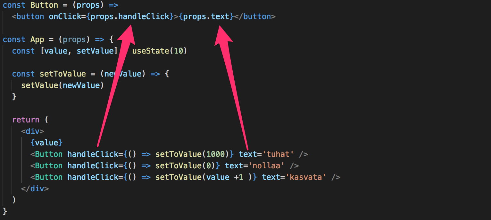

<!-- ### Älä määrittele komponenttia komponentin sisällä -->
### Do Not Define Components Within Components

<!-- Eriytetään vielä sovelluksestamme luvun näyttäminen omaan komponenttiin <i>Display</i>. -->
Let's extract displaying the value of the application into its own <i>Display</i> component.

<!-- Muutetaan ohjelmaa seuraavasti, eli määritelläänkin uusi komponentti <i>App</i>-komponentin sisällä: -->
We will change the application by defining a new component inside of the <i>App</i>-component.

```js
// tämä on oikea paikka määritellä komponentti!
const Button = (props) => (
  <button onClick={props.handleClick}>
    {props.text}
  </button>
)

const App = props => {
  const [value, setValue] = useState(10)

  const setToValue = newValue => {
    setValue(newValue)
  }

  // älä määrittele komponenttia täällä!
  const Display = props => <div>{props.value}</div> // highlight-line

  return (
    <div>
      <Display value={value} />
      <Button handleClick={() => setToValue(1000)} text="tuhat" />
      <Button handleClick={() => setToValue(0)} text="nollaa" />
      <Button handleClick={() => setToValue(value + 1)} text="kasvata" />
    </div>
  )
}
```

<!-- Kaikki näyttää toimivan. Mutta **älä tee koskaan näin!**, eli määrittele komponenttia toisen komponentin sisällä. Tapa on hyödytön ja johtaa useissa tilanteissa ikäviin ongelmiin. Siirretäänkin komponentin <i>Display</i> määrittely oikeaan paikkaan, eli komponentin <i>App</i> määrittelevän funktion ulkopuolelle: -->
The application still appears to work but **don't implement components like this!** Never define components inside of other components. The method provides no benefits and leads to many unpleasant problems. Let's instead move the <i>Display</i> component function to its correct place which is outside of the <i>App</i> component function:

```js
const Display = props => <div>{props.value}</div>

const Button = (props) => (
  <button onClick={props.handleClick}>
    {props.text}
  </button>
)

const App = props => {
  const [value, setValue] = useState(10)

  const setToValue = newValue => {
    setValue(newValue)
  }

  return (
    <div>
      <Display value={value} />
      <Button handleClick={() => setToValue(1000)} text="tuhat" />
      <Button handleClick={() => setToValue(0)} text="nollaa" />
      <Button handleClick={() => setToValue(value + 1)} text="kasvata" />
    </div>
  )
}
```

<!-- ### Hyödyllistä materiaalia -->
### Useful Material

<!-- Internetissä on todella paljon Reactiin liittyvää materiaalia. Tällä hetkellä ongelman muodostaa kuitenkin se, että käytämme kurssilla niin uutta Reactia, että suurin osa internetistä löytyvästä tavarasta on meidän kannaltamme vanhentunutta. -->
The internet is full of React-related material. However, we use such a new style of React that a large majority of the material found online is outdated for our purposes.

<!-- Seuraavassa muutamia linkkejä: -->
You may find the following links useful:

<!-- - Reactin [docs](https://reactjs.org/docs/hello-world.html) kannattaa ehdottomasti käydä jossain vaiheessa läpi, ei välttämättä kaikkea nyt, osa on ajankohtaista vasta kurssin myöhemmissä osissa ja kaikki Class-komponentteihin liittyvä on kurssin kannalta epärelevanttia
- Reactin sivuilla oleva [tutoriaali](https://reactjs.org/tutorial/tutorial.html) sen sijaan on aika huono
- [Egghead.io](https://egghead.io):n kursseista [Start learning React](https://egghead.io/courses/start-learning-react) on laadukas, ja hieman uudempi [The Beginner's guide to React](https://egghead.io/courses/the-beginner-s-guide-to-reactjs) on myös kohtuullisen hyvä; molemmat sisältävät myös asioita jotka tulevat tällä kurssilla vasta myöhemmissä osissa. Molemmissa toki se ongelma, että ne käyttävät Class-komponentteja -->
- The React [official documentation](https://reactjs.org/docs/hello-world.html) is worth checking out at some point, although most of it will become relevant only later on in the course. Also, everything related to Class-components is irrelevant to us.
- The official React [tutorial](https://reactjs.org/tutorial/tutorial.html) is not very good.
- Some courses on [Egghead.io](https://egghead.io) like [Start learning React](https://egghead.io/courses/start-learning-react) is of high quality, and the slightly newer [The Beginner's guide to React](https://egghead.io/courses/the-beginner-s-guide-to-reactjs) is also relatively good; both courses introduce concepts that will also be introduced later on in this course. However, both courses use Class components instead of the new functional ones used in this course.

</div>

<div class="tasks">
  <!-- <h3>Tehtäviä</h3> -->
  <h3>Exercises</h3>

<!-- Tehtävät palautetaan GitHubin kautta ja merkitsemällä tehdyt tehtävät [palautussovellukseen](https://studies.cs.helsinki.fi/fullstackopen2019/). -->
You submit your solutions to the exercises by first pushing your code to GitHub and then marking the completed exercises into the [exercise submission system](https://studies.cs.helsinki.fi/fullstackopen2019/).

<!-- Tehtävät palautetaan **yksi osa kerrallaan**. Kun olet palauttanut osan tehtävät, et voi enää palauttaa saman osan tekemättä jättämiäsi tehtäviä. -->
You submit all of your solutions to the exercise of one part **in a single submission.**. Once you have submitted your solutions for one part, you can not add more exercise solutions to your submission.

<!-- <i>Samaa ohjelmaa kehittelevissä tehtäväsarjoissa ohjelman lopullisen version palauttaminen riittää, voit toki halutessasi tehdä commitin jokaisen tehtävän jälkeisestä tilanteesta, mutta se ei ole välttämätöntä.</i> -->
<i>Some of the exercises work on the same application. In these cases it is sufficient to submit just the final version of the application. If you wish, you can make a commit after every finished exercise but it is not mandatory.</i>

<!-- **VAROITUS** create-react-app tekee projektista automaattisesti git-repositorion, ellei sovellusta luoda jo olemassaolevan repositorion sisälle. Todennäköisesti **et halua** että projektista tulee repositorio, joten suorita projektin juuressa komento _rm -rf .git_. -->
**WARNING** create-react-app will automatically turn your project into a git-repository unless you create your application inside of an existing git repository. It's likely that **do not want** you project to be a repository, so simply run the _rm -rf .git_ command at the root of your application.

<!-- **React ei toimi...** käyttäessäsi tilan tuovaa hookia <i>useState</i>, saatat törmätä seuraavaan virheilmoitukseen: -->
**React does not work...** you may run into the following error message once you start using the <i>useState</i> hook:

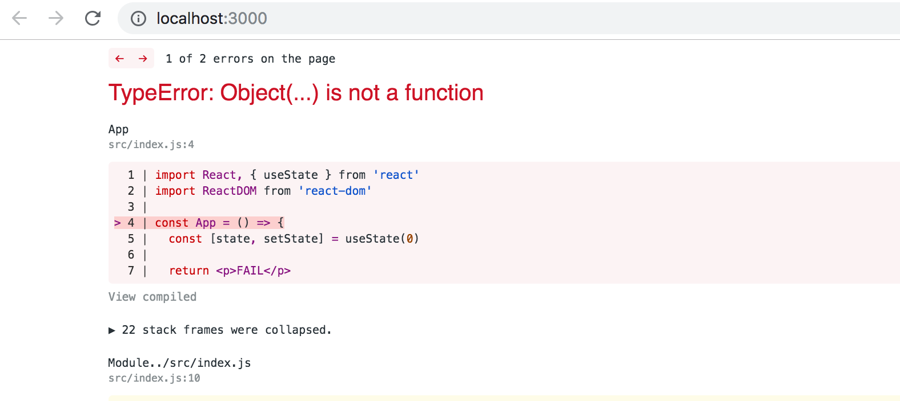

<!-- Syynä tälle on se, että <i>et ole asentanut</i> riittävän uutta Reactia kuten [osan 1 alussa](/osa1/reactin_alkeet) neuvottiin. -->
The reason for this is that <i>you have not installed</i> a new enough version of React as was instructed at [the beginning of part 1](/osa1/reactin_alkeet).

<!-- Joissain tilanteissa saatat myös joutua antamaan komennon -->
In some situations you may also have to run the command below from the root of the project

``` 
rm -rf node_modules/ && npm i
```

  <!-- <h4> 1.6: unicafe step1</h4> -->
  <h4> 1.6: unicafe step1</h4>

<!-- Monien firmojen tapaan nykyään myös [Unicafe](https://www.unicafe.fi/#/9/4) kerää asiakaspalautetta. Tee Unicafelle verkossa toimiva palautesovellus. Vastausvaihtoehtoja olkoon vain kolme: <i>hyvä</i>, <i>neutraali</i> ja <i>huono</i>. -->
Like most companies, [Unicafe](https://www.unicafe.fi/#/9/4) collects feedback from its customers. Your task is to implement a web application for collecting customer feedback. There are only three options for feedback: <i>good</i>, <i>neutral</i>, and <i>bad</i>.

<!-- Sovelluksen tulee näyttää jokaisen palautteen lukumäärä. Sovellus voi näyttää esim. seuraavalta: -->
The application must display the total amount of collected feedback for each category. Your final application could look like this:

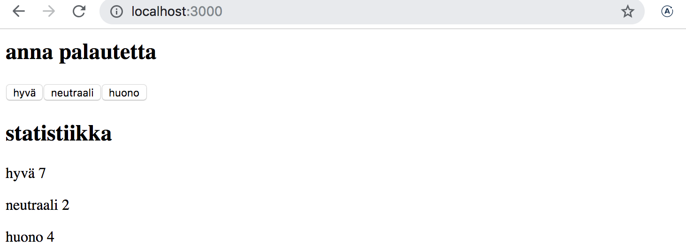

<!-- Huomaa, että sovelluksen tarvitsee toimia vain yhden selaimen käyttökerran ajan, esim. kun selain refreshataan, tilastot saavat hävitä. -->
Note that your application needs to work only during a single browser session. Once you refresh the page, the collected feedback is allowed to disappear.

<!-- Voit tehdä koko sovelluksen tiedostoon <i>index.js</i>. Tiedoston sisältö voi olla aluksi seuraava -->
You can implement the application in a single <i>index.js</i> file. You can use the code below as a starting point for your application.

```js
import React, { useState } from 'react'
import ReactDOM from 'react-dom'

const App = () => {
  // tallenna napit omaan tilaansa
  const [good, setGood] = useState(0)
  const [neutral, setNeutral] = useState(0)
  const [bad, setBad] = useState(0)

  return (
    <div>
      code here
    </div>
  )
}

ReactDOM.render(<App />, 
  document.getElementById('root')
)
```

<h4>1.7: unicafe step2</h4>

<!-- Laajenna sovellusta siten, että se näyttää palautteista enemmän statistiikkaa: yhteenlasketun määrän, keskiarvon (hyvän arvo 1, neutraalin 0, huonon -1) ja sen kuinka monta prosenttia palautteista on ollut positiivisia: -->
Expand your application so that it shows more statistics about the gathered feedback: the total number of collected feedback, the average score (good: 1, neutral: 0, bad: -1) and the percentage of positive feedback.

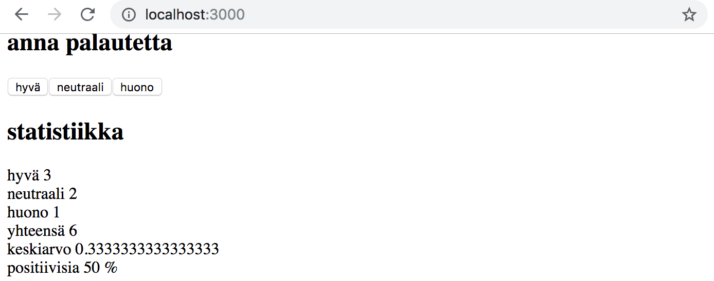

<h4>1.8: unicafe step3</h4>

<!-- Refaktoroi sovelluksesi siten, että tilastojen näyttäminen on eriytetty oman komponentin <i>Statistics</i> vastuulle. Sovelluksen tila säilyy edelleen juurikomponentissa <i>App</i>. -->
Refactor your application so that displaying the statistics is extracted into its own <i>Statistics</i> component. The state of the application should remain in the <i>App</i> root component.

<!-- Muista, että komponentteja ei saa määritellä toisen komponentin sisällä: -->
Remember that components should not be defined inside of other components:

```js
// oikea paikka komponentin määrittelyyn
const Statistics = (props) => {
  // ...
}

const App = () => {
  const [good, setGood] = useState(0)
  const [neutral, setNeutral] = useState(0)
  const [bad, setBad] = useState(0)

  // EI NÄIN!!! eli älä määrittele komponenttia 
  // toisen komponentin sisällä!
  const Statistics = (props) => {
    // ...
  }

  return (
    // ...
  )
}
```

<h4>1.9: unicafe step4</h4>

<!-- Muuta sovellusta siten, että numeeriset tilastot näytetään ainoastaan jos palautteita on jo annettu: -->
Change your application to display statistics only once feedback has been gathered.

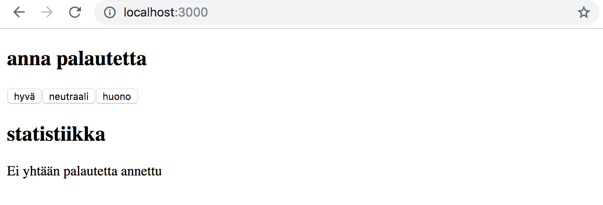

<h4>1.10: unicafe step5</h4>

<!-- Jatketaan sovelluksen refaktorointia. Eriytä seuraavat <i>kaksi</i> komponenttia -->
Let's continue refactoring the application. Extract the following two components:

<!-- - <i>Button</i> vastaa yksittäistä palautteenantonappia
- <i>Statistic</i> huolehtii tilastorivien, esim. keskiarvon näyttämisestä -->
- <i>Button</i> for defining the buttons used for submitting feedback
- <i>Statistic</i> for displaying a single statistic, e.g. the average score.

<!-- Tarkennuksena: komponentti <i>Statistic</i> näyttää aina yhden tilastorivin, joten sovellus käyttää montaa komponenttia kaikkien tilastorivien renderöintiin  -->
Clarification: the <i>Statistic</i> component always displays a single statistic, meaning that the application uses multiple components for rendering all of the statistics

```js
const Statistics = (props) => {
  /// ...
  return(
    <div>
      <Statistic text="hyvä" value ={...} />
      <Statistic text="neutraali" value ={...} />
      <Statistic text="huono" value ={...} />
      // ...
    </div>
  )
}

```

<!-- Sovelluksen tila säilytetään edelleen juurikomponentissa <i>App</i>. -->
The application's state should still be kept in the root component <i>App</i>.

<h4>1.11*: unicafe step6</h4>

<!-- Toteuta tilastojen näyttäminen HTML:n [taulukkona](https://developer.mozilla.org/en-US/docs/Learn/HTML/Tables/Basics) siten, että saat sovelluksesi näyttämään suunnilleen seuraavanlaiselta: -->
Display the statistics in an HTML [table](https://developer.mozilla.org/en-US/docs/Learn/HTML/Tables/Basics), so that your application looks roughly like this:

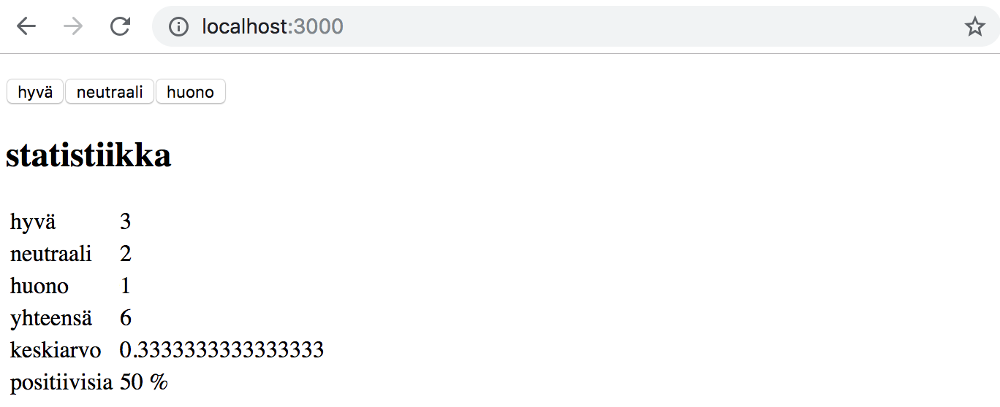

<!-- Muista pitää konsoli koko ajan auki. Jos saat konsoliin seuraavan warningin: -->
Remember to keep your console open at all times. If you see this warning in your console


<!-- tee tarvittavat toimenpiteet jotta saat warningin katoamaan. Googlaa tarvittaessa virheilmoituksella. -->
then perform the necessary actions to make the warning disappear. Try Googling the error message if you get stuck.

<!-- **Huolehdi nyt ja jatkossa, että konsolissa ei näy mitään warningeja!** -->
**Make sure that from now on you don't see any warnings in your console!**

<h4>1.12*: anecdotes step1</h4>

<!-- Ohjelmistotuotannossa tunnetaan lukematon määrä [anekdootteja](http://www.comp.nus.edu.sg/~damithch/pages/SE-quotes.htm) eli pieniä "onelinereita", jotka kiteyttävät alan ikuisia totuuksia. -->
The world of software engineering is filled with [anecdotes](http://www.comp.nus.edu.sg/~damithch/pages/SE-quotes.htm) that distill timeless truths from our field into short one-liners.

<!-- Laajenna seuraavaa sovellusta siten, että siihen tulee nappi, jota painamalla sovellus näyttää <i>satunnaisen</i> ohjelmistotuotantoon liittyvän anekdootin: -->
Expand the following application by adding that can be clicked to display a <i>random</i> anecdote from the field of software engineering: 

```js
import React, { useState } from 'react'
import ReactDOM from 'react-dom'

const App = (props) => {
  const [selected, setSelected] = useState(0)

  return (
    <div>
      {props.anecdotes[selected]}
    </div>
  )
}

const anecdotes = [
  'If it hurts, do it more often',
  'Adding manpower to a late software project makes it later!',
  'The first 90 percent of the code accounts for the first 90 percent of the development time...The remaining 10 percent of the code accounts for the other 90 percent of the development time.',
  'Any fool can write code that a computer can understand. Good programmers write code that humans can understand.',
  'Premature optimization is the root of all evil.',
  'Debugging is twice as hard as writing the code in the first place. Therefore, if you write the code as cleverly as possible, you are, by definition, not smart enough to debug it.'
]

ReactDOM.render(
  <App anecdotes={anecdotes} />,
  document.getElementById('root')
)
```

<!-- Google kertoo, miten voit generoida Javascriptilla sopivia satunnaisia lukuja. Muista, että voit testata esim. satunnaislukujen generointia konsolissa. -->
Google will tell you how to generate random numbers in JavaScript. Remember that you can test generating random numbers e.g. straight in the console of your browser.

<!-- Sovellus voi näyttää esim. seuraavalta: -->
Your finished application could look something like this:

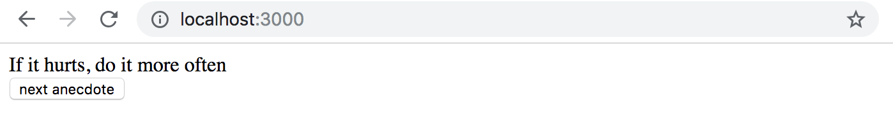

<!-- **VAROITUS** create-react-app tekee projektista automaattisesti git-repositorion, ellei sovellusta luoda jo olemassaolevan repositorion sisälle. Todennäköisesti **et halua** että projektista tulee repositorio, joten suorita projektin juuressa komento _rm -rf .git_. -->
**WARNING** create-react-app will automatically turn your project into a git-repository unless you create your application inside of an existing git repository. It's likely that **do not want** you project to be a repository, so simply run the _rm -rf .git_ command at the root of your application.

<h4>1.13*: anecdotes step2</h4>

<!-- Laajenna sovellusta siten, että näytettävää anekdoottia on mahdollista äänestää: -->
Expand your application so that you can vote for the displayed anecdote.

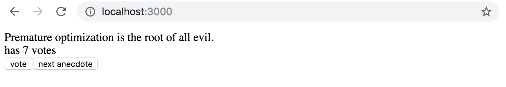

<!-- **Huom:** jos päätät tallettaa kunkin anekdootin äänet komponentin tilassa olevan olion kenttiin tai taulukkoon, saatat tarvita päivittäessäsi tilaa oikeaoppisesti olion tai taulukon <i>kopioimista</i>. -->
**NB** if you decide to store the votes of each anecdote into an array or object in the component's state, you should refer to the material to see the correct way of updating state stored into complex data structures like objects and arrays.

<!-- Olio voidaan kopioida esim. seuraavasti: -->
You can create a copy of an object like this:

```js
const points = { 0: 1, 1: 3, 2: 4, 3: 2 }

const copy = { ...points }
// kasvatetaan olion kentän 2 arvoa yhdellä
copy[2] += 1     
```

<!-- ja taulukko esim. seuraavasti: -->
And a copy of an array like this:

```js
const points = [1, 4, 6, 3]

const copy = [...points]
// kasvatetaan taulukon paikan 2 arvoa yhdellä
copy[2] += 1     
```

<!-- Yksinkertaisempi ratkaisu lienee nyt taulukon käyttö. Googlaamalla löydät paljon vihjeitä sille, miten kannattaa luoda halutun mittainen taulukko, joka on täytetty nollilla esim. [tämän](https://stackoverflow.com/questions/20222501/how-to-create-a-zero-filled-javascript-array-of-arbitrary-length/22209781). -->
Using an array might be the simpler choice in this case. Googling will provide you with lots of hints on how to create a zero-filled array of a desired length, like [this](https://stackoverflow.com/questions/20222501/how-to-create-a-zero-filled-javascript-array-of-arbitrary-length/22209781).

<h4>1.14*: anecdotes step3</h4>

<!-- Ja sitten vielä lopullinen versio, joka näyttää eniten ääniä saaneen anekdootin: -->
Now implement the final version of the application that displays the anecdote with the largest number of votes:

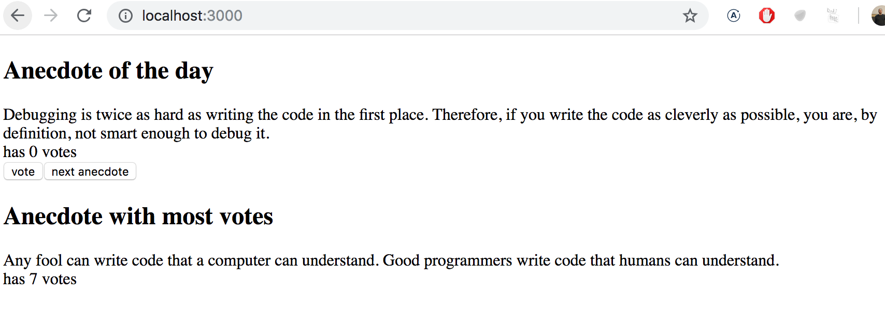

<!-- Jos suurimman äänimäärän saaneita anekdootteja on useita, riittää että niistä näytetään yksi. -->
If multiple anecdotes are tied for first place it is sufficient to just show one of them.

<!-- Tämä oli osan viimeinen tehtävä ja on aika pushata koodi githubiin sekä merkata tehdyt tehtävät [palautussovellukseen](https://studies.cs.helsinki.fi/fullstackopen2019). -->
This was the last exercise for this part of the course and it's time to push your code to GitHub and mark all of your finished exercises to the [exercise submission system](https://studies.cs.helsinki.fi/fullstackopen2019).

</div>
