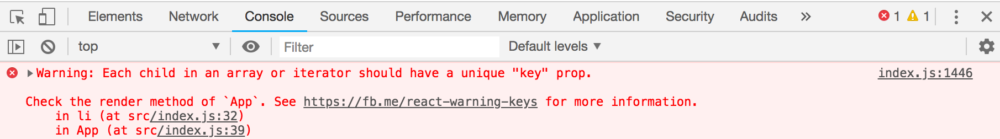
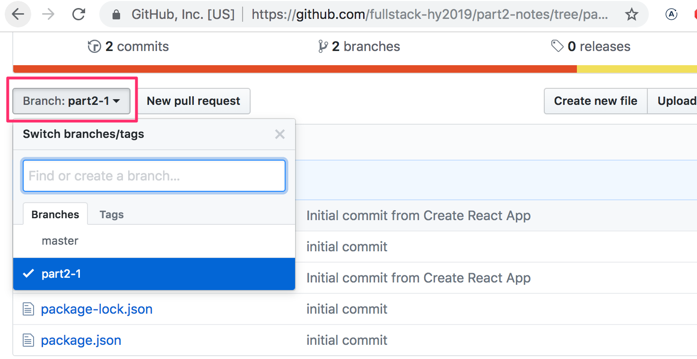
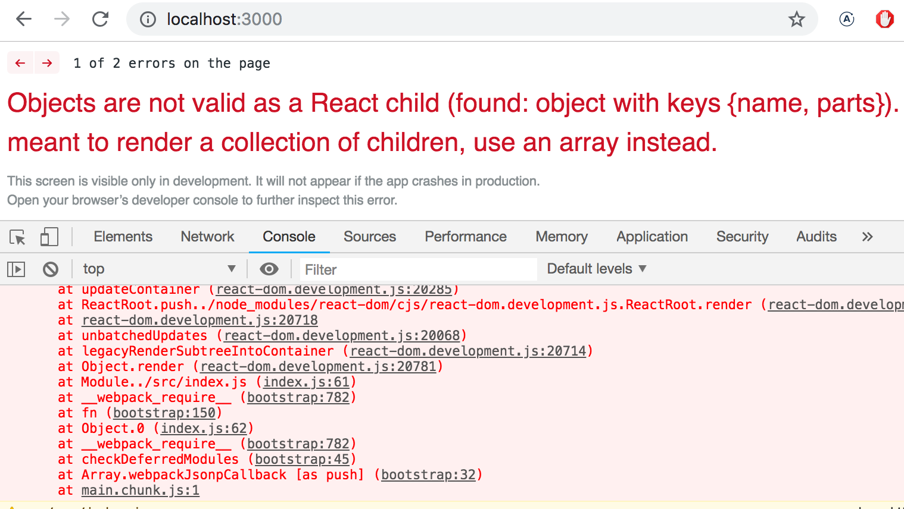
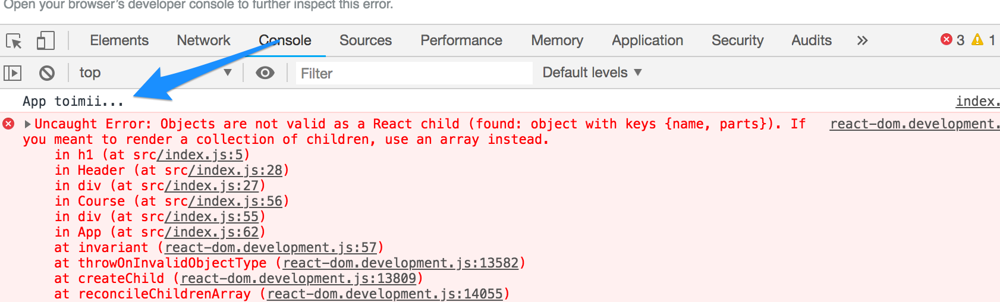
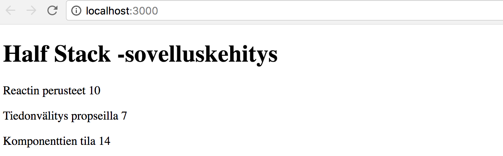
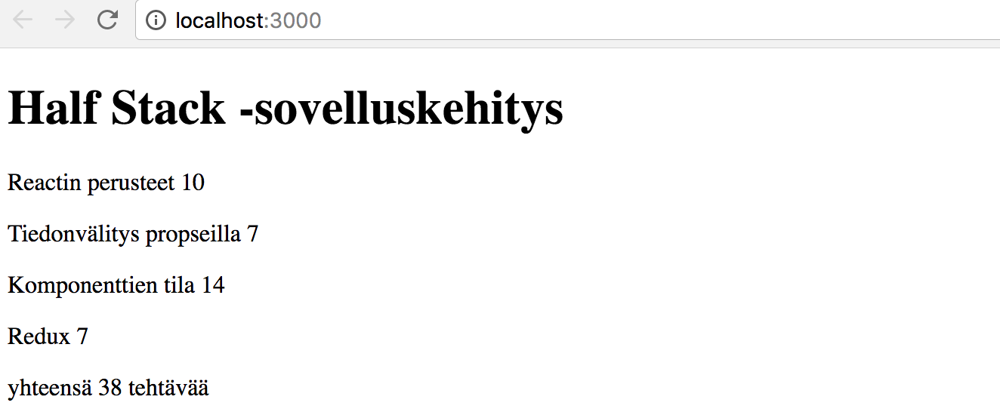
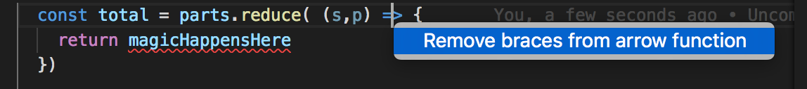
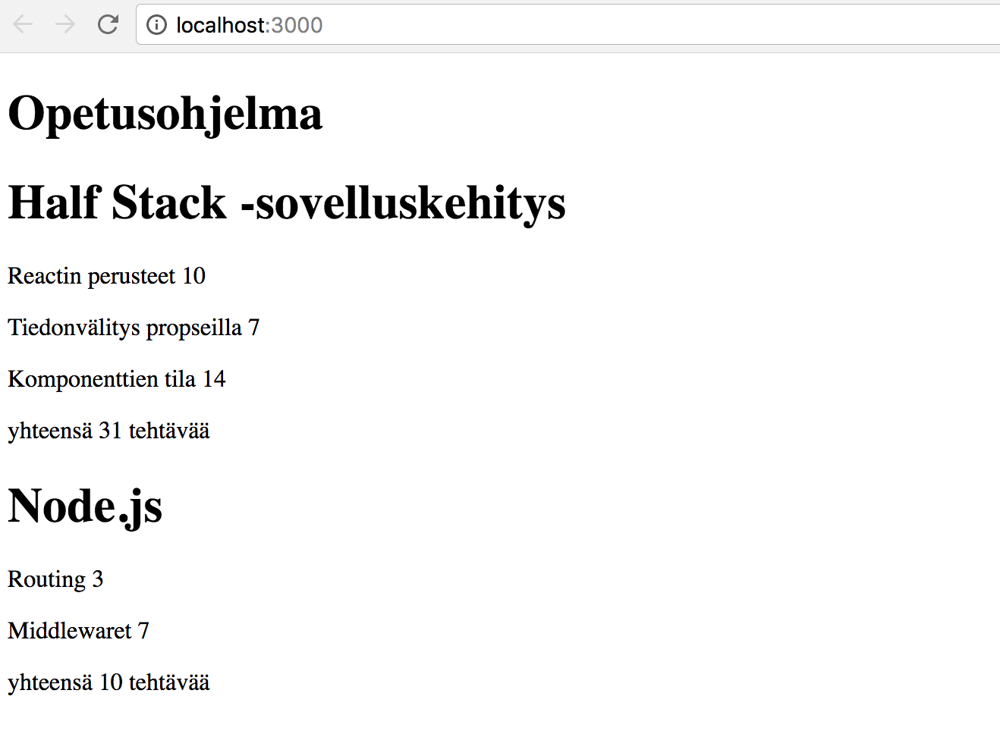

<div class="content">

<!-- Ennen kun menemme uuteen asiaan, nostetaan esiin muutama edellisen osan huomiota herättänyt seikka. -->
Before we go into a new topic, let's go through some topics which proved difficult last year. 

### console.log

<!-- **Mikä erottaa kokeneen ja kokemattoman Javascript-ohjelmoijan? Kokeneet käyttävät 10-100 kertaa enemmän console.logia**. -->
***What's the difference between experienced JavaScript programmer and a rookie? The experienced one uses 10-100 times more console.log***

<!-- Paradoksaalista kyllä tämä näyttää olevan tilanne, vaikka kokematon ohjelmoija oikeastaan tarvitsisi console.logia (tai jotain muita debuggaustapoja) huomattavissa määrin kokenutta enemmän. 

Eli kun joku ei toimi, älä arvaile vaan logaa tai käytä jotain muita debuggauskeinoja. -->
Paradoxically, this seems to be true even though rookie programmers would need console.log (or any debugging method) more than experienced ones. 

When something does not work, don't just guess, but log or use some other way of debugging. 

<!-- **HUOM** kun käytät komentoa _console.log_ debuggaukseen, älä yhdistele asioita "javamaisesti" plussalla, eli sen sijaan että kirjoittaisit -->
**NB** when you use the command console.log for debugging, don't concatenate things 'the Java way' with a plus. Instead of writing 
```js
console.log('propsin arvo on' + props)
```

separate the things to be printed with a dash:

```js
console.log('propsin arvo on', props)
```

<!-- Jos yhdistät merkkijonoon olion, tuloksena on suhteellisen hyödytön tulostusmuoto -->
If you add an object to a string, the result is a pretty useless read. 

```js
propsin arvo on [Object object]
```

<!-- kun taas pilkulla erotellessa saat tulostettavat asiat developer-konsoliin oliona, jonka sisältöä on mahdollista tarkastella. -->

<!-- Lue tarvittaessa lisää React-sovellusten debuggaamisesta [täältä](/osa1/monimutkaisempi_tila_reactin_debuggaus#react-sovellusten-debuggaus). -->
But if you use a dash you'll get the things printed to the developer-console as an object, contents of which can be read. 
If necessary, read more about debugging React-applications from [here](/osa1/monimutkaisempi_tila_reactin_debuggaus#react-sovellusten-debuggaus)

### Event handlers revisited

<!-- Viime vuoden kurssin alun kokemusten perusteella tapahtumien käsittely on osoittautunut haastavaksi. -->

<!-- Edellisen osan lopussa oleva kertaava osa [tapahtumankäsittely revisited](/osa1/monimutkaisempi_tila_reactin_debuggaus#tapahtumankasittely-revisited) kannattaa käydä läpi, jos osaaminen on vielä häilyvällä pohjalla. -->

<!-- Myös tapahtumankäsittelijöiden välittäminen komponentin <i>App</i> alikomponenteille on herättänyt ilmaan kysymyksiä, pieni kertaus aiheeseen [täällä](/osa1/monimutkaisempi_tila_reactin_debuggaus#tapahtumankasittelijan-vieminen-alikomponenttiin). -->
Based on last year's course, event handling has proven to be difficult. 
It's worth reading the revision chapter at the end of the previous part [event handlers revisited](/osa1/monimutkaisempi_tila_reactin_debuggaus#tapahtumankasittely-revisited) if it feels like your own knowledge on the topic needs some brusing up. 

Passing event handlers to the child components of the <i>App</i> component has raised some questions. Small revision on the topic [here](/osa1/monimutkaisempi_tila_reactin_debuggaus#tapahtumankasittelijan-vieminen-alikomponenttiin).


### Protip: Visual Studio Code snippets

<!-- Visual studio codeen on helppo määritellä "snippettejä", eli Netbeansin "sout":in tapaisia oikoteitä yleisesti käytettyjen koodinpätkien generointiin. Ohje snippetien luomiseen [täällä](https://code.visualstudio.com/docs/editor/userdefinedsnippets#_creating-your-own-snippets). -->
With visual studio code it's easy to create 'snippets', shortcuts to generating the most used bits of code like 'sout' on Netbeans. 
Instructions for creating snippets [here](https://code.visualstudio.com/docs/editor/userdefinedsnippets#_creating-your-own-snippets).

<!-- VS Code -plugineina löytyy myös hyödyllisiä valmiiksi määriteltyjä snippettejä, esim. -->
<!-- [tämä](https://marketplace.visualstudio.com/items?itemName=xabikos.ReactSnippets). -->
Useful, ready made snippets can also be found as VS Code plugins for example  [here](https://marketplace.visualstudio.com/items?itemName=xabikos.ReactSnippets).

<!-- Tärkein kaikista snippeteistä on komennon <em>console.log()</em> nopeasti ruudulle tekevä snippet, esim. <em>clog</em>, jonka voi määritellä seuraavasti: -->
The most important snippet is a shortcut to adding the <em>console.log()</em> command, for example <em>clog</em>. This can be created like so: 
```js
{
  "console.log": {
    "prefix": "clog",
    "body": [
      "console.log('$1')",
    ],
    "description": "Log output to console"
  }
}
```

### JavaScript Arrays

<!-- Tästä osasta lähtien käytämme runsaasti Javascriptin [taulukkojen](https://developer.mozilla.org/en-US/docs/Web/JavaScript/Reference/Global_Objects/Array) funktionaalisia käsittelymetodeja, kuten _find_, _filter_ ja _map_. Periaate niissä on täysin sama kuin Java 8:sta tutuissa streameissa, joita on käytetty jo parin vuoden ajan Tietojenkäsittelytieteen osaston Ohjelmoinnin perusteissa ja jatkokurssilla sekä Ohjelmoinnin MOOC:issa. -->
From here on out, we will be using the functional programming methods of JavaScript [array](https://developer.mozilla.org/en-US/docs/Web/JavaScript/Reference/Global_Objects/Array), such as  _find_, _filter_  and _map_  all the time. They operate on the same general princible as streams in Java 8, which have been used last few years in ohjelmoinnin perusteet and ohjelmoinnin jatkokurssi at the department of Computer Science, and in the programming MOOC. 

<!-- Jos taulukon funktionaalinen käsittely tuntuu vielä vieraalta, kannattaa katsoa Youtubessa olevasta videosarjasta <i>Functional Programming in JavaScript</i> ainakin kolme ensimmäistä osaa -->
If functional programming with arrays feels foreign, it is worth it to watch at least the three first parts from YouTube video series <i>Functional Programming in JavaScript</i>:

- [Higher-order functions](https://www.youtube.com/watch?v=BMUiFMZr7vk&list=PL0zVEGEvSaeEd9hlmCXrk5yUyqUag-n84)
- [Map](https://www.youtube.com/watch?v=bCqtb-Z5YGQ&list=PL0zVEGEvSaeEd9hlmCXrk5yUyqUag-n84&index=2)
- [Reduce basics](https://www.youtube.com/watch?v=Wl98eZpkp-c&t=31s)

### Rendering collections

<!-- Tehdään nyt Reactilla [osan 0](/osa0) alussa käytettyä esimerkkisovelluksen [Single page app -versiota](https://fullstack-exampleapp.herokuapp.com/spa) vastaavan sovelluksen 'frontend' eli selainpuolen sovelluslogiikka. -->
We will now do the 'frontend', or the browser side application logic, in React for a similar application to the example application from [part 0](/osa0)

Let's start with the following:

```js
import React from 'react'
import ReactDOM from 'react-dom'

const notes = [
  {
    id: 1,
    content: 'HTML on helppoa',
    date: '2019-01-10T17:30:31.098Z',
    important: true
  },
  {
    id: 2,
    content: 'Selain pystyy suorittamaan vain javascriptiä',
    date: '2019-01-10T18:39:34.091Z',
    important: false
  },
  {
    id: 3,
    content: 'HTTP-protokollan tärkeimmät metodit ovat GET ja POST',
    date: '2019-01-10T19:20:14.298Z',
    important: true
  }
]

const App = (props) => {
  const { notes } = props

  return (
    <div>
      <h1>Muistiinpanot</h1>
      <ul>
        <li>{notes[0].content}</li>
        <li>{notes[1].content}</li>
        <li>{notes[2].content}</li>
      </ul>
    </div>
  )
}

ReactDOM.render(
  <App notes={notes} />,
  document.getElementById('root')
)
```

<!-- Jokaiseen muistiinpanoon on merkitty tekstuaalisen sisällön ja aikaleiman lisäksi myös _boolean_-arvo, joka kertoo onko muistiinpano luokiteltu tärkeäksi, sekä yksikäsitteinen tunniste <i>id</i>. -->
Every note contains its textual content and a timestamp as well as a _boolean_ value for marking wether the note has been categorized as important or not, and a unique <i>id</i>.

<!-- Koodin toiminta perustuu siihen, että taulukossa on tasan kolme muistiinpanoa, yksittäiset muistiinpanot renderöidään 'kovakoodatusti' viittaamalla suoraan taulukossa oleviin olioihin: -->
The code is based on there being exactly three notes in the array. 
Single note is rendered by accessing the objects in the array by referring to a hard coded index number:

```js
<li>{note[1].content}</li>
```

<!-- Tämä ei tietenkään ole järkevää. Ratkaisu voidaan yleistää generoimalla taulukon perusteella joukko React-elementtejä käyttäen [map](https://developer.mozilla.org/en-US/docs/Web/JavaScript/Reference/Global_Objects/Array/map)-funktiota: -->
This is of course not practical. The solution can be generalized by generating React-elements from the array objects using the [map](https://developer.mozilla.org/en-US/docs/Web/JavaScript/Reference/Global_Objects/Array/map) function.

```js
notes.map(note => <li>{note.content}</li>)
```

<!-- nyt tuloksena on taulukko, jonka sisältö on joukko <i>li</i>-elementtejä -->
The result is an array of <i>li</i> elements.

```js
[
  '<li>HTML on helppoa</li>',
  '<li>Selain pystyy suorittamaan vain javascriptiä</li>',
  '<li>HTTP-protokollan tärkeimmät metodit ovat GET ja POST</li>',
]
```

<!-- jotka voidaan sijoittaa <i>ul</i>-tagien sisälle: -->
Which can then be put inside <i>ul</i> tags:

```js
const App = (props) => {
  const { notes } = props

  return (
    <div>
      <h1>Muistiinpanot</h1>
// highlight-start
      <ul>
        {notes.map(note => <li>{note.content}</li>)}
      </ul>
// highlight-end      
    </div>
  )
}
```

<!-- Koska <i>li</i>-tagit generoiva koodi on Javascriptia, tulee se sijoittaa JSX-templatessa aaltosulkujen sisälle kaiken muun Javascript-koodin tapaan. -->
Because the code generating the <i>li</i> tags is JavaScript, in a JSX template it must be put inside brackets like all other JavaScript code. 

<!-- Usein vastaavissa tilanteissa dynaamisesti generoitava sisältö eristetään omaan metodiin, jota JSX-template kutsuu: -->
Often in similar situations the dynamically generated content is separated into its own method, which the JSX template calls: 

```js
const App = (props) => {
  const { notes } = props

// highlight-start
  const rows = () =>
    notes.map(note => <li>{note.content}</li>)
// highlight-end

  return (
    <div>
      <h1>Muistiinpanot</h1>
      <ul>
        {rows()} // highlight-line
      </ul>
    </div>
  )
}
```

### Key-attribute

<!-- Vaikka sovellus näyttää toimivan, tulee konsoliin ikävä varoitus -->
Even thought the application seems to be working, there is a nasty warning on the console: 



<!-- Kuten virheilmoituksen linkittämä [sivu](https://reactjs.org/docs/lists-and-keys.html#keys) kertoo, tulee taulukossa olevilla, eli käytännössä _map_-metodilla muodostetuilla elementeillä olla uniikki avain, eli attribuutti nimeltään <i>key</i>. -->
As the [page](https://reactjs.org/docs/lists-and-keys.html#keys) linked to in the error message tells, items in an array, so the elements generated by the _map_ method, must have an unique key value:  an attribute called <i>key</i>.

<!-- Lisätään avaimet: -->
Lets add the keys:

```js
const App = (props) => {
  const { notes } = props

// highlight-start
  const rows = () =>
    notes.map(note => <li key={note.id}>{note.content}</li>)
// highlight-end

  return (
    <div>
      <h1>Muistiinpanot</h1>
      <ul>
        {rows()}
      </ul>
    </div>
  )
}
```

<!-- Virheilmoitus katoaa. -->
And the error message dissappears. 

<!-- React käyttää taulukossa olevien elementtien <i>key</i>-kenttiä päätellessään miten sen tulee päivittää komponentin generoimaa näkymää silloin kun komponentti uudelleenrenderöidään. Lisää aiheesta [täällä](https://reactjs.org/docs/reconciliation.html#recursing-on-children). -->
React uses the key attributes of objects in an array to determine how to update the view generated by a component when the component is rerendered. More about this [here](https://reactjs.org/docs/reconciliation.html#recursing-on-children).

### Map

<!-- Taulukoiden metodin [map](https://developer.mozilla.org/en-US/docs/Web/JavaScript/Reference/Global_Objects/Array/map) toiminnan sisäistäminen on jatkon kannalta äärimmäisen tärkeää. -->
Understanding how the array method [map](https://developer.mozilla.org/en-US/docs/Web/JavaScript/Reference/Global_Objects/Array/map) works is crucial for the rest of the course. 

<!-- Sovellus siis sisältää taulukon _notes_ -->
The application contains an array called _notes_

```js
const notes = [
  {
    id: 1,
    content: 'HTML on helppoa',
    date: '2017-12-10T17:30:31.098Z',
    important: true,
  },
  {
    id: 2,
    content: 'Selain pystyy suorittamaan vain javascriptiä',
    date: '2017-12-10T18:39:34.091Z',
    important: false,
  },
  {
    id: 3,
    content: 'HTTP-protokollan tärkeimmät metodit ovat GET ja POST',
    date: '2017-12-10T19:20:14.298Z',
    important: true,
  },
]
```

<!-- Pysähdytään hetkeksi tarkastelemaan miten _map_ toimii. -->
Lets pause for a moment and examine how _map_ works.

<!-- Jos esim. tiedoston loppuun lisätään seuraava koodi -->
If the following code is added e.g to the end of the file 

```js
const result = notes.map(note => note.id)
console.log(result)
```

<!-- tulostuu konsoliin <i>[1, 2, 3]</i> eli _map_ muodostaa uuden taulukon, jonka jokainen alkio on saatu alkuperäisen taulukon _notes_ alkioista <i>mappaamalla</i> komennon parametrina olevan funktion avulla. -->
<i>[1, 2, 3]</i>  will be printed to the console.
 _Map_ always creates a new array, elements of which have been created from the elements of the original array by <i>mapping</i> using the function given as a parameter to the map method. 

<!-- Funktio on -->
The function is

```js
note => note.id
```

<!-- eli kompaktissa muodossa kirjoitettu nuolifunktio, joka on täydelliseltä kirjoitustavaltaan seuraava -->
Which is an arrow function written in a compact form. The full form would be: 

```js
(note) => {
  return note.id
}
```

<!-- eli funktio saa parametrikseen muistiinpano-olion ja <i>palauttaa</i> sen kentän <i>id</i> arvon. -->
The function gets a note object as a parameter, and <i>returns</i> the value of it's  <i>id</i> field.

<!-- Muuttamalla komento muotoon -->
Changing the command to:

```js
const result = notes.map(note => note.content)
```
<!-- tuloksena on taulukko, joka koostuu muistiinpanojen sisällöistä. -->

<!-- Tämä on jo lähellä käyttämäämme React-koodia: -->
results into an array containing the contents of the notes.

This is already pretty close to the React code we used:


```js
notes.map(note => <li key={note.id}>{note.content}</li>)
```

<!-- joka muodostaa jokaista muistiinpano-olioa vastaavan <i>li</i>-tagin, jonka sisään tulee muistiinpanon sisältö. -->

<!-- Koska metodin _map_ parametrina olevan funktion -->
which generates a <i>li</i> tag containing the contents of the note from each note object. 

Because the function parameter of the _map_ method

```js
note => <li key={note.id}>{note.content}</li>
```

<!-- käyttötarkoitus on näkymäelementtien muodostaminen, tulee muuttujan arvo renderöidä aaltosulkeiden sisällä. Kokeile mitä koodi tekee, jos poistat aaltosulkeet. -->
is used to create view elements, the value of the variable must be rendered inside of curly brackets. 
Try what happens if the brackets are removed. 

<!-- Aaltosulkeiden käyttö tulee varmaan aiheuttamaan alussa pientä päänvaivaa, mutta totut niihin pian. Reactin antama visuaalinen feedback on välitön. -->
The use of curly brackets will cause some headache in the beginning, but you will get used to them soon. The visual feedback from React is immediate. 

<!-- Tarkastellaan vielä erästä bugien lähdettä. Lisää koodiin seuraava -->
Let's examine one source of bugs. Add the following to your code

```js
const result = notes.map(note => {note.content} )
console.log(result)
```

<!-- Tulostuu -->
It will print
```js
[undefined, undefined, undefined]
```

<!-- Missä on vika? Koodihan on ihan sama kun äsken toiminut koodi. Paitsi ei ihan. Metodin _map_ parametrina on nyt seuraava funktio -->
Whats the matter? The code is exactly the same as the one that worked earlier. Except not quite. The _map_  method now has the following function as a parameter

```js
note => {
  note.content
}
```

<!-- Koska funktio koostuu nyt <i>koodilohkosta</i> on funktion paluuarvo määrittelemätön eli _undefined_. Nuolifunktiot siis palauttavat ainoan komentonsa arvon, ainoastaan jos nuolifunktio on määritelty kompaktissa muodossaan, ilman koodilohkoa: -->
Because the function now forms <i>a code block</i>, it's return value is undefined. Arrow functions return the value of their only statement only if the function is defined in the compact form. Without the code block: 

```js
note => note.content
```

<!-- huomaa, että 'oneliner'-nuolifunktioissa kaikkea ei tarvitse eikä aina kannatakaan kirjoittaa samalle riville. -->

<!-- Parempi muotoilu ohjelmamme muistiinpanorivit tuottavalle apufunktiolle saattaakin olla seuraava useille riveille jaoteltu versio: -->
Note that 'oneliner' arrow functions do not need to be, nor should always be, written on one line. 

Better formatting for the helper function returning the rows of notes in our application could be the following version spread over multiple lines: 


```js
const rows = () => notes.map(note =>
  <li key={note.id}>
    {note.content}
  </li>
)
```

<!-- Kyse on kuitenkin edelleen yhden komennon sisältävästä nuolifunktiosta, komento vain sattuu olemaan hieman monimutkaisempi. -->
This still is an arrow function with only one statement, the statement just happens to be a bit more complicated. 

### Antipattern: arrow indexes as keys

<!-- Olisimme saaneet konsolissa olevan varoituksen katoamaan myös käyttämällä avaimina taulukon indeksejä. Indeksit selviävät käyttämällä map-metodissa myös toista parametria: -->
We could have made the error message on our console dissappear by using the array indexes as keys. The indexes can be retrieved by giving a second parameter to the map-method: 

```js
notes.map((note, i) => ...)
```

<!-- näin kutsuttaessa _i_ saa arvokseen sen paikan indeksin taulukossa, missä <i>Note</i> sijaitsee. -->
When called like this, _i_ gets the value of the index of the position in the array where the <i>Note</i> resides.

<!-- Eli eräs virhettä aiheuttamaton tapa määritellä rivien generointi on -->
So one way to define the row generation without getting errors is

```js
const rows = () => notes.map((note, i) => 
  <li key={i}>
    {note.content}
  </li>
)
```

<!-- Tämä **ei kuitenkaan ole suositeltavaa** ja voi näennäisestä toimimisestaan aiheuttaa joissakin tilanteissa pahoja ongelmia. Lue lisää esimerkiksi [täältä](https://medium.com/@robinpokorny/index-as-a-key-is-an-anti-pattern-e0349aece318). -->
This is however **not recommended** and can cause bad problems even if it seems to be working just fine. 
Read more [from here](https://medium.com/@robinpokorny/index-as-a-key-is-an-anti-pattern-e0349aece318).

### Refactoring modules

<!-- Siistitään koodia hiukan. Koska olemme kiinnostuneita ainoastaan propsien kentästä _notes_, otetaan se vastaan suoraan [destrukturointia](https://developer.mozilla.org/en-US/docs/Web/JavaScript/Reference/Operators/Destructuring_assignment) hyödyntäen: -->
Let's tidy the code up a bit. We are only interested in the field _notes_ of the props, so let's receive that straight using [destructuring](https://developer.mozilla.org/en-US/docs/Web/JavaScript/Reference/Operators/Destructuring_assignment): 

```js
const App = ({ notes }) => { // highlight-line
  // ...

  return (
    <div>
      <h1>Muistiinpanot</h1>
      <ul>
        {rows()}
      </ul>
    </div>
  )
}
```

<!-- Jos unohdit mitä destrukturointi tarkottaa ja miten se toimii, kertaa [täältä](/osa1/komponentin_tila_ja_tapahtumankasittely#destrukturointi). -->
If you have forgotten what destructuring means and how it works, revise [this](/osa1/komponentin_tila_ja_tapahtumankasittely#destrukturointi).

<!-- Erotetaan yksittäisen muistiinpanon esittäminen oman komponenttinsa <i>Note</i> vastuulle: -->
We'll separate displaying a single note into it's own component <i>Note</i>: 

```js
// highlight-start
const Note = ({ note }) => {
  return (
    <li>{note.content}</li>
  )
}
// highlight-end

const App = ({ notes }) => {
  const rows = () => notes.map(note =>
  // highlight-start
    <Note 
      key={note.id}
      note={note}
    />
    // highlight-end
  )

  return (
    <div>
      <h1>Muistiinpanot</h1>
      <ul>
        {rows()}
      </ul>
    </div>
  )
}
```

<!-- Huomaa, että <i>key</i>-attribuutti täytyy nyt määritellä <i>Note</i>-komponenteille, eikä <i>li</i>-tageille kuten ennen muutosta. -->

<!-- Koko React-sovellus on mahdollista määritellä samassa tiedostossa, mutta se ei luonnollisesti ole järkevää. Usein käytäntönä on määritellä yksittäiset komponentit omassa tiedostossaan <i>ES6-moduuleina</i>. -->

<!-- Koodissamme on käytetty koko ajan moduuleja. Tiedoston ensimmäiset rivit -->
Note, that the <i>key</i> attribute must now be defined for the <i>Note</i> components, and not for the <i>li</i> tags like before. 

A whole React application can be written to a single file, but that is of course not very practical. Common practice is to declare each component in their own file as a <i>ES6-module</i>.

We have been using modules the whole time. The first few lines of a file

```js
import React from 'react'
import ReactDOM from 'react-dom'
```

<!-- [importtaavat](https://developer.mozilla.org/en-US/docs/Web/JavaScript/Reference/Statements/import) eli ottavat käyttöönsä kaksi moduulia. Moduuli <i>react</i> sijoitetaan muuttujaan _React_ ja <i>react-dom</i> muuttujaan _ReactDOM_.  -->
[Import](https://developer.mozilla.org/en-US/docs/Web/JavaScript/Reference/Statements/import) two modules, enabling them to be used in the code. The <i>react</i> module is placed into a variable called _React_ and <i>react-dom</i> to variable _ReactDOM_.

<!-- Siirretään nyt komponentti <i>Note</i> omaan moduuliinsa. -->

<!-- Pienissä sovelluksissa komponentit sijoitetaan yleensä <i>src</i>-hakemiston alle sijoitettavaan hakemistoon <i>components</i>. Konventiona on nimetä tiedosto komponentin mukaan.  -->

<!-- Tehdään nyt sovellukseen hakemisto <i>components</i> ja sinne tiedosto <i>Note.js</i> jonka sisältö on seuraava: -->
Let's move our <i>Note</i> component into it's own module. 

In smaller applications components are usually placed in a directory called <i>components</i> , which is placed within the <i>src</i> directory. The convention is to name the file after the component. 

Now we'll create a directory called <i>components</i> to our application and place a file <i>Note.js</i> there. 
The contents of the Note.js file are as follows: 

```js
import React from 'react'

const Note = ({ note }) => {
  return (
    <li>{note.content}</li>
  )
}

export default Note
```

<!-- Koska kyseessä on React-komponentti, tulee React importata komponentissa. -->

<!-- Moduulin viimeisenä rivinä [eksportataan](https://developer.mozilla.org/en-US/docs/Web/JavaScript/Reference/Statements/export) määritelty komponentti, eli muuttuja <i>Note</i>. -->

<!-- Nyt komponenttia käyttävä tiedosto <i>index.js</i> voi [importata](https://developer.mozilla.org/en-US/docs/Web/JavaScript/Reference/Statements/import) moduulin: -->
Because this is a React-component, we must import React. 

The last line of the module [exports](https://developer.mozilla.org/en-US/docs/Web/JavaScript/Reference/Statements/export) the declared module, the variable <i>Note</i>.

Now the file using the component, <i>index.js</i>, can [import](https://developer.mozilla.org/en-US/docs/Web/JavaScript/Reference/Statements/import) the module: 

```js
import React from 'react'
import ReactDOM from 'react-dom'
import Note from './components/Note' // highlight-line

const App = ({notes}) => {
  // ...
}
```

<!-- Moduulin eksporttaama komponentti on nyt käytettävissä muuttujassa <i>Note</i> täysin samalla tavalla kuin aiemmin. -->

<!-- Huomaa, että itse määriteltyä komponenttia importatessa komponentin sijainti tulee ilmaista <i>suhteessa importtaavaan tiedostoon</i>: -->
The component exported by the module is now available for use in the variable <i>Note</i> just as it was earlier. 

Note, that when importing our own components their location must be given <i>in relation to the importing file</i>:

```js
'./components/Note'
```

<!-- Piste alussa viittaa nykyiseen hakemistoon, eli kyseessä on nykyisen hakemiston alihakemisto <i>components</i> ja sen sisällä tiedosto <i>Note.js</i>. Tiedoston päätteen voi jättää pois. -->

<!-- Koska myös <i>App</i> on komponentti, eristetään sekin omaan moduuliinsa. Koska kyseessä on sovelluksen juurikomponentti, sijoitetaan se suoraan hakemistoon <i>src</i>. Tiedoston sisältö on seuraava: -->
The period in the beginning refers to the current directory, so the module's location is a file called <i>Note.js</i> in a subdirectory of the current directory called <i>components</i>. The filename extension can be left out.

<i>App</i> is a component as well, so let's declare it in it's own module as well. Because it is the root component of the application, we'll place it in the <i>src</i> directory. The contents of the file are as follows: 

```js
import React from 'react'
import Note from './components/Note'

const App = ({ notes }) => {
  const rows = () => notes.map(note =>
    <Note
      key={note.id}
      note={note}
    />
  )

  return (
    <div>
      <h1>Muistiinpanot</h1>
      <ul>
        {rows()}
      </ul>
    </div>
  )
}

export default App // highlight-line
```

<!-- Tiedoston <i>index.js</i> sisällöksi jää: -->
What's left in the <i>index.js</i> file is: 

```js
import React from 'react'
import ReactDOM from 'react-dom'
import App from './App'  // highlight-line

const notes = [
  // ...
]

ReactDOM.render(
  <App notes={notes} />,
  document.getElementById('root')
)
```

<!-- Moduuleilla on paljon muutakin käyttöä kuin mahdollistaa komponenttien määritteleminen omissa tiedostoissaan, palaamme moduuleihin tarkemmin myöhemmin kurssilla. -->
Modules have plenty of other uses than enabling component declarations to be separated into their own files. We will get back into them later in this course. 

<!-- Sovelluksen tämänhetkinen koodi on kokonaisuudessaan [githubissa](https://github.com/fullstack-hy2019/part2-notes/tree/part2-1) -->
The current code of the application can be found from [github](https://github.com/fullstack-hy2019/part2-notes/tree/part2-1).

<!-- Huomaa, että repositorion master-haarassa on myöhemmän vaiheen koodi, tämän hetken koodi on branchissa [part2-1](https://github.com/fullstack-hy2019/part2-notes/tree/part2-1): -->
Note, that the master branch of the repository contains the code for a later version of the application. The current code is in the branch [part2-1](https://github.com/fullstack-hy2019/part2-notes/tree/part2-1):



<!-- Jos kloonaat projektin itsellesi, suorita komento _npm install_ ennen käynnistämistä eli komentoa _npm start_. -->
If you clone the project to yourself, run the command _npm install_ before starting the application with _npm start_.

### When the application breaks

<!-- Kun aloitat ohjelmoijan uraasi (ja allekirjoittaneella edelleen 30 vuoden ohjelmointikokemuksella) käy melko usein niin, että ohjelma hajoaa aivan totaalisesti. Erityisen usein näin käy dynaamisesti tyypitetyillä kielillä, kuten Javascript, missä kääntäjä ei tarkasta minkä tyyppisiä arvoja esim. funktioiden parametreina ja paluuarvoina liikkuu. -->
When you start your programming career (and even after 30 years of coding like yours truly) quite often the application just breaks down completely. Especially this happens with dynamically typed languages like JavaScript, where the compiler does not check the data type of e.g function variables or return values. 

<!-- Reactissa räjähdys näyttää esim. seuraavalta -->
React explosion can for example look like this:



<!-- Tilanteista pelastaa yleensä parhaiten <em>console.log</em>. Pala räjähdyksen aiheuttavaa koodia seuraavassa -->
In these situations your best way out is the <em>console.log</em>.
The piece of code causing the explosion is this: 

```js
const Course = ({ course }) => (
  <div>
   <Header course={course} />
  </div>
)

const App = () => {
  const course = {
    // ...
  }

  return (
    <div>
      <Course course={course} />
    </div>
  )
}
```

<!-- Syy toimimattomuuteen alkaa selvitä lisäilemällä koodiin <em>console.log</em>-komentoja. Koska ensimmäinen renderöitävä asia on komponentti <i>App</i> kannattaa sinne laittaa ensimmäisen tulostus:  -->
We'll hone in on the reason of the breakdown by adding <em>console.log</em> commands to the code. Because the first thing to be rendered is the <i>App</i> component, it's worth putting the first console.log there: 

```js
const App = () => {
  const course = {
    // ...
  }

  console.log('App toimii...') // highlight-line

  return (
    // ..
  )
}
```

<!-- Konsoliin tulevan tulostuksen nähdäkseen on skrollattava pitkän punaisen virhematon yläpuolelle -->
To see the printing on the console we must scroll up over the long red wall of errors.



<!-- Kun joku asia havaitaan toimivaksi, on aika logata syvemmältä. Jos komponentti on määritelty yksilausekkeista, eli returnittomana funktiota, on konsoliin tulostus haastavampaa: -->
When one thing is found to be working, it's time to log deeper. If the component has been declared as a single statement, or a function without a return, it makes printing to the console harder. 

```js
const Course = ({ course }) => (
  <div>
   <Header course={course} />
  </div>
)
```

<!-- komponentti on syytä muuttaa pidemmän kaavan mukaan määritellyksi jotta tulostus päästään lisäämään: -->
The component should be changed to the longer form, so we can add the printing: 

```js
const Course = ({ course }) => { 
  console.log(course) // highlight-line
  return (
    <div>
    <Header course={course} />
    </div>
  )
}
```

<!-- Erittäin usein ongelma on siitä että propsien odotetaan olevan eri muodossa tai eri nimisiä, kuin ne todellisuudessa ovat ja destrukturointi epäonnistuu. Ongelma alkaa useimmiten ratketa kun poistetaan destrukturointi ja katsotaan mitä <em>props</em> oikeasti pitää sisällään: -->
Very often the root of the problem is, that the props are expected to be different type or called different than they actually are, and desctructuring fails. The problem often begins to solve itself when desctructuring is removed and we see what the <em>props</em> actually contains. 

```js
const Course = (props) => { // highlight-line
  console.log(props)  // highlight-line
  const { course } = props
  return (
    <div>
    <Header course={course} />
    </div>
  )
}
```

<!-- Ja jos ongelma ei vieläkään selviä, ei auta kuin jatkaa vianjäljitystä, eli kirjoittaa lisää console.logeja. -->

<!-- Lisäsin tämän luvun materiaaliin, kun seuraavan tehtävän mallivastauksen koodi räjähti ihan totaalisesti (syynä väärässä muodossa ollut propsi), ja jouduin jälleen kerran debuggaamaan console.logaamalla. -->
If the problem has still not been solved, doesn't help but continue tracking down the issue by writing more console.log. 

I added this chapter to the material after the model answer of the next question exploded completely (due to props of the wrong type), and I had to debug by using console.log.

</div>

<div class="tasks">

<h3>Excercises</h3>

<!-- Tehtävät palautetaan GitHubin kautta ja merkitsemällä tehdyt tehtävät [palautussovellukseen](https://studies.cs.helsinki.fi/fullstackopen2019/). -->

<!-- Voit palauttaa kurssin kaikki tehtävät samaan repositorioon, tai käyttää useita repositorioita. Jos palautat eri osien tehtäviä samaan repositorioon, käytä järkevää hakemistojen nimentää. -->

<!-- Tehtävät palautetaan **yksi osa kerrallaan**. Kun olet palauttanut osan tehtävät, et voi enää palauttaa saman osan tekemättä jättämiäsi tehtäviä. -->
The exercises are submitted via GitHub, and by marking the exercises as done in the [submission system](https://studies.cs.helsinki.fi/fullstackopen2019/).

You can submit all of the exercises into the same repository, or use multiple different repositories. If you submit exercises from different parts into the same repository, name your directories well.

The exercises are submitted **One part at a time**. When you have submitted the exercises for a part, you can no longer submit any missed exercises for that part.

<!-- Huomaa, että tässä osassa on muitakin tehtäviä kuin allaolevat, eli <i>älä tee palautusta</i> ennen kun olet tehnyt osan tehtävistä kaikki mitkä haluat palauttaa. -->
Note, that this part has more exercises than the ones below, so <i>do not submit</i> before you have done all exercises from this part you want to submit. 

<!-- **VAROITUS** create-react-app tekee projektista automaattisesti git-repositorion, ellei sovellusta luoda jo olemassaolevan repositorion sisälle. Todennäköisesti **et halua** että projektista tulee repositorio, joten suorita projektin juuressa komento _rm -rf .git_. -->
**WARNING** create-react-app makes the project automatically into a git-repository, if the project is not created inside of an already existing repository. You propably **do not** want the project to become a repository, so run the command  _rm -rf .git_ from it's root. 

<h4>2.1: course contents step6</h4>

<!-- Viimeistellään nyt tehtävien 1.1-1.5 kurssin sisältöjä renderöivän ohjelman koodi. Voit ottaa tarvittaessa pohjaksi mallivastauksen koodin. -->
Let's finish the code for rendering course contents from exercises 1.1 - 1.5. You can start with the code from the model answers. 

<!-- **Huomaa, että jos kopioit projektin paikasta toiseen, saattaa olla tarpeen ensin tuhota hakemisto <i>node\_modules</i> ja antaa sen jälkeen asentaa riippuvuudet uudelleen, eli komento _npm install_ ennen kuin saat kopioidun projektin käynnistettyä.** Lähtökohtaisesti toki kannattaa olla kokonaan kopioimatta tai laittamatta versionhallintaan hakemistoa <i>node\_modules</i> -->
**Note that if you copy a project from one place to another, you might have to destroy the <i>node\_modules</i> directory and install the debendencies again with the command _npm install_ before you can start the application.**
It might not be good to copy a project or to put the  <i>node\_modules</i> directory into the version control per se. 

<!-- Muutetaan komponenttia <i>App</i> seuraavasti: -->
Let's change the <i>App</i> component like so: 

```js
const App = () => {
  const course = {
    name: 'Half Stack -sovelluskehitys',
    parts: [
      {
        name: 'Reactin perusteet',
        exercises: 10,
        id: 1
      },
      {
        name: 'Tiedonvälitys propseilla',
        exercises: 7,
        id: 2
      },
      {
        name: 'Komponenttien tila',
        exercises: 14,
        id: 3
      }
    ]
  }

  return (
    <div>
      <Course course={course} />
    </div>
  )
}
```

<!-- Määrittele sovellukseen yksittäisen kurssin muotoilusta huolehtiva komponentti <i>Course</i>. -->
Declare a component responsible for formatting a single course called <i>Course</i>. 

<!-- Sovelluksen komponenttirakenne voi olla esim. seuraava: -->
The component structure of the application can be for example the following: 

<pre>
App
  Course
    Header
    Content
      Part
      Part
      ...
</pre>

<!-- Eli komponentti <i>Course</i> sisältää edellisessä osassa määritellyt komponentit, joiden vastuulle tulee kurssin nimen ja osien renderöinti. -->

<!-- Renderöityvä sivu voi näyttää esim. seuraavalta: -->
So the component <i>Course</i> contains the components declared in the previous part, which are responsible for rendering the course name and it's parts. 

The rendered page can for example look as follows: 



<!-- Tässä vaiheessa siis tehtävien yhteenlaskettua lukumäärää ei vielä tarvita. -->

<!-- Sovelluksen täytyy luonnollisesti toimia <i>riippumatta kurssissa olevien osien määrästä</i>, eli varmista että sovellus toimii jos lisäät tai poistat kurssin osia. -->

<!-- Varmista, että konsolissa ei näy mitään virheilmoituksia! -->
You don't need the sum of exercises yet. 

The application must work <i>regardless of the number of parts a course has</i>, so make sure the application works if you add or remove parts of a course. 

Ensure that the console shows no errors!

<h4>2.2: Course contents step7</h4>

<!-- Ilmoita myös kurssin yhteenlaskettu tehtävien lukumäärä: -->
Show also the sum of the exercises of the course. 



<h4>2.3*: Course contents step8</h4>

<!-- Jos et jo niin tehnyt, laske koodissasi tehtävien määrä taulukon metodilla [reduce](https://developer.mozilla.org/en-US/docs/Web/JavaScript/Reference/Global_Objects/Array/Reduce). -->
If you haven't done so already, calculate the sum of exercises with the array method [reduce](https://developer.mozilla.org/en-US/docs/Web/JavaScript/Reference/Global_Objects/Array/Reduce).

<!-- **Pro tip:** Kun koodisi joka näyttää esimerkisi seuraavalta  -->
**Pro tip:** when your code looks as follows

```js
const total = 
  parts.reduce( (s, p) => someMagicHere )
```

<!-- ei toimi, kannattaa taas kerran turvautua komentoon _console.log_, joka jälleen vaatii sen, että nuolifunktio muutetaan pidempään muotoonsa -->
and does not work, it's worth to use console.log, which requires the arrow function to be written in it's longer form

```js
const total = parts.reduce( (s, p) => {
  console.log('what is happening', s, p)
  return someMagicHere 
})
```

<!-- **Pro tip2:** VS codeen on asennettavissa laajennus, ilmeisesti [tämä](https://marketplace.visualstudio.com/items?itemName=cmstead.jsrefactor), jonka avulla nuolifunktion lyhyen muodon voi muuttaa automaattisesti pidemmäksi muodoksi ja päinvastoin: -->
**Pro tip2:** There is a plugin for VS code, [this one](https://marketplace.visualstudio.com/items?itemName=cmstead.jsrefactor), which  changes short form arrow functions into their longer form automatically, and vice versa. 



<h4>2.4: Course contents step9</h4>

<!-- Laajennetaan sovellusta siten, että kursseja voi olla <i>mielivaltainen määrä</i>: -->
Let's extend our application to allow for <i>arbituary number</i> of courses:

```js
const App = () => {
  const courses = [
    {
      name: 'Half Stack -sovelluskehitys',
      id: 1,
      parts: [
        {
          name: 'Reactin perusteet',
          exercises: 10,
          id: 1
        },
        {
          name: 'Tiedonvälitys propseilla',
          exercises: 7,
          id: 2
        },
        {
          name: 'Komponenttien tila',
          exercises: 14,
          id: 3
        }
      ]
    },
    {
      name: 'Node.js',
      id: 2,
      parts: [
        {
          name: 'Routing',
          exercises: 3,
          id: 1
        },
        {
          name: 'Middlewaret',
          exercises: 7,
          id: 2
        }
      ]
    }
  ]

  return (
    <div>
      // ...
    </div>
  )
}
```

<!-- Sovelluksen ulkoasu voi olla esim seuraava: -->
The application can for example look like this: 



<h4>2.5: separate module</h4>

<!-- Määrittele komponentti <i>Course</i> omana moduulinaan, jonka komponentti <i>App</i> importtaa. Voit sisällyttää kaikki kurssin alikomponentit samaan moduuliin. -->
Declare the <i>Course</i> component as a separate module, which is imported by the <i>App</i> component. You can include all subcomponents of the course into the same module. 

</div>
