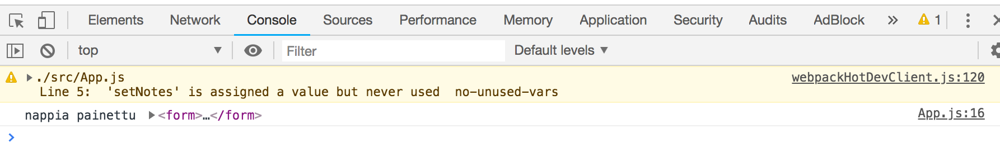
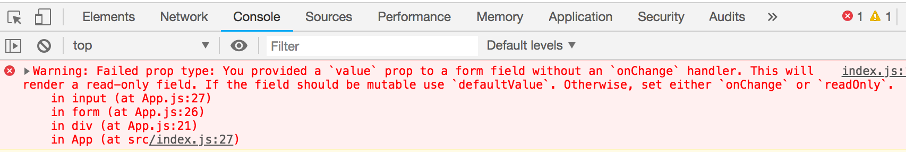
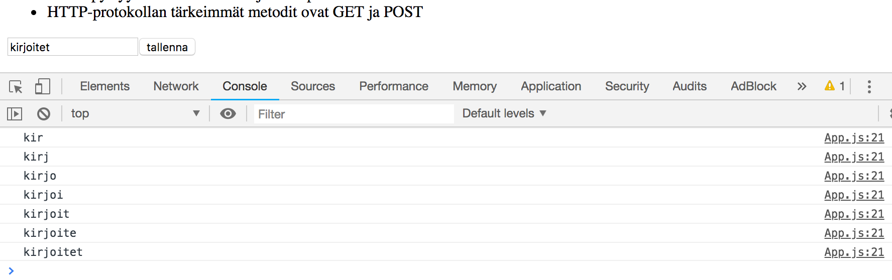
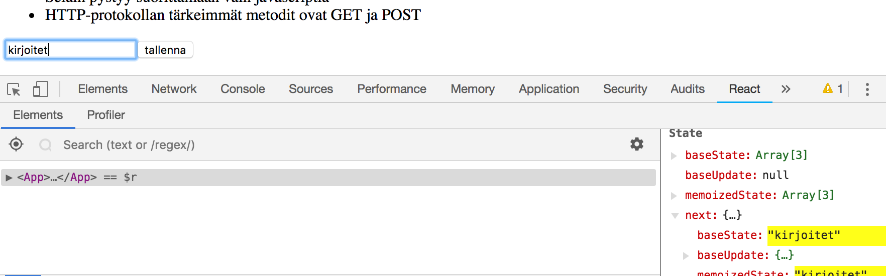
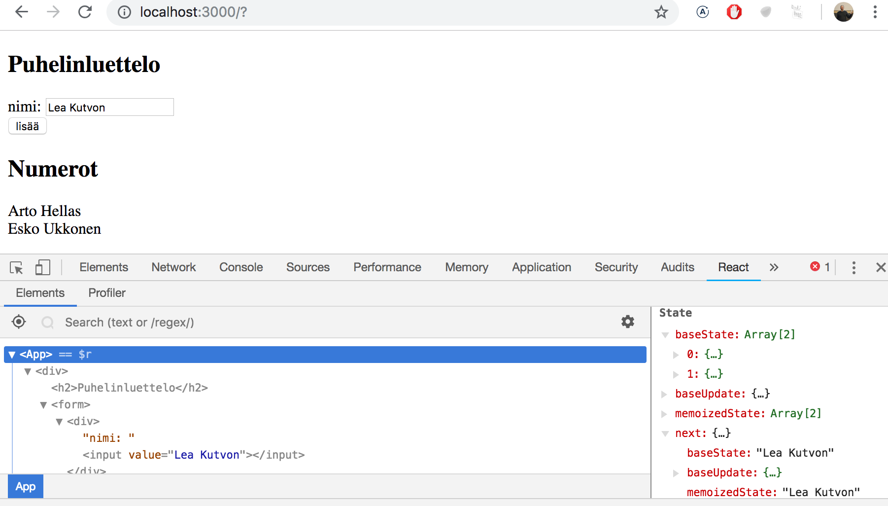
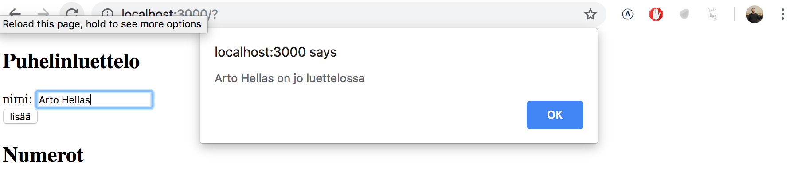
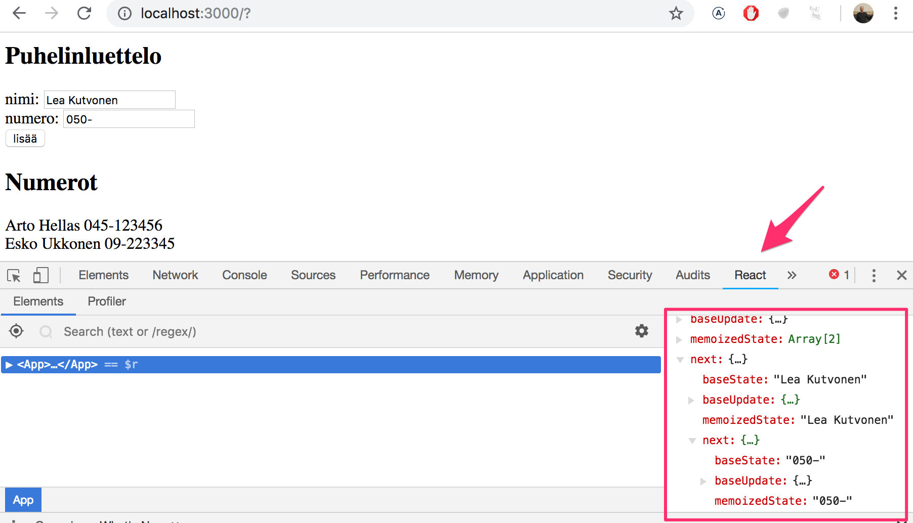
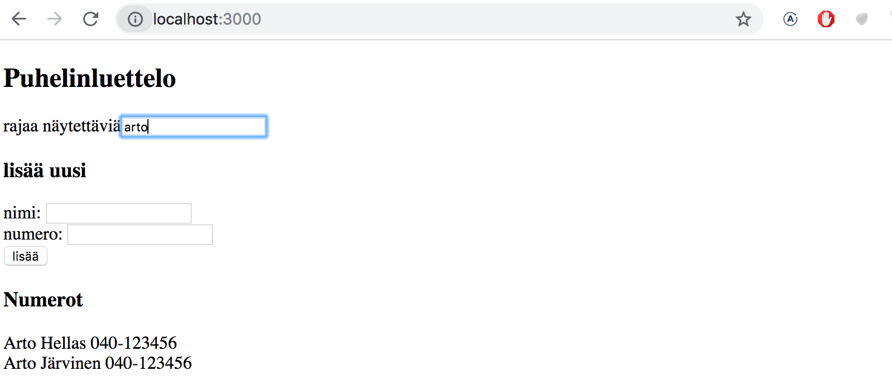

<div class="content">

<!-- Jatketaan sovelluksen laajentamista siten, että se mahdollistaa uusien muistiinpanojen lisäämisen. -->
Let's continue expanding our application by allowing users to add new notes. 

<!-- Jotta saisimme sivun päivittymään uusien muistiinpanojen lisäyksen yhteydessä, on parasta sijoittaa muistiinpanot komponentin <i>App</i> tilaan. Eli importataan funktio [useState](https://reactjs.org/docs/hooks-state.html) ja määritellään sen avulla komponentille tila, joka saa aluksi arvokseen propsina välitettävän muistiinpanot alustavan taulukon:  -->
In order to get our page to update when new notes are added it's best to store the notes in the <i>App</i> component's state. Let's import the [useState](https://reactjs.org/docs/hooks-state.html) function and use it to define a piece of state that gets initialized with the initial notes array passed in the props. 

```js
import React, { useState } from 'react' // highlight-line
import Note from './components/Note'

const App = (props) => { // highlight-line
  const [notes, setNotes] = useState(props.notes) // highlight-line

  const rows = () => notes.map(note =>
    <Note
      key={note.id}
      note={note}
    />
  )

  return (
    <div>
      <h1>Muistiinpanot</h1>
      <ul>
        {rows()}
      </ul>
    </div>
  )
}

export default App
```

<!-- Komponentti siis alustaa funktion <em>useState</em> avulla tilan  <em>notes</em> arvoksi propseina välitettävän alustavan muistiinpanojen listan: -->
The component uses the <em>useState</em> function to initialize the piece of state stored in <em>notes</em> with the array of notes passed in the props:

```js
const App = (props) => { 
  const [notes, setNotes] = useState(props.notes) 

  // ...
}
```

<!-- Jos haluaisimme lähteä liikkeelle tyhjästä muistiinpanojen listasta, annettaisiin tilan alkuarvoksi tyhjä taulukko, ja koska komponentti ei käyttäisi ollenkaan propseja, voitaisiin parametri <em>props</em> jättää kokonaan määrittelemättä: -->
If we wanted to start with an empty list of notes we would set the initial value as an empty array, and since the props would not then be used, we could omit the <em>props</em> parameter from the function definition:

```js
const App = () => { 
  const [notes, setNotes] = useState([]) 

  // ...
}  
```

<!-- Jätetään kuitenkin toistaiseksi tilalle alkuarvon asettava määrittely voimaan. -->
Let's stick with the initial value passed in the props for the time being.

<!-- Lisätään seuraavaksi komponenttiin lomake eli HTML [form](https://developer.mozilla.org/en-US/docs/Learn/HTML/Forms) uuden muistiinpanon lisäämistä varten: -->
Next, let's add an HTML [form](https://developer.mozilla.org/en-US/docs/Learn/HTML/Forms) to the component that will be used for adding new notes.

```js
const App = (props) => {
  const [notes, setNotes] = useState(props.notes) 

  const rows = () => // ...

// highlight-start 
  const addNote = (event) => {
    event.preventDefault()
    console.log('nappia painettu', event.target)
  }
 // highlight-end  

  return (
    <div>
      <h1>Muistiinpanot</h1>
      <ul>
        {rows()}
      </ul>
// highlight-start    
      <form onSubmit={addNote}>
        <input />
        <button type="submit">tallenna</button>
      </form>   
// highlight-end       
    </div>
  )
}
```

<!-- Lomakkeelle on lisätty myös tapahtumankäsittelijäksi funktio _addNote_ reagoimaan sen "lähettämiseen", eli napin painamiseen. -->
We have added the _addNote_ function as an event handler to the form element that will be called when the form is submitted by clicking the submit button.

<!-- Tapahtumankäsittelijä on [osasta 1](/osa1#tapahtumankäsittely) tuttuun tapaan määritelty seuraavasti: -->
We use the method discussed in [part 1](/osa1#tapahtumankäsittely) for defining our event handler:

```js
const addNote = (event) => {
  event.preventDefault()
  console.log('nappia painettu', event.target)
}
```

<!-- Parametrin <em>event</em> arvona on metodin kutsun aiheuttama [tapahtuma](https://reactjs.org/docs/handling-events.html). -->
The <em>event</em> parameter is the [event](https://reactjs.org/docs/handling-events.html) that triggers the call to the event handler function: 

<!-- Tapahtumankäsittelijä kutsuu heti tapahtuman metodia <em>event.preventDefault()</em> jolla se estää lomakkeen lähetyksen oletusarvoisen toiminnan, joka aiheuttaisi mm. sivun uudelleenlatautumisen. -->
The event handler immediately calls the <em>event.preventDefault()</em> method, which prevents the default action of submitting a form, which would cause the page to reload among other things.

<!-- Tapahtuman kohde, eli _event.target_ on tulostettu konsoliin -->
The target of the event stored in _event.target_ is logged to the console



<!-- Kohteena on siis komponentin määrittelemä lomake. -->
The target in this case is the form that we have defined in our component.

<!-- Miten pääsemme käsiksi lomakkeen <i>input</i>-komponenttiin syötettyyn dataan? -->
How do we access the data contained in the form's <i>input</i> element?

<!-- Tapoja on useampia, tutustumme ensin ns. [kontrolloituina komponentteina](https://reactjs.org/docs/forms.html#controlled-components) toteutettuihin lomakkeisiin. -->
There are many ways to accomplish this; the first method we will take a look at is the use of so-called [controlled components](https://reactjs.org/docs/forms.html#controlled-components).

<!-- Lisätään komponentille <i>App</i> tila <em>newNote</em> lomakkeen syötettä varten **ja** määritellään se <i>input</i>-komponentin attribuutin <i>value</i> arvoksi: -->
Let's add a new piece of state called <em>newNote</em> for storing the user submitted input **and** let's set it as the <i>input</i> element's  <i>value</i> attribute:

```js
const App = (props) => {
  const [notes, setNotes] = useState(props.notes) 
  // highlight-start
  const [newNote, setNewNote] = useState(
    'uusi muistiinpano...'
  ) 
// highlight-end
  // ...

  return (
    <div>
      <h1>Muistiinpanot</h1>
      <ul>
        {rows()}
      </ul>
      <form onSubmit={addNote}>
        <input value={newNote} /> // highlight-line
        <button type="submit">tallenna</button>
      </form>      
    </div>
  )
}
```

<!-- Tilaan <em>newNote</em> määritelty "placeholder"-teksti <i>uusi muistiinpano...</i> ilmestyy syötekomponenttiin, tekstiä ei kuitenkaan voi muuttaa. Konsoliin tuleekin ikävä varoitus joka kertoo mistä on kyse -->
The placeholder text stored as the initial value of the <em>newNote</em> state appears in the <i>input</i> element but the input text can't be edited. The console displays a warning that gives us a clue as to what might be wrong:



<!-- Koska määrittelimme syötekomponentille <i>value</i>-attribuutiksi komponentin <i>App</i> tilassa olevan muuttujan, alkaa <i>App</i> [kontrolloimaan](https://reactjs.org/docs/forms.html#controlled-components) syötekomponentin toimintaa. -->
Since we assigned a piece of the <i>App</i> component's state as the <i>value</i> attribute of the input element, the <i>App</i> component now [controls](https://reactjs.org/docs/forms.html#controlled-components) the behavior of the input element.

<!-- Jotta kontrolloidun syötekomponentin editoiminen olisi mahdollista, täytyy sille rekisteröidä <i>tapahtumankäsittelijä</i>, joka synkronoi syötekenttään tehdyt muutokset komponentin <i>App</i> tilaan: -->
In order to enable editing for the input element we have to register an <i>event handler</i> that synchronizes the changes made to the input with the component's state:

```js
const App = (props) => {
  const [notes, setNotes] = useState(props.notes) 
  const [newNote, setNewNote] = useState(
    'uusi muistiinpano...'
  )

  // ...
// highlight-start
  const handleNoteChange = (event) => {
    console.log(event.target.value)
    setNewNote(event.target.value)
  }
// highlight-end

  return (
    <div>
      <h1>Muistiinpanot</h1>
      <ul>
        {rows()}
      </ul>
      <form onSubmit={addNote}>
        <input
          value={newNote}
          onChange={handleNoteChange} // highlight-line
        />
        <button type="submit">tallenna</button>
      </form>      
    </div>
  )
}
```

<!-- Lomakkeen <i>input</i>-komponentille on nyt rekisteröity tapahtumankäsittelijä tilanteeseen <i>onChange</i>: -->
We have now registered an event handler to the <i>onChange</i> attribute of the form's <i>input</i> element:

```js
<input
  value={newNote}
  onChange={handleNoteChange}
/>
```

<!-- Tapahtumankäsittelijää kutsutaan <i>aina kun syötekomponentissa tapahtuu jotain</i>. Tapahtumankäsittelijämetodi saa parametriksi tapahtumaolion <em>event</em> -->
The event handler is called every time <i>a change occurs in the input element</i>. The event handler function receives the event object as its <em>event</em> parameter:

```js
const handleNoteChange = (event) => {
  console.log(event.target.value)
  setNewNote(event.target.value)
}
```

<!-- Tapahtumaolion kenttä <em>target</em> vastaa nyt kontrolloitua <i>input</i>-kenttää ja <em>event.target.value</em> viittaa inputin syötekentän arvoon. -->
The <em>target</em> property of the event object now corresponds the controlled <i>input</i> element and <em>event.target.value</em> refers to the input value of that element.

<!-- Huomaa, että toisin kuin lomakkeen lähettämistä vastaavan tapahtuman <i>onSubmit</i> käsittelijässä, nyt oletusarvoisen toiminnan estävää metodikutusua _event.preventDefault()_ ei tarvita, sillä syötekentän muutoksella ei ole oletusarvoista toimintaa toisin kuin lomakkeen lähettämisellä. -->
Note that we did not need to call the _event.preventDefault()_ method like we did in the <i>onSubmit</i> event handler. This is because unlike on a form submission there is no default action that occurs on an input change.

<!-- Voit seurata konsolista miten tapahtumankäsittelijää kutsutaan: -->
You can follow along in the console to see how the event handler is called:



<!-- Muistithan jo asentaa [React devtoolsin](https://chrome.google.com/webstore/detail/react-developer-tools/fmkadmapgofadopljbjfkapdkoienihi)? Devtoolsista näet, miten tila muuttuu syötekenttään kirjoitettaessa: -->
You did remember to install [React devtools](https://chrome.google.com/webstore/detail/react-developer-tools/fmkadmapgofadopljbjfkapdkoienihi), right? Good. You can directly view how the state changes from the React Devtools tab:



<!-- Nyt komponentin <i>App</i> tila <em>newNote</em> heijastaa koko ajan syötekentän arvoa, joten voimme viimeistellä uuden muistiinpanon lisäämisestä huolehtivan metodin <em>addNote</em>: -->
Now the <i>App</i> component's <em>newNote</em> state reflects the current value of the input, which means that we can complete the <em>addNote</em> function for creating new notes:

```js
const addNote = (event) => {
  event.preventDefault()
  const noteObject = {
    content: newNote,
    date: new Date().toISOString(),
    important: Math.random() > 0.5,
    id: notes.length + 1,
  }

  setNotes(notes.concat(noteObject))
  setNewNote('')
}
```

<!-- Ensin luodaan uutta muistiinpanoa vastaava olio <em>noteObject</em>, jonka sisältökentän arvo saadaan komponentin tilasta <em>newNote</em>. Yksikäsitteinen tunnus eli <i>id</i> generoidaan kaikkien muistiinpanojen lukumäärän perusteella. Koska muistiinpanoja ei poisteta, menetelmä toimii sovelluksessamme. Komennon <em>Math.random()</em> avulla muistiinpanosta tulee 50% todennäköisyydellä tärkeä. -->
First we create a new object for the note called <em>noteObject</em>, that will receive its content from the component's <em>newNote</em> state. The unique identifier <i>id</i> is generated based on the total number of notes. Since notes are never deleted, this method works in our application. With the help of the <em>Math.random()</em> command, our note has a 50% change of being marked as important.

<!-- Uusi muistiinpano lisätään vanhojen joukkoon oikeaoppisesti käyttämällä [osasta 1](/osa1/javascriptia#taulukot) tuttua taulukon metodia [concat](https://developer.mozilla.org/en-US/docs/Web/JavaScript/Reference/Global_Objects/Array/concat): -->
The new note is added to the list of notes by using the [concat](https://developer.mozilla.org/en-US/docs/Web/JavaScript/Reference/Global_Objects/Array/concat) method of arrays that was introduced in [part](/osa1/javascriptia#taulukot):

```js
setNotes(notes.concat(noteObject))
```

<!-- Metodi ei muuta alkuperäistä tilaa <em>notes</em> vaan luo <i>uuden taulukon, joka sisältää myös lisättävän alkion</i>. Tämä on tärkeää, sillä Reactin tilaa [ei saa muuttaa suoraan](https://reactjs.org/docs/state-and-lifecycle.html#using-state-correctly)! -->
The method does not mutate the original <em>notes</em> state array, but rather creates <i>a new copy of the array with the new item added to the end</i>. This is important since we must never [mutate state directly](https://reactjs.org/docs/state-and-lifecycle.html#using-state-correctly) in React!

<!-- Tapahtumankäsittelijä tyhjentää myös syötekenttää kontrolloivan tilan <em>newNote</em> sen funktiolla <em>setNewNote</em> -->
The event handler also resets the value of the controlled input element by calling the <em>setNewNote</em> function of the <em>newNote</em> state:

```js
setNewNote('')
```

<!-- Sovelluksen tämän hetkinen koodi on kokonaisuudessaan [githubissa](https://github.com/fullstack-hy2019/part2-notes/tree/part2-2), branchissä <i>part2-2</i>. -->
You can find the code for our current application in its entirety in the <i>part2-2</i> branch of [this github repository](https://github.com/fullstack-hy2019/part2-notes/tree/part2-2).

<!-- ### Näytettävien elementtien filtteröinti -->
### Filtering Displayed Elements

<!-- Tehdään sovellukseen toiminto, joka mahdollistaa ainoastaan tärkeiden muistiinpanojen näyttämisen. -->
Let's add some new functionality to our application that allows us to only view the important notes.

<!-- Lisätään komponentin <i>App</i> tilaan tieto siitä näytetäänkö muistiinpanoista kaikki vai ainoastaan tärkeät: -->
Let's add a piece of state to the <i>App</i> component that keeps track of which notes should be displayed:

```js
const App = (props) => {
  const [notes, setNotes] = useState(props.notes) 
  const [newNote, setNewNote] = useState('')
  const [showAll, setShowAll] = useState(true) // highlight-line
  
  // ...
}
```

<!-- Muutetaan komponenttia siten, että se tallettaa muuttujaan <em>notesToShow</em> näytettävien muistiinpanojen listan riippuen siitä tuleeko näyttää kaikki vai vain tärkeät: -->
Let's change the component so that it stores a list of all the notes to be displayed in the <em>notesToShow</em> variable. The items of the list depends on the state of the component:

```js
const App = (props) => {
  // ..

// highlight-start
  const notesToShow = showAll
    ? notes
    : notes.filter(note => note.important === true)
// highlight-end

  const rows = () => notesToShow.map(note => // highlight-line
    <Note
      key={note.id}
      note={note}
    />
  )

  // ...
}  
```

<!-- Muuttujan <em>notesToShow</em> määrittely on melko kompakti -->
The definition of the <em>notesToShow</em> variable is rather compact

```js
const notesToShow = showAll
  ? notes
  : notes.filter(note => note.important === true)
```

<!-- Käytössä on monissa muissakin kielissä oleva [ehdollinen](https://developer.mozilla.org/en-US/docs/Web/JavaScript/Reference/Operators/Conditional_Operator) operaattori. -->
The definition uses the [conditional](https://developer.mozilla.org/en-US/docs/Web/JavaScript/Reference/Operators/Conditional_Operator) operator that can also be seen in many other programming languages.

<!-- Operaattori toimii seuraavasti. Jos meillä on esim: -->
The operator functions as follows. If we have:

```js
const result = condition ? val1 : val2
```

<!-- muuttujan <em>tulos</em> arvoksi asetetaan <em>val1</em>:n arvo jos <em>ehto</em> on tosi. Jos <em>ehto</em> ei ole tosi, muuttujan <em>tulos</em> arvoksi tulee <em>val2</em>:n arvo. -->
the <em>result</em> variable will be set to the value of <em>val1</em> if <em>condition</em> is true. If <em>condition</em> is false, the <em>result</em> variable will be set to the value of<em>val2</em>.


<!-- Eli jos tilan arvo <em>showAll</em> on epätosi, muuttuja <em>notesToShow</em> saa arvokseen vaan ne muistiinpanot, joiden <em>important</em>-kentän arvo on tosi. Filtteröinti tapahtuu taulukon metodilla [filter](https://developer.mozilla.org/en-US/docs/Web/JavaScript/Reference/Global_Objects/Array/filter): -->
If the value of <em>showAll</em> is false, the <em>notesToShow</em> variable will be assigned to a list that only contain notes that have the <em>important</em> property set to true. Filtering is done with the help of the array [filter](https://developer.mozilla.org/en-US/docs/Web/JavaScript/Reference/Global_Objects/Array/filter) method:

```js
notes.filter(note => note.important === true)
```

<!-- vertailu-operaatio on oikeastaan turha, koska <em>note.important</em> on arvoltaan joko <i>true</i> tai <i>false</i>, eli riittää kirjoittaa -->
The comparison operator is in fact redundant, since the value of <em>note.important</em> is either <i>true</i> or <i>false</i> which means that we can simply write

```js
notes.filter(note => note.important)
```

<!-- Tässä käytettiin kuitenkin ensin vertailuoperaattoria, mm. korostamaan erästä tärkeää seikkaa: Javascriptissa <em>arvo1 == arvo2</em> ei toimi kaikissa tilanteissa loogisesti ja onkin varmempi käyttää aina vertailuissa muotoa <em>arvo1 === arvo2</em>. Enemmän aiheesta [täällä](https://developer.mozilla.org/en-US/docs/Web/JavaScript/Equality_comparisons_and_sameness). -->
The reason we showed the comparison operator first was to emphasize an important detail: in JavaScript <em>val1 == val2</em> does not work as expected in all situations and it's safer to use <em>val1 === val2</em> exclusively in comparisons. You can read more about the topic [here](https://developer.mozilla.org/en-US/docs/Web/JavaScript/Equality_comparisons_and_sameness).

<!-- Filtteröinnin toimivuutta voi jo nyt kokeilla vaihtelemalla sitä, miten tilan kentän <em>showAll</em> alkuarvo määritelään konstruktorissa. -->
You can test out the filtering functionality by changing the initial value of the <em>showAll</em> state.

<!-- Lisätään sitten toiminnallisuus, joka mahdollistaa <em>showAll</em>:in tilan muuttamisen sovelluksesta. -->
Next let's add functionality that enables users to toggle the <em>showAll</em> state of the application from the user interface.

<!-- Oleelliset muutokset ovat seuraavassa: -->
The relevant changes are shown below:

```js
import React, { useState } from 'react' 
import Note from './components/Note'

const App = (props) => {
  const [notes, setNotes] = useState(props.notes) 
  const [newNote, setNewNote] = useState('')
  const [showAll, setShowAll] = useState(true)

  // ...

  return (
    <div>
      <h1>Muistiinpanot</h1>
// highlight-start      
      <div>
        <button onClick={() => setShowAll(!showAll)}>
          näytä {showAll ? 'vain tärkeät' : 'kaikki' }
        </button>
      </div>
// highlight-end            
      <ul>
        {rows()}
      </ul>
      <form onSubmit={addNote}>
        <input
          value={newNote}
          onChange={handleNoteChange}
        />
        <button type="submit">tallenna</button>
      </form>      
    </div>
  )
}
```

<!-- Näkyviä muistiinpanoja (kaikki vai ainoastaan tärkeät) siis kontrolloidaan napin avulla. Napin tapahtumankäsittelijä on niin yksinkertainen että se on kirjotettu suoraan napin attribuutiksi. Tapahtumankäsittelijä muuttaa _showAll_:n arvon truesta falseksi ja päinvastoin: -->
The displayed notes (all versus important) is controlled with a button. The event handler for the button is so simple that it has been defined directly in the attribute of the button element. The event handler switches the value of _showAll_ from true to false and vice versa:

```js
() => setShowAll(!showAll)
```

<!-- Napin teksti riippuu tilan <em>showAll</em> arvosta: -->
The text of the button depends on the value of the <em>showAll</em> state:

```js
näytä {showAll ? 'vain tärkeät' : 'kaikki'}
```

<!-- Sovelluksen tämän hetkinen koodi on kokonaisuudessaan [githubissa](https://github.com/fullstack-hy2019/part2-notes/tree/part2-3), branchissa <i>part2-3</i>. -->
You can find the code for our current application in its entirety in the <i>part2-3</i> branch of [this github repository](https://github.com/fullstack-hy2019/part2-notes/tree/part2-3).
</div>

<div class="tasks">

<!-- <h3>Tehtäviä</h3> -->
<h3>Exercises</h3>

<!-- <i>Seuraavassa tehtävässä aloitettavaa ohjelmaa kehitellään eteenpäin muutamassa seuraavassa tehtävässä. Tässä ja kurssin aikana muissakin vastaantulevissa tehtäväsarjoissa ohjelman lopullisen version palauttaminen riittää, voit toki halutessasi tehdä commitin jokaisen tehtävän jälkeisestä tilanteesta, mutta se ei ole välttämätöntä.</i> -->
In the first exercise, we we will start working on an application that will be further developed in the later exercises. In related sets of exercises it is sufficient to return the final version of your application. You may also make a separate commit after you have finished each part of the exercise set, but doing so is not required.

<!-- **VAROITUS** create-react-app tekee projektista automaattisesti git-repositorion, ellei sovellusta luoda jo olemassaolevan repositorion sisälle. Todennäköisesti **et halua** että projektista tulee repositorio, joten suorita projektin juuressa komento _rm -rf .git_. -->
**WARNING** create-react-app will automatically turn your project into a git-repository unless you create your application inside of an existing git repository. It's likely that **do not want** you project to be a repository, so simply run the _rm -rf .git_ command at the root of your application.

<!-- <h4>2.6: puhelinluettelo step1</h4> -->
<h4>2.6: The Phonebook Step1</h4>

<!-- Toteutetaan yksinkertainen puhelinluettelo. <i>**Aluksi luetteloon lisätään vaan nimiä.**</i> -->
Let's create a simple phonebook. <i>**In this part we will only be adding names to the phonebook.**</i>

<!-- Voit ottaa sovelluksesi komponentin <i>App</i> pohjaksi seuraavan: -->
You can use the code below as a starting point for the <i>App</i> component of your application:

```js
import React, { useState } from 'react'

const App = () => {
  const [ persons, setPersons] = useState([
    { name: 'Arto Hellas' }
  ]) 
  const [ newName, setNewName ] = useState('')

  return (
    <div>
      <h2>Puhelinluettelo</h2>
      <form>
        <div>
          nimi: <input />
        </div>
        <div>
          <button type="submit">lisää</button>
        </div>
      </form>
      <h2>Numerot</h2>
      ...
    </div>
  )

}

export default App
```

<!-- Tila <em>newName</em> on tarkoitettu lomakkeen kentän kontrollointiin. -->
The <em>newName</em> state is meant for controlling the form input element.

<!-- Joskus tilaa tallettavia ja tarvittaessa muitakin muuttujia voi olla hyödyllistä renderöidä debugatessa komponenttiin, eli voi tilapäisesti lisätä komponentin  palauttamaan koodiin esim. seuraavan: -->
Sometimes it can be useful to render state and other variables as text for debugging purposes. You can temporarily add the following element to the rendered component:

```
<div>debug: {newName}</div>
```

<!-- Muista myös osan 1 luku [React-sovellusten debuggaus](#react-sovellusten-debuggaus), erityisesti [react developer tools](https://chrome.google.com/webstore/detail/react-developer-tools/fmkadmapgofadopljbjfkapdkoienihi) on välillä todella kätevä komponentin tilan muutosten seuraamisessa. -->
It's also important to put what we learned in the [debugging React applications](#react-sovellusten-debuggaus) chapter of part one into good use. The [React developer tools](https://chrome.google.com/webstore/detail/react-developer-tools/fmkadmapgofadopljbjfkapdkoienihi) extension especially, is incredibly useful for tracking changes that occur in the application's state.

<!-- Sovellus voi näyttää tässä vaiheessa seuraavalta: -->
After finishing this exercise your application should look something like this:



<!-- Huomaa, React developer toolsin käyttö! -->
Note the use of the React developer tools extension in the picture above!

<!-- **Huom:** -->
**NB:**

<!-- - voit käyttää kentän <i>key</i> arvona henkilön nimeä
- muista estää lomakkeen lähetyksen oletusarvoinen toiminta! -->
- you can use the person's name as value of the <i>key</i> property
- remember to prevent the default action of submitting HTML forms!

<h4>2.7: The Phonebook Step2</h4>

<!-- Jos lisättävä nimi on jo sovelluksen tiedossa, estä lisäys. Taulukolla on lukuisia sopivia [metodeja](https://developer.mozilla.org/en-US/docs/Web/JavaScript/Reference/Global_Objects/Array) tehtävän tekemiseen. -->
Prevent the user from being able to add names that  already exist in the phonebook. JavaScript arrays have numerous suitable [methods](https://developer.mozilla.org/en-US/docs/Web/JavaScript/Reference/Global_Objects/Array) for accomplishing this task.

<!-- Anna tilanteessa virheilmoitus komennolla [alert](https://developer.mozilla.org/en-US/docs/Web/API/Window/alert): -->
Issue a warning with the [alert](https://developer.mozilla.org/en-US/docs/Web/API/Window/alert) command when such an action is attempted:



<!-- **Muistutus edellisestä osasta:** kun muodostat Javascriptissä merkkijonoja muuttujaan perustuen, on tyylikkäin tapa asian hoitamiseen [template string](https://developer.mozilla.org/en-US/docs/Web/JavaScript/Reference/Template_literals): -->
**Brief reminder from the previous part:** when you are forming strings that contain values from variables, it is recommended to use a [template string](https://developer.mozilla.org/en-US/docs/Web/JavaScript/Reference/Template_literals):

```js
`${newName} on jo luettelossa`
```

<!-- Jos muuttujalla <em>newName</em> on arvona <i>arto</i>, on tuloksena merkkijono -->
If the <em>newName</em> variable holds the value <i>arto</i>, the template string expression returns the string

```js
`arto on jo luettelossa`
```

<!-- Sama toki hoituisi javamaisesti merkkijonojen plus-metodilla -->
The same could be done in a more Java-like fashion by using the plus operator:

```js
newName + ' on jo luettelossa'
```

<!-- Template stringin käyttö antaa kuitenkin professionaalimman vaikutelman. -->
Using template strings is the more idiomatic option and the sign of a true JavaScript professional.

<h4>2.8: The Phonebook Step3</h4>

<!-- Lisää sovellukseen mahdollisuus antaa henkilöille puhelinnumero. Tarvitset siis lomakkeeseen myös toisen <i>input</i>-elementin (ja sille oman muutoksenkäsittelijän): -->
Expand your application by allowing users to add phone numbers to the phone book. You will need to add a second <i>input</i> element to the form (along with its own event handler):

```
<form>
  <div>nimi: <input /></div>
  <div>numero: <input /></div>
  <div><button type="submit">lisää</button></div>
</form>
```

<!-- Sovellus voi näyttää tässä vaiheessa seuraavalta. Kuvassa myös [react developer tools](https://chrome.google.com/webstore/detail/react-developer-tools/fmkadmapgofadopljbjfkapdkoienihi):in tarjoama näkymä komponentin <i>App</i> tilaan: -->
At this point the application could look something like this. The image also displays the application's state with the help of [React developer tools](https://chrome.google.com/webstore/detail/react-developer-tools/fmkadmapgofadopljbjfkapdkoienihi):



<h4>2.9*: The Phonebook Step4</h4>

<!-- Tee lomakkeeseen hakukenttä, jonka avulla näytettävien nimien listaa voidaan rajata: -->
Implement a search field that can be used to filter the list of people by name:



<!-- Rajausehdon syöttämisen voi hoitaa omana lomakkeeseen kuulumattomana <i>input</i>-elementtinä. Kuvassa rajausehdosta on tehty <i>caseinsensitiivinen</i> eli ehto <i>arto</i> löytää isolla kirjaimella kirjoitetun Arton. -->
You can implement the search field as an <i>input</i> element that is placed outside the HTML form. The filtering logic shown in the image is <i>case insensitive</i>, meaning that the search term <i>arto</i> also returns results that contain Arto with an uppercase A.

<!-- **Huom:** Kun toteutat jotain uutta toiminnallisuutta, on usein hyötyä 'kovakoodata' sovellukseen jotain sisältöä, esim. -->
**NB:** When you are working on new functionality, it's often useful to "hardcode" some dummy data into your application, e.g.

```js
const App = () => {
  const [persons, setPersons] = useState([
    { name: 'Arto Hellas', number: '040-123456' },
    { name: 'Martti Tienari', number: '040-123456' },
    { name: 'Arto Järvinen', number: '040-123456' },
    { name: 'Lea Kutvonen', number: '040-123456' }
  ])

  // ...
}
```

<!-- Näin vältytään turhalta manuaaliselta työltä, missä testaaminen edellyttäisi myös testiaineiston syöttämistä käsin soveluksen lomakkeen kautta. -->
This saves you from having to manually input data into your application for testing out your new functionality.

<h4>2.10: The Phonebook Step5</h4>

<!-- Jos koko sovelluksesi on tehty yhteen komponenttiin, refaktoroi sitä eriyttämällä sopivia komponentteja. Pidä kuitenkin edelleen kaikki tila sekä tapahtumankäsittelijäfunktiot juurikomponentissa <i>App</i>. -->
If you have implemented your application in a single component, refactor it by extracting suitable parts into new components. Maintain the application's state and all event handlers in the <i>App</i> root component.

<!-- Riittää että erotat sovelluksesta <i>**kolme**</i> komponenttia. Hyviä kandidaatteja ovat esim. filtteröintilomake, uuden henkilön lisäävä lomake, kaikki henkilöt renderöivä komponentti sekä yksittäisen henkilön renderöivä komponentti. -->
It is sufficient to extract <i>**three**</i> components from the application. Good candidates for separate components are e.g. the search filter, the form for adding new people into the phonebook, a component that renders all people from the phonebook, and a component that renders a single person's details.

<!-- Sovelluksen juurikomponentti voi näyttää refaktoroinnin jälkeen suunilleen seuraavalta, eli se ei itse renderöi suoraan oikeastaan mitään muita kuin otsikkoja: -->
The application's root component could look something like this after refactoring. The refactored root component below only renders titles and lets the extracted components take care of the rest.

```js
const App = () => {
  // ...

  return (
    <div>
      <h2>Puhelinluettelo</h2>

      <Filter ... />

      <h3>lisää uusi</h3>

      <PersonForm 
        ...
      />

      <h3>Numerot</h3>

      <Persons ... />
    </div>
  )
}
```

</div>
