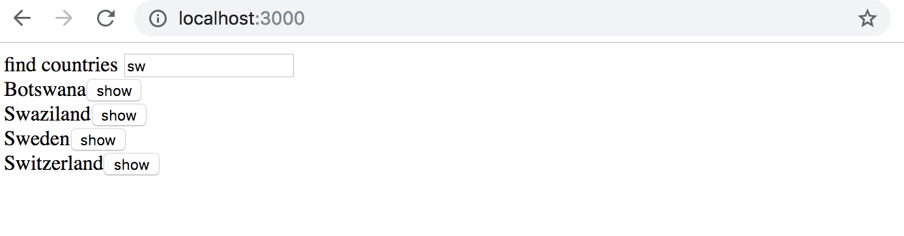

<div class="content">

<!-- Olemme nyt viipyneet tovin keskittyen pelkkään "frontendiin", eli selainpuolen toiminnallisuuteen. Rupeamme itse toteuttamaan "backendin", eli palvelinpuolen toiminnallisuutta vasta kurssin kolmannessa osassa, mutta otamme nyt jo askeleen sinne suuntaan tutustumalla siihen, miten selaimessa suoritettava koodi kommunikoi backendin kanssa. -->

For a while now we have only worked on the "frontend", aka the functionality in the browser. We will begin working on the "backend", aka the server side functionality, in the third part of this course. Nonetheless, we will take a step in that direction by getting familiar with how the code in the browser communicates with the backend.

<!-- Käytetään nyt palvelimena sovelluskehitykseen tarkoitettua [JSON Serveriä](https://github.com/typicode/json-server). -->

Let's use a tool called [JSON Server](https://github.com/typicode/json-server), which is meant to be used during software development, to act as our server.

<!-- Tehdään projektin juurihakemistoon tiedosto <i>db.json</i>, jolla on seuraava sisältö: -->

Make a file <i>db.json</i> into the root directory of the project with the following content:

```json
{
  "notes": [
    {
      "id": 1,
      "content": "HTML on helppoa",
      "date": "2019-01-10T17:30:31.098Z",
      "important": true
    },
    {
      "id": 2,
      "content": "Selain pystyy suorittamaan vain javascriptiä",
      "date": "2019-01-10T18:39:34.091Z",
      "important": false
    },
    {
      "id": 3,
      "content": "HTTP-protokollan tärkeimmät metodit ovat GET ja POST",
      "date": "2019-01-10T19:20:14.298Z",
      "important": true
    }
  ]
}
```

<!-- JSON server on mahdollista [asentaa](https://github.com/typicode/json-server#install) koneelle ns. globaalisti komennolla _npm install -g json-server_. Globaali asennus edellyttää kuitenkin pääkäyttäjän oikeuksia, eli se ei ole mahdollista laitoksen koneilla tai uusilla fuksiläppäreillä. -->

You can [install](https://github.com/typicode/json-server#install) JSON server so-called globally on your machine using the command _npm install -g json-server_. A global installation requires administrative privileges, which means it is not possible on the faculty computers or freshman laptops.

<!-- Globaali asennus ei kuitenkaan ole tarpeen, voimme käynnistää <i>json-serverin</i> komennon _npx_ avulla: -->

However, a global installation is not necessary, since we can run the <i>json-server</i> using the command _npx_:

```js
npx json-server --port=3001 --watch db.json
```

<!-- Oletusarvoisesti <i>json-server</i> käynnistyy porttiin 3000, mutta create-react-app:illa luodut projektit varaavat portin 3000, joten joudumme nyt määrittelemään json-serverille vaihtoehtoisen portin 3001. -->

By default <i>json-server</i> starts running on port 3000, but because projects created using create-react-app reserve port 3000 we must define an alternate port, e.g. 3001, for json-server.

<!-- Mennään selaimella osoitteeseen <http://localhost:3001/notes>. Kuten huomaamme, <i>json-server</i> tarjoaa osoitteessa tiedostoon tallentamamme muistiinpanot JSON-muodossa: -->

In the browser let's navigate to the address <http://localhost:3001/notes>. We can see that <i>json-server</i> serves the notes we previously wrote to the file in the JSON format:


<!-- Jos selaimesi ei osaa näyttää JSON-muotoista dataa formatoituna, asenna jokin sopiva plugin, esim. [JSONView](https://chrome.google.com/webstore/detail/jsonview/chklaanhfefbnpoihckbnefhakgolnmc) -->
<!-- helpottamaan elämääsi. -->

If your browser doesn't have a way to format the display of JSON-data, then install an appropriate plugin, e.g. [JSONView](https://chrome.google.com/webstore/detail/jsonview/chklaanhfefbnpoihckbnefhakgolnmc) to make your life easier.

<!-- Ideana jatkossa onkin se, että muistiinpanot talletetaan palvelimelle, eli tässä vaiheessa <i>json-serverille</i>. React-koodi hakee muistiinpanot palvelimelta ja renderöi ne ruudulle. Kun sovellukseen lisätään uusi muistiinpano, React-koodi lähettää sen myös palvelimelle, jotta uudet muistiinpanot jäävät pysyvästi "muistiin". -->

The idea, going forward, is to save the notes to the server, which in this case means saving to json-server. The React code fetches the notes from the server and renders them to the screen. When a new note is added to the application the React code also sends it to the server to make the new note persistent in "memory".

<!-- json-server tallettaa kaiken datan palvelimella sijaitsevaan tiedostoon <i>db.json</i>. Todellisuudessa data tullaan tallentamaan johonkin tietokantaan. json-server on kuitenkin käyttökelpoinen apuväline, joka mahdollistaa palvelinpuolen toiminnallisuuden käyttämisen kehitysvaiheessa ilman tarvetta itse ohjelmoida mitään. -->

json-server stores all the data into the file <i>db.json</i>, which resides on the server. In the real world data will be stored into some kind of database. However, json-server is a handy tool, which facilitates the usage of server side functionality in the development phase without needing to program anything.

<!-- Tutustumme palvelinpuolen toteuttamisen periaatteisiin tarkemmin kurssin [osassa 3](/osa3). -->

We will get familiar with the principles of implementing server side functionality in more detail in [part 3](/part3) of this course.

<!-- ### Selain suoritusympäristönä -->

### The browser as a runtime environment

<!-- Ensimmäisenä tehtävänämme on siis hakea React-sovellukseen jo olemassaolevat mustiinpanot osoitteesta <http://localhost:3001/notes>. -->

Our first task is fetching the already existing notes to our React application from the address <http://localhost:3001/notes>.

<!-- Osan 0 [esimerkkiprojektissa](/osa0#selaimessa-suoritettava-sovelluslogiikka) nähtiin jo eräs tapa hakea Javascript-koodista palvelimella olevaa dataa. Esimerkin koodissa data haettiin [XMLHttpRequest](https://developer.mozilla.org/en-US/docs/Web/API/XMLHttpRequest)- eli XHR-olion avulla muodostetulla HTTP-pyynnöllä. Kyseessä on vuonna 1999 lanseerattu tekniikka, jota kaikki web-selaimet ovat jo pitkään tukeneet. -->

In the the [project example](/osa0#selaimessa-suoritettava-sovelluslogiikka) from part 0 we already encountered a way to data from a server using Javascript. The code in the example was fetching the data using [XMLHttpRequest](https://developer.mozilla.org/en-US/docs/Web/API/XMLHttpRequest), otherwise known as a HTTP request made using a XHR object. This is a technique launched in the year 1999, which every browser has supported for a good while.

<!-- Nykyään XHR:ää ei kuitenkaan kannata käyttää ja selaimet tukevatkin jo laajasti [fetch](https://developer.mozilla.org/en-US/docs/Web/API/WindowOrWorkerGlobalScope/fetch)-metodia, joka perustuu XHR:n käyttämän tapahtumapohjaisen mallin sijaan ns. [promiseihin](https://developer.mozilla.org/en-US/docs/Web/JavaScript/Reference/Global_Objects/Promise). -->

Nowadays it is not recommended to use XHR and browsers already widely support the [fetch](https://developer.mozilla.org/en-US/docs/Web/API/WindowOrWorkerGlobalScope/fetch) method, which is based on so-called [promises](https://developer.mozilla.org/en-US/docs/Web/JavaScript/Reference/Global_Objects/Promise), instead of the event driven model used by XHR.

<!-- Muistutuksena edellisestä osasta (oikeastaan tätä tapaa pitää lähinnä <i>muistaa olla käyttämättä</i> ilman painavaa syytä), XHR:llä haettiin dataa seuraavasti -->

The following is a refresh of how data was fetched using XHR, mentioned in part 0 (which one should actually <i>remember to not use</i> without a good reason)

```js
const xhttp = new XMLHttpRequest()

xhttp.onreadystatechange = function() {
  if (this.readyState == 4 && this.status == 200) {
    const data = JSON.parse(this.responseText)
    // käsittele muuttujaan data sijoitettu kyselyn tulos
  }
}

xhttp.open('GET', '/data.json', true)
xhttp.send()
```

<!-- Heti alussa HTTP-pyyntöä vastaavalle <em>xhttp</em>-oliolle rekisteröidään <i>tapahtumankäsittelijä</i>, jota Javascript runtime kutsuu kun <em>xhttp</em>-olion tila muuttuu. Jos tilanmuutos tarkoittaa että pyynnön vastaus on saapunut, käsitellään data halutulla tavalla. -->

Right at the beginning we register an <i>event handler</i> to the <em>xhttp</em> object, which represents the HTTP request, and will be called by the Javascript runtime when the state of the <em>xhttp</em> object changes. If the change in state means that the response to the request has arrived, then the data is handled accordingly.

<!-- Huomionarvoista on se, että tapahtumankäsittelijän koodi on määritelty jo ennen kun itse pyyntö lähetetään palvelimelle. Tapahtumankäsittelijäfunktio tullaan kuitenkin suorittamaan vasta jossain myöhäisemmässä vaiheessa. Koodin suoritus ei siis etene synkronisesti "ylhäältä alas", vaan <i>asynkronisesti</i>, Javascript kutsuu sille rekisteröityä tapahtumankäsittelijäfunktiota jossain vaiheessa. -->

It is notable that the code in the event handler is defined before the request is sent to the server. Despite this the code within the event handler will be executed at a later point in time. Therefore the code does not execute synchronously "from top to bottom", but does so <i>asynchronously</i>. Javascript calls the event handler that was registered for the request at some point.

<!-- Esim. Java-ohjelmoinnista tuttu synkroninen tapa tehdä kyselyjä etenisi seuraavaan tapaan (huomaa että kyse ei ole oikeasti toimivasta Java-koodista): -->

The way of doing requests synchronously, familiar from e.g. Java programming, would play out as follows (NB this is not actually working Java code):

```java
HTTPRequest request = new HTTPRequest();

String url = "https://fullstack-exampleapp.herokuapp.com/data.json";
List<Muistiinpano> muistiinpanot = request.get(url);

muistiinpanot.forEach(m => {
  System.out.println(m.content);
})
```

<!-- Javassa koodi etenee nyt rivi riviltä ja koodi pysähtyy odottamaan HTTP-pyynnön, eli komennon _request.get(...)_ valmistumista. Komennon palauttama data, eli muistiinpanot talletetaan muuttujaan ja dataa aletaan käsittelemään halutulla tavalla. -->

In Java the code executes line by line and stops to wait for the HTTP request, which means waiting for the command _request.get(...)_ to finish. The data returned by the command, the notes, are then stored in a variable and we start manipulation the data in the as we want.

<!-- Javascript-enginet eli suoritusympäristöt kuitenkin noudattavat [asynkronista mallia](https://developer.mozilla.org/en-US/docs/Web/JavaScript/EventLoop), eli periaatteena on se, että kaikki [IO-operaatiot](https://en.wikipedia.org/wiki/Input/output) (poislukien muutama poikkeus) suoritetaan ei-blokkaavana, eli operaatioiden tulosta ei jäädä odottamaan vaan koodin suoritusta jatketaan heti eteenpäin. -->

On the other hand Javascript engines, or runtime environments, follow the [asynchronous model](https://developer.mozilla.org/en-US/docs/Web/JavaScript/EventLoop), behind which is a principle, according to which all [IO-operations](https://en.wikipedia.org/wiki/Input/output) (with some exceptions) are executed as non-blocking, meaning not waiting and immediately resuming code execution.

<!-- Siinä vaiheessa kun operaatio valmistuu tai tarkemmin sanoen jonain valmistumisen jälkeisenä ajanhetkenä, kutsuu Javascript-engine operaatiolle rekisteröityjä tapahtumankäsittelijöitä. -->

When operations are completed, or more specifically at some point after completion, the Javascript engine calls the event handlers registered to the operation.

<!-- Nykyisellään Javascript-moottorit ovat <i>yksisäikeisiä</i> eli ne eivät voi suorittaa rinnakkaista koodia. Tämän takia on käytännössä pakko käyttää ei-blokkaavaa mallia IO-operaatioiden suorittamiseen, sillä muuten selain 'jäätyisi' siksi aikaa kun esim. palvelimelta haetaan dataa. -->

Currently Javascript engines are <i>single threaded</i>, meaning they cannot execute code in parallel. Due to this fact, it is practically a requirement to use a non-blocking model for executing IO operations. Otherwise the browser would "freeze" for the duration of e.g. fetching data from a server.

<!-- Javascript-moottoreiden yksisäikeisyydellä on myös sellainen seuraus, että jos koodin suoritus kestää erittäin pitkään, menee selain jumiin suorituksen ajaksi. Jos lisätään sovelluksen alkuun seuraava koodi: -->

Another consequence of the single threaded nature of Javascript engines is that if some code execution takes up a lot of time the browser will be stuck for the duration of the execution. If we add the following code at the top of our application:

```js
setTimeout(() => {
  console.log('loop..')
  let i = 0
  while (i < 50000000000) {
    i++
  }
  console.log('end')
}, 5000)
```

<!-- Kaikki toimii 5 sekunnin ajan normaalisti. Kun <em>setTimeout</em>:in parametrina määritelty funktio suoritetaan, menee selaimen sivu jumiin pitkän loopin suorituksen ajaksi. Ainakaan Chromessa selaimen tabia ei pysty edes sulkemaan luupin suorituksen aikana. -->

Everything works normally for 5 seconds. When the function defined as the parameter for <em>setTimeout</em> is run the browser is stuck for the duration of the execution of the long loop. At least in Chrome, the browser tab cannot even be closed during the execution of the loop.

<!-- Eli jotta selain säilyy <i>responsiivisena</i>, eli että se reagoi koko ajan riittävän nopeasti käyttäjän haluamiin toimenpiteisiin, koodin logiikan tulee olla sellainen, että yksittäinen laskenta ei saa kestää liian kauaa. -->

For the browser to remain <i>responsive</i>, which would include continuously reacting to operations desired by the user in a timely manner, the code logic needs to be such that an individual computation cannot take too long.

<!-- Aiheesta löytyy paljon lisämateriaalia internetistä, eräs varsin havainnollinen esitys aiheesta Philip Robertsin esitelmä [What the heck is the event loop anyway?](https://www.youtube.com/watch?v=8aGhZQkoFbQ) -->

There is a bunch of extra material about this topic on the internet. One particularly clear presentation of the topic is the keynote by Philip Roberts called [What the heck is the event loop anyway?](https://www.youtube.com/watch?v=8aGhZQkoFbQ)

<!-- Nykyään selaimissa on mahdollisuus suorittaa myös rinnakkaista koodia ns. [web workerien](https://developer.mozilla.org/en-US/docs/Web/API/Web_Workers_API/Using_web_workers) avulla. Yksittäisen selainikkunan koodin ns. event loopista huolehtii kuitenkin edelleen [vain yksi säie](https://medium.com/techtrument/multithreading-javascript-46156179cf9a). -->

In today's browsers it is possible to run parallelized code with the help of so-called [web workers](https://developer.mozilla.org/en-US/docs/Web/API/Web_Workers_API/Using_web_workers). The event loop of an individual browser window is, however, still only handled by a [single thread](https://medium.com/techtrument/multithreading-javascript-46156179cf9a).

### npm

<!-- Palaamme jälleen asiaan, eli datan hakemiseen palvelimelta. -->

Let's get back to the topic of fetching data from the server.

<!-- Voisimme käyttää datan palvelimelta hakemiseen aiemmin mainittua promiseihin perustuvaa funktiota [fetch](https://developer.mozilla.org/en-US/docs/Web/API/WindowOrWorkerGlobalScope/fetch). Fetch on hyvä työkalu, se on standardoitu ja kaikkien modernien selaimien (poislukien IE) tukema. -->

We could use the previously mentioned promise based function [fetch](https://developer.mozilla.org/en-US/docs/Web/API/WindowOrWorkerGlobalScope/fetch) to pull the data from the server. Fetch is a great tool. It is standardized and supported by all modern browsers (excluding IE).

<!-- Käytetään selaimen ja palvelimen väliseen kommunikaatioon kuitenkin [axios](https://github.com/axios/axios)-kirjastoa, joka toimii samaan tapaan kuin fetch, mutta on hieman mukavampikäyttöinen. Hyvä syy axios:in käytölle on myös se, että pääsemme tutustumaan siihen miten ulkopuolisia kirjastoja eli <i>npm-paketteja</i> liitetään React-projektiin. -->

Having said that, for the communication between the browser and server we will instead be using the [axios](https://github.com/axios/axios) library, which functions like fetch, but is a bit more pleasant to use. Another good reason for the use of axios is us getting familiar with adding external libraries, so-called <i>npm packages</i>, to React projects.

<!-- Nykyään lähes kaikki Javascript-projektit määritellään node "pakkausmanagerin" eli [npm](https://docs.npmjs.com/getting-started/what-is-npm):n avulla. Myös create-react-app:in avulla generoidut projektit ovat npm-muotoisia projekteja. Varma tuntomerkki siitä on projektin juuressa oleva tiedosto <i>package.json:</i> -->

Nowadays practically all Javascript projects are defined using the node package manager, aka [npm](https://docs.npmjs.com/getting-started/what-is-npm). The projects created using create-react-app also follow the npm format. A strong sign that a project uses npm is the file <i>package.json</i> at the root of the project:

```json
{
  "name": "notes",
  "version": "0.1.0",
  "private": true,
  "dependencies": {
    "react": "^16.8.0",
    "react-dom": "^16.8.0",
    "react-scripts": "2.1.3"
  },
  "scripts": {
    "start": "react-scripts start",
    "build": "react-scripts build",
    "test": "react-scripts test",
    "eject": "react-scripts eject"
  },
  "eslintConfig": {
    "extends": "react-app"
  },
  "browserslist": [
    ">0.2%",
    "not dead",
    "not ie <= 11",
    "not op_mini all"
  ]
}
```

<!-- Tässä vaiheessa meitä kiinnostaa osa <i>dependencies</i>, joka määrittelee mitä <i>riippuvuuksia</i> eli ulkoisia kirjastoja projektilla on. -->

At this point the <i>dependencies</i> part is most interesting to us, because it defines what <i>dependencies</i>, or external libraries, the project has.

<!-- Haluamme nyt käyttöömme axioksen. Voisimme määritellä kirjaston suoraan tiedostoon <i>package.json</i>, mutta on parempi asentaa se komentoriviltä -->

Now we want to use axios. We define the library directly into the file <i>package.json</i>, but it is better to install it from the command line.

```js
npm install axios --save
```

<!-- **Huomaa, että _npm_-komennot tulee antaa aina projektin juurihakemistossa**, eli siinä minkä sisältä tiedosto <i>package.json_</i> löytyy. -->
**NB _npm_-commands should always be run in the project root directory**, which is where the <i>package.json</i> file can be found.

<!-- Nyt axios on mukana riippuvuuksien joukossa: -->

Axios is now included among the other dependencies:

```json
{
  "dependencies": {
    "axios": "^0.18.0", // highlight-line
    "json-server": "^0.14.2",
    "react": "^16.8.0",
    "react-dom": "^16.8.0",
    "react-scripts": "2.1.3"
  },
  // ...
}

```

<!-- Sen lisäksi, että komento <em>npm install</em> lisäsi axiosin riippuvuuksien joukkoon, se myös <i>latasi</i> kirjaston koodin. Koodi löytyy muiden riippuvuuksien tapaan projektin juuren hakemistosta <i>node_modules</i>, mikä kuten huomata saattaa sisältääkin runsaasti kaikenlaista. -->

In addition to adding axios to the dependencies, the <em>npm install</em> command also  <i>downloaded</i> the library code. As with other dependencies the code can be found in the <i>node_modules</i> directory located in the root. As one might notice, <i>node_modules</i> contains a fair bit of interesting stuff.

<!-- Tehdään toinenkin pieni lisäys. Asennetaan myös <i>json-server</i> projektin <i>sovelluskehityksen aikaiseksi</i> riippuvuudeksi komennolla -->

Let's make another addition. Install <i>json-server</i> as a development dependency, which is only used during development, by providing the command

```js
npm install json-server --save-dev
```

<!-- ja tehdään tiedoston <i>package.json</i> osaan <i>scripts</i> pieni lisäys -->

and making a small addition to the <i>scripts</i> part of the <i>package.json</i> file

```json
{
  // ... 
  "scripts": {
    "start": "react-scripts start",
    "build": "react-scripts build",
    "test": "react-scripts test --env=jsdom",
    "eject": "react-scripts eject",
    "server": "json-server -p3001 db.json"  // highlight-line
  }
}
```

<!-- Nyt voimme käynnistää  json-serverin projektin hakemistosta mukavasti ilman tarvetta parametrien määrittelylle komennolla -->

We can now conveniently, without parameter definitions, start the json-server from the project root directory with the command

```js
npm run server
```

<!-- Tutustumme _npm_-työkaluun tarkemmin kurssin [kolmannessa osassa](/osa3). -->

We will get more familiar with the _npm_ tool in the [third part of the course](/part3).

<!-- Huomaa, että aiemmin käynnistetty json-server tulee olla sammutettuna, muuten seuraa ongelmia -->

NB the previously started json-server must be terminated before staring a new one, otherwise there will be trouble


<!-- Virheilmoituksen punaisella oleva teksti kertoo mistä on kyse:  -->

The red print in the error message informs us about the issue:

<i>Cannot bind to the port 3001. Please specify another port number either through --port argument or through the json-server.json configuration file</i> 

<!-- eli sovellus ei onnistu käynnistyessään kytkemään itseään [porttiin](https://en.wikipedia.org/wiki/Port_(computer_networking)), syy tälle on se, että portti 3001 on jo aiemmin käynnistetyn json-serverin varaama. -->

as we can see the application is not able to bind itself to the [port](https://en.wikipedia.org/wiki/Port_(computer_networking)). The reason being that port 3001 is already occupied by the previously started json-server.

<!-- Käytimme komentoa _npm install_ kahteen kertaan hieman eri tavalla -->

We used the command _npm install_ twice, but with slight differences

```js
npm install axios --save
npm install json-server --save-dev
```

<!-- Parametrissa oli siis hienoinen ero. <i>axios</i> tallennettiin sovelluksen ajonaikaiseksi riippuvuudeksi (_--save_), sillä ohjelman suoritus edellyttää kirjaston olemassaoloa. <i>json-server</i> taas asennettiin sovelluskehityksen aikaiseksi riippuvuudeksi (_--save-dev_), sillä ohjelma itse ei varsinaisesti kirjastoa tarvitse, se on ainoastaan apuna sovelluksehityksen aikana. Erilaisista riipuvuuksista lisää kurssin seuraavassa osassa. -->

There is a fine difference in the parameters. <i>axios</i> is installed as a runtime dependency (_--save_) of the application, because the execution of the program requires the existence of the library. On the other hand <i>json-server</i> was installed as a development dependency (_--save-dev_), since the program itself doesn't require it. It is used as assistance during software development. There will be more on different dependencies in the next part of the course.

<!-- ### Axios ja promiset -->
### Axios and promises

<!-- Olemme nyt valmiina käyttämään axiosia. Jatkossa oletetaan että <i>json-server</i> on käynnissä portissa 3001. -->

Now we are ready to use axios. Going forward, json-server is assumed to be running on port 3001.

<!-- Kirjaston voi ottaa käyttöön samaan tapaan kuin esim. React otetaan käyttöön, eli sopivalla <em>import</em>-lauseella. -->

The library can be brought into use like other libraries, e.g. React, are brought in with an appropriate <em>import</em> statement.

<!-- Lisätään seuraava tiedostoon <i>index.js</i> -->

Add the following to the file <i>index.js</i>

```js
import axios from 'axios'

const promise = axios.get('http://localhost:3001/notes')
console.log(promise)

const promise2 = axios.get('http://localhost:3001/foobar')
console.log(promise2)
```

<!-- Konsoliin tulostuu seuraavaa -->

This should be printed to the console


<!-- Axiosin metodi _get_ palauttaa [promisen](https://developer.mozilla.org/en-US/docs/Web/JavaScript/Guide/Using_promises). -->

Axios' method _get_ returns a [promise](https://developer.mozilla.org/en-US/docs/Web/JavaScript/Guide/Using_promises).

<!-- Mozillan dokumentaatio sanoo promisesta seuraavaa: -->

The documentation on Mozilla's site states the following about promises:

> <i>A Promise is an object representing the eventual completion or failure of an asynchronous operation.</i>

<!-- Promise siis edustaa asynkronista operaatiota. Promise voi olla kolmessa eri tilassa: -->

On other words a promise is an object that represents an asynchronous operation. A promise can have three distinct states:

<!-- - aluksi promise on <i>pending</i>, eli promisea vastaava asynkroninen operaatio ei ole vielä tapahtunut -->
<!-- - jos operaatio päättyy onnistuneesti, menee promise tilaan <i>fulfilled</i>, josta joskus käytetään nimitystä <i>resolved</i> -->
<!-- - kolmas mahdollinen tila on <i>rejected</i>, joka edustaa epäonnistunutta operaatiota -->

- first, the promise is <i>pending</i>, meaning the respective asynchronous operation has not yet occurred
- if the operation finishes successfully, then the promise will move its state to <i>fulfilled</i>, sometimes called <i>resolved</i>
- a third possible state is <i>rejected</i>, which represents a failed operation

<!-- Esimerkkimme ensimmäinen promise on <i>fulfilled</i>, eli vastaa onnistunutta <em>axios.get('http://localhost:3001/notes')</em> pyyntöä. Promiseista toinen taas on <i>rejected</i>, syy selviää konsolista, eli yritettiin tehdä HTTP GET -pyyntöä osoitteeseen, jota ei ole olemassa. -->

The first promise in our example is <i>fulfilled</i>, representing a successful <em>axios.get('http://localhost:3001/notes')</em> request. The second one, however, is <i>rejected</i>, and the console will tell us the reason. It looks like we were trying to make a HTTP GET request to an address, which doesn't exist.

<!-- Jos ja kun haluamme tietoon promisea vastaavan operaation tuloksen, tulee promiselle rekisteröidä tapahtumankuuntelija. Tämä tapahtuu metodilla <em>then</em>: -->

If and when we want to access the result of the operation represented by the promise, we must register an event handler to the promise. This is achieved using the method <em>then</em>:

```js
const promise = axios.get('http://localhost:3001/notes')

promise.then(response => {
  console.log(response)
})
```

<!-- Konsoliin tulostuu seuraavaa -->

The following is printed to the console


<!-- Javascriptin suoritusympäristö kutsuu <em>then</em>-metodin avulla rekisteröityä takaisinkutsufunktiota antaen sille parametriksi olion <em>result</em>, joka sisältää kaiken oleellisen HTTP GET -pyynnön vastaukseen liittyvän, eli palautetun <i>datan</i>, <i>statuskoodin</i> ja <i>headerit</i>. -->

The Javascript runtime environment calls the callback function registered by the <em>then</em> method providing it with a <em>result</em> object as a parameter. The <em>result</em> object contains all the essential data related to the response of a HTTP GET request, which would include the returned <i>data</i>, <i>status code</i> and <i>headers</i>.

<!-- Promise-olioa ei ole yleensä tarvetta tallettaa muuttujaan, ja onkin tapana ketjuttaa metodin <em>then</em> kutsu suoraan axiosin metodin kutsun perään: -->

Rarely does one need to save the promise object to a variable, and it is common to chain the <em>then</em> method call right after the axios method call:

```js
axios.get('http://localhost:3001/notes').then(response => {
  const notes = response.data
  console.log(notes)
})
```

<!-- Takaisinkutsufunktio ottaa nyt vastauksen sisällä olevan datan muuttujaan ja tulostaa muistiinpanot konsoliin. -->

The callback function now takes the data contained within the response, saves it to a variable and print the notes to the console.

<!-- Luettavampi tapa formatoida <i>ketjutettuja</i> metodikutsuja on sijoittaa jokainen kutsu omalle rivilleen: -->

A more readable way to format <i>chained</i> method calls is to place each call on its own line:

```js
axios
  .get('http://localhost:3001/notes')
  .then(response => {
    const notes = response.data
    console.log(notes)
  })
```

<!-- näin jo nopea, ruudun vasempaan laitaan kohdistunut vilkaisu kertoo mistä on kyse. -->

this way a quick glance at the left side of the screen gives a decent picture of what's going on.

<!-- Palvelimen palauttama data on pelkkää tekstiä, käytännössä yksi iso merkkijono.  -->
<!-- Axios-kirjasto osaa kuitenkin parsia datan Javascript-taulukoksi, sillä palvelin on kertonut headerin <i>content-type</i> avulla että datan muoto on <i>application/json; charset=utf-8</i> (ks. edellinen kuva). -->

The data returned by the server is plaint text, basically just one long string. The axios library is still able to parse the data into a Javascript array, since the server has specified that the data format is <i>application/json; charset=utf-8</i> (see previous image) using the <i>content-type</i> header.

<!-- Voimme vihdoin siirtyä käyttämään sovelluksessamme palvelimelta haettavaa dataa. -->

Finally we can begin using data fetched from the server.

<!-- Tehdään se aluksi "huonosti", eli lisätään sovellusta vastaavan komponentin <i>App</i> renderöinti takaisinkutsufunktion sisälle muuttamalla <i>index.js</i> seuraavaan muotoon: -->

Let's first do it "poorly", which would mean putting the <i>App</i> component representing the application inside the callback function by modifying <i>index.js</i> as follows:

```js
import ReactDOM from 'react-dom'
import React from 'react'
import App from './App'

import axios from 'axios'

axios.get('http://localhost:3001/notes').then(response => {
  const notes = response.data
  ReactDOM.render(
    <App notes={notes} />,
    document.getElementById('root')
  )
})
```

<!-- Joissain tilanteissa tämäkin tapa voisi olla ok, mutta se on hieman ongelmallinen ja päätetäänkin siirtää datan hakeminen komponenttiin <i>App</i>. -->

In some cases this way might be fine, but it is still a bit problematic. Instead we move the fetching of data into the <i>App</i> component.

<!-- Ei ole kuitenkaan ihan selvää, mihin kohtaan komponentin koodia komento <em>axios.get</em> olisi hyvä sijoittaa. -->

However, it is not immediately obvious where among the component's code the command <em>axios.get</em> should be placed.

### Effect-hookit

Olemme jo käyttäneet Reactin version [16.8.0](https://www.npmjs.com/package/react/v/16.8.0) mukanaan tuomia [state hookeja](https://reactjs.org/docs/hooks-state.html) tuomaan funktioina määriteltyihin React-komponentteihin tilan. Versio 16.8.0 tarjoaa kokonaan uutena ominaisuutena myös
[effect hookit](https://reactjs.org/docs/hooks-effect.html), dokumentaation sanoin

> <i>The Effect Hook lets you perform side effects in function components.</i>
> <i>Data fetching, setting up a subscription, and manually changing the DOM in React components are all examples of side effects. </i>

Eli effect hookit ovat juuri oikea tapa hakea dataa palvelimelta.

Poistetaan nyt datan hakeminen tiedostosta <i>index.js</i>. Komponentille <i>App</i> ei ole enää tarvetta välittää dataa propseina. Eli  <i>index.js</i> pelkistyy seuraavaan muotoon

```js
ReactDOM.render(<App />, document.getElementById('root'))
```
Komponentti <i>App</i> muuttuu seuraavasti:

```js
import React, { useState, useEffect } from 'react' // highlight-line
import axios from 'axios' // highlight-line
import Note from './components/Note'

const App = () => {
  const [notes, setNotes] = useState([]) 
  const [newNote, setNewNote] = useState('')
  const [showAll, setShowAll] = useState(true)

// highlight-start
  useEffect(() => {
    console.log('effect')
    axios
      .get('http://localhost:3001/notes')
      .then(response => {
        console.log('promise fulfilled')
        setNotes(response.data)
      })
  }, [])

  console.log('render', notes.length, 'notes')
// highlight-end

  // ...
}
```


Koodiin on myös lisätty muutama aputulostus, jotka auttavat hahmottamaan miten suoritus etenee.

Konsoliin tulostuu

<pre>
render 0 notes
effect
promise fulfilled
render 3 notes
</pre>

Ensin siis suoritetaan komponentin määrittelevan funktion runko ja renderöidään komponentti ensimmäistä kertaa. Tässä vaiheessa tulostuu <i>render 0 notes</i> eli dataa ei ole vielä haettu palvelimelta.

Efekti, eli funktio 

```js
() => {
  console.log('effect')
  axios
    .get('http://localhost:3001/notes')
    .then(response => {
      console.log('promise fulfilled')
      setNotes(response.data)
    })
}
```

suoritetaan heti renderöinnin jälkeen. Funktion suoritus saa aikaan sen, että konsoliin tulostuu <i>effect</i> ja että komento <em>axios.get</em> aloittaa datan hakemisen palvelimelta sekä rekisteröi operaatiolle <i>tapahtumankäsittelijäksi</i> funktion

```js
response => {
  console.log('promise fulfilled')
  setNotes(response.data)
})
```

Siinä vaiheessa kun data saapuu palvelimelta, Javascriptin runtime kutsuu rekisteröityä tapahtumankäsittelijäfunktiota, joka tulostaa konsoliin <i>promise fulfilled</i> sekä tallettaa tilaan palvelimen palauttamat muistiinpanot funktiolla <em>setNotes(response.data)</em>.

Kuten aina, tilan päivittävän funktion kutsu aiheuttaa komponentin uudelleen renderöitymisen. Tämän seurauksena konsoliin tulostuu <i>render 3 notes</i> ja palvelimelta haetut muistiinpanot renderöityvät ruudulle.

Tarkastellaan vielä efektihookin määrittelyä kokonaisuudessaan

```js
useEffect(() => {
  console.log('effect')
  axios
    .get('http://localhost:3001/notes').then(response => {
      console.log('promise fulfilled')
      setNotes(response.data)
    })
}, [])
```

Kirjotetaan koodi hieman toisella tavalla. 

```js
const hook = () => {
  console.log('effect')
  axios
    .get('http://localhost:3001/notes')
    .then(response => {
      console.log('promise fulfilled')
      setNotes(response.data)
    })
}

useEffect(hook, [])
```

Nyt huomaamme selvemmin, että funktiolle [useEffect](https://reactjs.org/docs/hooks-reference.html#useeffect) annetaan <i>kaksi parametria</i>. Näistä ensimmäinen on funktio, eli itse <i>efekti</i>. Dokumentaation mukaan

> <i>By default, effects run after every completed render, but you can choose to fire it only when certain values have changed.</i>

Eli oletusarvoisesti efekti suoritetaan <i>aina</i> sen jälkeen, kun komponentti renderöidään. Meidän tapauksessamme emme kuitenkaan halua suorittaa efektin kuin ensimmäisen renderöinnin yhteydessä. 

Funktion <em>useEffect</em> toista parametria käytetään [tarkentamaan sitä miten usein efekti suoritetaan](https://reactjs.org/docs/hooks-reference.html#conditionally-firing-an-effect). Jos toisena parametrina on tyhjä taulukko <em>[]</em>, suoritetaan efekti ainoastaan komponentin ensimmäisen renderöinnin aikana.

Efektihookien avulla on mahdollisuus tehdä paljon muutakin kuin hakea dataa palvelimelta, tämä riittää kuitenkin meille tässä vaiheessa.

Mieti vielä tarkasti äsken läpikäytyä tapahtumasarjaa, eli mitä kaikkea koodista suoritetaan, missä järjetyksessä ja kuinka monta kertaa. Tapahtumien järjestyksen ymmärtäminen on erittäin tärkeää!

Huomaa, että olisimme voineet kirjoittaa efektifunktion koodin myös seuraavasti:

```js
useEffect(() => {
  console.log('effect')

  const eventHandler = response => {
    console.log('promise fulfilled')
    setNotes(response.data)
  }

  const promise = axios.get('http://localhost:3001/notes')
  promise.then(eventHandler)
}, [])
```

Muuttujaan <em>eventHandler</em> on sijoitettu viite tapahtumankäsittelijäfunktioon. Axiosin metodin <em>get</em> palauttama promise on talletettu muuttujaan <em>promise</em>. Takaisinkutsun rekisteröinti tapahtuu antamalla promisen then-metodin parametrina muuttuja <em>eventHandler</em>, joka viittaa käsittelijäfunktioon. Useimmiten funktioiden ja promisejen sijoittaminen muuttujiin ei ole tarpeen ja ylempänä käyttämämme kompaktimpi esitystapa riittää:

```js
useEffect(() => {
  console.log('effect')
  axios
    .get('http://localhost:3001/notes')
    .then(response => {
      console.log('promise fulfilled')
      setNotes(response.data)
    })
}, [])
```

Sovelluksessa on tällä hetkellä vielä se ongelma, että jos lisäämme uusia muisiinpanoja, ne eivät tallennu palvelimelle asti. Eli kun uudelleenlataamme sovelluksen, kaikki lisäykset katoavat. Korjaus asiaan tulee pian.

Sovelluksen tämän hetkinen koodi on kokonaisuudessaan [githubissa](https://github.com/fullstack-hy2019/part2-notes/tree/part2-4), branchissa <i>part2-4</i>.

### Sovelluskehityksen suoritusympäristö

Sovelluksemme kokonaisuuden konfiguraatiosta on pikkuhiljaa muodostunut melko monimutkainen. Käydään vielä läpi mitä tapahtuu missäkin. Seuraava diagrammi kuvaa asetelmaa


React-sovelluksen muodostavaa Javascript-koodia siis suoritetaan selaimessa. Selain hakee Javascriptin <i>React dev serveriltä</i>, joka on se ohjelma, mikä käynnistyy kun suoritetaan komento <em>npm start</em>. Dev-serveri muokkaa sovelluksen Javascriptin selainta varten sopivaan muotoon, se mm. yhdistelee eri tiedostoissa olevan Javascript-koodin yhdeksi tiedostoksi. Puhumme enemmän dev-serveristä kurssin osassa 7.

JSON-modossa olevan datan selaimessa pyörivä React-sovellus siis hakee koneella portissa 3001 käynnissä olevalta <i>json-serveriltä</i>, joka taas saa JSON-datan tiedostosta <i>db.json</i>.

Kaikki sovelluksen osat ovat näin sovelluskehitysvaiheessa ohjelmoijan koneella eli <i>localhostissa</i>. Tilanne muuttuu sitten kun sovellus viedään internettiin. Teemme näin osassa 3.

</div>

<div class="tasks">

<h3>Tehtäviä</h3>

<h4>2.11: puhelinluettelo step6</h4>

Jatketaan puhelinluettelon kehittämistä. Talleta sovelluksen alkutila projektin juureen sijoitettavaan tiedostoon <i>db.json</i>:

```json
{
  "persons": [
    {
      "name": "Arto Hellas",
      "number": "040-123456",
      "id": 1
    },
    {
      "name": "Martti Tienari",
      "number": "040-123456",
      "id": 2
    },
    {
      "name": "Arto Järvinen",
      "number": "040-123456",
      "id": 3
    },
    {
      "name": "Lea Kutvonen",
      "number": "040-123456",
      "id": 4
    }
  ]
}
```

Käynnistä json-server porttiin 3001 ja varmista selaimella osoitteesta <http://localhost:3001/persons>, että palvelin palauttaa henkilölistan.

Jos saat virheilmoituksen:

```js
events.js:182
      throw er; // Unhandled 'error' event
      ^

Error: listen EADDRINUSE 0.0.0.0:3001
    at Object._errnoException (util.js:1019:11)
    at _exceptionWithHostPort (util.js:1041:20)
```

on portti 3001 jo jonkin muun sovelluksen, esim. jo käynnissä olevan json-serverin käytössä. Sulje toinen sovellus tai jos se ei onnistu, vaihda porttia.

Muuta sovellusta siten, että datan alkutila haetaan <i>axios</i>-kirjaston avulla palvelimelta. Hoida datan hakeminen [Effect hookilla](https://reactjs.org/docs/hooks-effect.html)).

<h4>2.12* maiden tiedot, step1</h4>

Rajapinta [https://restcountries.eu](https://restcountries.eu) tarjoaa paljon eri maihin liittyvää tietoa koneluettavassa muodossa ns. REST-apina.

Tee sovellus, jonka avulla voit tarkastella eri maiden tietoja. Sovelluksen kannattaa hakea tiedot endpointista [all](https://restcountries.eu/#api-endpoints-all).

Sovelluksen käyttöliittymä on yksinkertainen. Näytettävä maa haetaan kirjoittamalla hakuehto etsintäkenttään.

Jos ehdon täyttäviä maita on liikaa (yli 10), kehoitetaan tarkentamaan hakuehtoa:


Jos maita on alle kymmenen, mutta yli 1 näytetään hakuehdon täyttävät maat:


Kun ehdon täyttäviä maita on enää yksi, näytetään maan perustiedot, lippu sekä siellä puhutut kielet:


**Huom:** riittää että sovelluksesi toimii suurimmalle osalle maista. Jotkut maat kuten <i>Sudan</i> voivat tuottaa ongelmia, sillä maan nimi on toisen maan <i>South Sudan</i> osa. Näistä corner caseista ei tarvitse välittää.

**VAROITUS** create-react-app tekee projektista automaattisesti git-repositorion, ellei sovellusta luoda jo olemassaolevan repositorion sisälle. Todennäköisesti **et halua** että projektista tulee repositorio, joten suorita projektin juuressa komento _rm -rf .git_.

<h4>2.13*: maiden tiedot, step2</h4>

**Tässä osassa on vielä paljon tekemistä, joten älä juutu tähän tehtävään!**

Paranna edellisen tehtävän maasovellusta siten, että kun sivulla näkyy useiden maiden nimiä, tulee maan nimen viereen nappi, jota klikkaamalla pääsee suoraan maan näkymään:



Tässäkin tehtävässä riittää, että ohjelmasi toimii suurella osalla maita ja maat joiden nimi sisältyy johonkin muuhun maahan, kuten <i>Sudan</i> voit unohtaa. 

<h4>2.14*: maiden tiedot, step3</h4>

**Tässä osassa on vielä paljon tekemistä, joten älä juutu tähän tehtävään!**

Lisää yksittäisen maan näkymään pääkaupungin säätiedotus. Säätiedotuksen tarjoavia palveluita on kymmeniä. Itse käytin [https://www.apixu.com](https://www.apixu.com):ia. 


</div>
