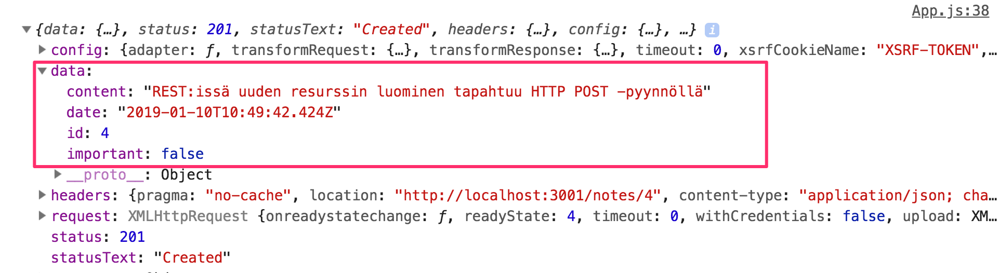
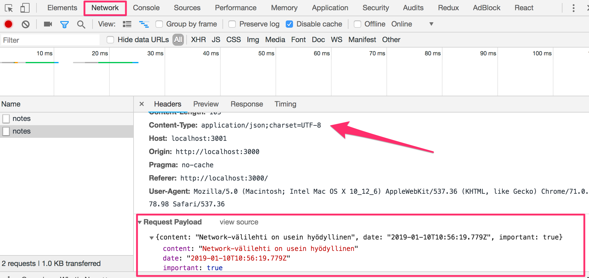
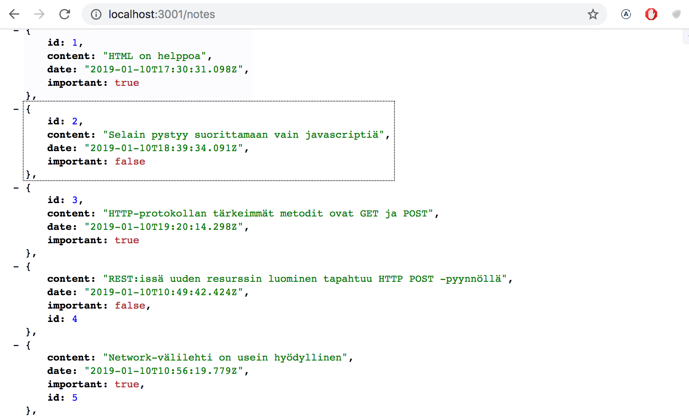
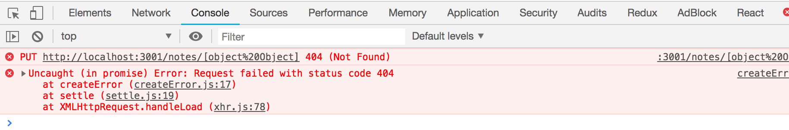
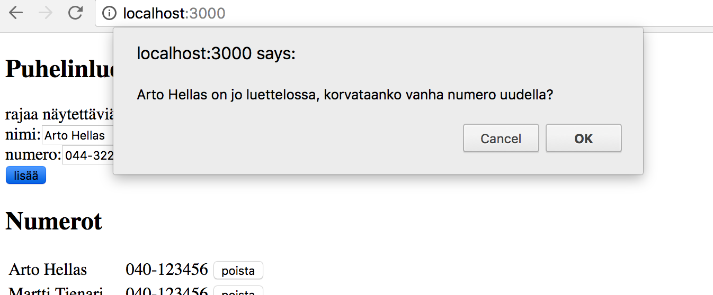

<div class="content">

<!-- Kun sovelluksella luodaan uusia muistiinpanoja, täytyy ne luonnollisesti tallentaa palvelimelle. [json-server](https://github.com/typicode/json-server) mainitsee dokumentaatiossaan olevansa ns. REST- tai RESTful-API -->
We naturally want to store all notes that are created in our application in a backend server somewhere. The [json-server](https://github.com/typicode/json-server) package claims to be a so-called REST or RESTful API in its documentation:

> <i>Get a full fake REST API with zero coding in less than 30 seconds (seriously)</i>

<!-- Ihan alkuperäisen [määritelmän](https://en.wikipedia.org/wiki/Representational_state_transfer) mukainen RESTful API json-server ei ole, mutta ei ole kovin moni muukaan itseään REST:iksi kutsuva rajapinta. -->
If we go by the original textbook [definition](https://en.wikipedia.org/wiki/Representational_state_transfer), the json-server does not fit the description of a REST API, but the same is true of most APIs claiming to be RESTful.

<!-- Tutustumme REST:iin tarkemmin kurssin [seuraavassa osassa](/osa3), mutta jo nyt on tärkeä ymmärtää minkälaista [konventiota](https://en.wikipedia.org/wiki/Representational_state_transfer#Applied_to_Web_services) json-server ja yleisemminkin REST API:t käyttävät [reittien](https://github.com/typicode/json-server#routes), eli URL:ien ja käytettävien HTTP-pyyntöjen tyyppien suhteen. -->
We will take a closer look at REST in the [next part](/osa3) of the course, but it's good to familiarize ourselves at this point with some of the [conventions](https://en.wikipedia.org/wiki/Representational_state_transfer#Applied_to_Web_services) used by json-server and REST APIs at large. In particular, we will be taking a look at how [routes](https://github.com/typicode/json-server#routes) aka. URLs and HTTP request types are conventionally used in REST.

### REST

<!-- REST:issä yksittäisiä asioita esim. meidän tapauksessamme muistiinpanoja kutsutaan <i>resursseiksi</i>. Jokaisella resurssilla on yksilöivä osoite eli URL. json-serverin noudattaman yleisen konvention mukaan yksittäistä muistiinpanoa kuvaavan resurssin URL on muotoa <i>notes/3</i>, missä 3 on resurssin tunniste. Osoite <i>notes</i> taas vastaa kaikkien yksittäisten muistiinpanojen kokoelmaa. -->
In REST terminology, we refer to individual data objects like the notes in our application as <i>resources</i>. Every resource has an associated unique address, aka. its URL. In the convention used by json-server, we would be able to locate an individual note at the resource URL <i>notes/3</i>, where 3 is the id of the resource. In this convention the <i>notes</i> url would point to a resource collection containing all notes.

<!-- Resursseja haetaan palvelimelta HTTP GET -pyynnöillä. Esim. HTTP GET osoitteeseen <i>notes/3</i> palauttaa muistiinpanon, jonka id-kentän arvo on 3. Kun taas HTTP GET -pyyntö osoitteeseen <i>notes</i> palauttaa kaikki muistiinpanot. -->
Resources are fetched from the server with HTTP GET requests. E.g. an HTTP GET request to the URL <i>notes/3</i> will return the note that has the id number 3. An HTTP GET request to the <i>notes</i> URL would return a list of all notes.

<!-- Uuden muistiinpanoa vastaavan resurssin luominen tapahtuu json-serverin noudattamassa REST-konventiossa tekemällä HTTP POST -pyyntö, joka kohdistuu myös samaan osoitteeseen <i>notes</i>. Pyynnön mukana sen runkona eli <i>bodynä</i> lähetetään luotavan muistiinpanon tiedot. -->
The creation of a new note resource in the REST convention followed by json-server is done with an HTTP POST request, that is made to the <i>notes</i> URL. The data for the new note resource is sent in the <i>body</i> of the request.

<!-- json-server vaatii, että tiedot lähetetään JSON-muodossa, eli käytännössä sopivasti muotoiltuna merkkijonona ja asettamalla headerille <i>Content-Type</i> arvo <i>application/json</i>. -->
json-server requires that all data is sent in the JSON format. In practice this means that the data must be a correctly formatted string, and that the request must contain the <i>Content-Type</i> request header with the value <i>application/json</i>.

<!-- ### Datan lähetys palvelimelle -->
### Sending Data to the Server

<!-- Muutetaan nyt uuden muistiinpanon lisäämisestä huolehtivaa tapahtumankäsittelijää seuraavasti: -->
Let's make the following changes to the event handler responsible for creating a new note:

```js
addNote = event => {
  event.preventDefault()
  const noteObject = {
    content: newNote,
    date: new Date(),
    important: Math.random() > 0.5,
  }

// highlight-start
  axios
    .post('http://localhost:3001/notes', noteObject)
    .then(response => {
      console.log(response)
    })
// highlight-end
}
```

<!-- eli luodaan muistiinpanoa vastaava olio, ei kuitenkaan lisätä sille kenttää <i>id</i>, sillä on parempi jättää id:n generointi palvelimen vastuulle! -->
We create a new object for the note but omit the <i>id</i> property, since it's better to let the server generate ids for our resources!

<!-- Olio lähetetään palvelimelle käyttämällä axiosin metodia <em>post</em>. Rekisteröity tapahtumankäsittelijä tulostaa konsoliin palvelimen vastauksen. -->
The object is sent to the server by using the axios <em>post</em> method. The registered event handler logs the response that is sent back from the server to the console.

<!-- Kun nyt kokeillaan luoda uusi muistiinpano, konsoliin tulostus näyttää seuraavalta: -->
When we try to create a new note, the following output pops up in console:



<!-- Uusi muistiinpano on siis _response_-olion kentän <i>data</i> arvona. Palvelin on lisännyt muistiinpanolle tunnisteen, eli <i>id</i>-kentän. -->
The newly created note resource is stored in the value of the <i>data</i> property of the _response_ object.

<!-- Joskus on hyödyllistä tarkastella HTTP-pyyntöjä [osan 0 alussa](/osa0#http-get) paljon käytetyn konsolin <i>Network</i>-välilehden kautta: -->
Sometimes it can be useful to inspect HTTP requests in the <i>Network</i> tab of Chrome developer tools, which was used heavily at the beginning of [part 0](/osa0#http-get):



<!-- Voimme esim. tarkastaa onko POST-pyynnön mukana menevä data juuri se mitä oletimme, onko headerit asetettu oikein ym. -->
We can use the inspector to check that the headers sent in the POST request are what we expected them to be, and that their values are correct.

<!-- Koska POST-pyynnössä lähettämämme data oli Javascript-olio, osasi axios automaattisesti asettaa pyynnön <i>Content-type</i> headerille oikean arvon eli <i>application/json</i>. -->
Since the data we sent in the POST request was a JavaScript object, axios automatically knew to set the appropriate <i>application/json</i> value for the <i>Content-Type</i> header.

<!-- Uusi muistiinpano ei vielä renderöidy ruudulle, sillä emme aseta komponentille <i>App</i> uutta tilaa muistiinpanon luomisen yhteydessä. Viimeistellään sovellus vielä tältä osin: -->
The new note is not yet rendered to the screen. This is because we did not update the state of the <i>App</i> component when we created the new note. Let's fix this:

```js
addNote = event => {
  event.preventDefault()
  const noteObject = {
    content: newNote,
    date: new Date(),
    important: Math.random() > 0.5,
  }

  axios
    .post('http://localhost:3001/notes', noteObject)
    .then(response => {
      // highlight-start
      setNotes(notes.concat(response.data))
      setNewNote('')
      // highlight-end
    })
}
```

<!-- Palvelimen palauttama uusi muistiinpano siis lisätään tuttuun tapaan funktiolla <em>setNotes</em> tilassa olevien muiden muistiinpanojen joukkoon (kannattaa [muistaa tärkeä detalji](/osa1#taulukon-käsittelyä) siitä, että metodi <em>concat</em> ei muuta komponentin alkuperäistä tilaa, vaan luo uuden taulukon) ja tyhjennetään lomakkeen teksti.  -->
The new note returned by the backend server is added to the list of notes in our application's state in a familiar fashion, by using the <em>setNotes</em> function and then resetting the note creation form. An [important detail](/osa1#taulukon-käsittelyä) to remember is that the <em>concat</em> method does not change the original state, but rather creates a new copy of the list.

<!-- Kun palvelimella oleva data alkaa vaikuttaa web-sovelluksen toimintalogiikkaan, tulee sovelluskehitykseen heti iso joukko uusia haasteita, joita tuo mukanaan mm. kommunikoinnin asynkronisuus. Debuggaamiseenkin tarvitaan uusia strategiota, debug-printtaukset ym. muuttuvat vain tärkeämmäksi, myös Javascriptin runtimen periaatteita ja React-komponenttien toimintaa on pakko tuntea riittävällä tasolla, arvaileminen ei riitä. -->
Once the data returned by the server starts to have an effect on the behavior of our web applications, we are immediately faced by a whole new set of challenges that arise due to the nature of asynchronous communication among other things. This creates the demand for new debugging strategies. Logging to the console and other means of debugging become more and more important, and we have to develop an understanding of the inner workings of the JavaScript runtime and React components — guessing is no longer an option.

<!-- Palvelimen tilaa kannattaa tarkastella myös suoraan, esim. selaimella: -->
It's beneficial to inspect the state of the backend server e.g. through the browser:



<!-- näin on mahdollista varmistua, mm. siirtyykö kaikki oletettu data palvelimelle. -->
This makes it possible to verify that all the data we intended to send was actually received by the server.

<!-- Kurssin seuraavassa osassa alamme toteuttaa itse myös palvelimella olevan sovelluslogiikan, tutustumme silloin tarkemmin palvelimen debuggausta auttaviin työkaluihin, mm. [postmaniin](https://chrome.google.com/webstore/detail/postman/fhbjgbiflinjbdggehcddcbncdddomop). Tässä vaiheessa json-server-palvelimen tilan tarkkailuun riittänee selain. -->
In the next part of the course we will learn to implement our own logic in the backend. We will then take a closer look at tools like [postman](https://chrome.google.com/webstore/detail/postman/fhbjgbiflinjbdggehcddcbncdddomop) that help us to debug our server applications. However, inspecting the state of the json-server through the browser is sufficient for our current needs.

<!-- > **HUOM:** sovelluksen nykyisessä versiossa selain lisää uudelle muistiinpanolle sen luomishetkeä kuvaavan kentän. Koska koneen oma kello voi näyttää periaatteessa mitä sattuu, on aikaleimojen generointi todellisuudessa viisaampaa hoitaa palvelimella ja tulemmekin tekemään tämän muutoksen kurssin seuraavassa osassa. -->
> **NB:** in the current version of our application the browser adds the creation date property to the note. Since the clock of the machine running the browser can be wrongly configured, it's much wiser to let the backend server generate this timestamp for us. This is in fact what we will do in the next part of the course.

<!-- Sovelluksen tämän hetkinen koodi on kokonaisuudessaan [githubissa](https://github.com/fullstack-hy2019/part2-notes/tree/part2-5), branchissa <i>part2-5</i>. -->
The code for the current state of our application can be found in the  <i>part2-5</i> branch on [github](https://github.com/fullstack-hy2019/part2-notes/tree/part2-5).

<!-- ### Muistiinpanon tärkeyden muutos -->
### Changing the importance of notes

<!-- Lisätään muistiinpanojen yhteyteen painike, millä niiden tärkeyttä voi muuttaa. -->
Let's add a button to every note that can be used for toggling its importance.

<!-- Muistiinpanon määrittelevän komponentin muutos on seuraavat: -->
We make the following changes to the <i>Note</i> component:

```js
const Note = ({ note, toggleImportance }) => {
  const label = note.important
    ? 'make not important' : 'make important'

  return (
    <li>
      {note.content} 
      <button onClick={toggleImportance}>{label}</button>
    </li>
  )
}
```

<!-- Komponentissa on nappi, jolle on rekisteröity klikkaustapahtuman käsittelijäksi propsien avulla välitetty funktio <em>toggleImportance</em>. -->
We add a button to the component and assign its event handler as the <em>toggleImportance</em> function passed in the component's props.

<!-- Komponentti <i>App</i> määrittelee alustavan version tapahtumankäsittelijästä <em>toggleImportanceOf</em> ja välittää sen jokaiselle <i>Note</i>-komponentille: -->
The <i>App</i> component defines an initial version of the <em>toggleImportanceOf</em> event handler function and passes it to every <i>Note</i> component:

```js
const App = () => {
  const [notes, setNotes] = useState([]) 
  const [newNote, setNewNote] = useState('')
  const [showAll, setShowAll] = useState(true)

  // ...

  // highlight-start
  const toggleImportanceOf = id => {
    console.log(
      'importance of ' + id + ' needs to be toggled'
    )
  }
  // highlight-end

  const rows = () => notesToShow.map(note =>
    <Note
      key={note.id}
      note={note}
      toggleImportance={() => toggleImportanceOf(note.id)} // highlight-line
    />
  )

  return (
    // ...
  )
}
```

<!-- Huomaa, että jokaisen muistiinpanon tapahtumankäsittelijäksi tulee nyt <i>yksilöllinen</i> funktio, sillä kunkin muistiinpanon <i>id</i> on uniikki. -->
Notice how every note receives its own <i>unique</i> event handler function, as the <i>id</i> of every note is unique.

<!-- Esim. jos <i>node.id</i> on 3, tulee tapahtumankäsittelijäksi _toggleImportance(note.id)_ eli käytännössä: -->
E.g. if <i>node.id</i> is 3, the event handler function returned by _toggleImportance(note.id)_ will be:

```js
() => { console.log('importance of 3 needs to be toggled') }
```

<!-- Pieni muistutus tähän väliin. Tapahtumankäsittelijän koodin tulostuksessa muodostetaan tulostettava merkkijono Javan tyyliin plussaamalla stringejä: -->
Short reminder. The string printed by the event handler is defined in a Java-like manner by plussing strings:

```js
console.log('importance of ' + id + ' needs to be toggled')
```

<!-- ES6:n [template string](https://developer.mozilla.org/en-US/docs/Web/JavaScript/Reference/Template_literals) -ominaisuuden ansiosta Javascriptissa vastaavat merkkijonot voidaan kirjottaa hieman mukavammin: -->
The [template string](https://developer.mozilla.org/en-US/docs/Web/JavaScript/Reference/Template_literals) syntax added in ES6 can be used to write similar strings in a much nicer way:

```js
console.log(`importance of ${id} needs to be toggled`)
```

<!-- Merkkijonon sisälle voi nyt määritellä "dollari-aaltosulku"-syntaksilla kohtia, minkä sisälle evaluoidaan javascript-lausekkeita, esim. muuttujan arvo. Huomaa, että template stringien hipsutyyppi poikkeaa Javascriptin normaaleista merkkijonojen käyttämistä hipsuista. -->
We can now use the "dollar bracket"-syntax to add parts to the string that will evaluate JavaScript expressions, e.g. the value of a variable. Note that the quotation marks used in template strings differ from the quotation marks used in regular JavaScript strings.

<!-- Yksittäistä json-serverillä olevaa muistiinpanoa voi muuttaa kahdella tavalla, joko <i>korvaamalla</i> sen tekemällä HTTP PUT -pyyntö muistiinpanon yksilöivään osoitteeseen tai muuttamalla ainoastaan joidenkin muistiinpanon kenttien arvoja HTTP PATCH -pyynnöllä. -->
Individual notes stored in the json-server backend can be modified in two different ways by making HTTP requests to the note's unique URL. We can either <i>replace</i> the entire note with an HTTP PUT request, or only change some of the note's properties with an HTTP PATCH request.

<!-- Korvaamme nyt muistiinpanon kokonaan, sillä samalla tulee esille muutama tärkeä React:iin ja Javascriptiin liittyvä seikka. -->

<!-- Tapahtumankäsittelijäfunktion lopullinen muoto on seuraavassa: -->
The final form of the event handler function is the following:

```js
const toggleImportanceOf = id => {
  const url = `http://localhost:3001/notes/${id}`
  const note = notes.find(n => n.id === id)
  const changedNote = { ...note, important: !note.important }

  axios.put(url, changedNote).then(response => {
    setNotes(notes.map(note => note.id !== id ? note : response.data))
  })
}
```

<!-- Melkein jokaiselle riville sisältyy tärkeitä yksityiskohtia. Ensimmäinen rivi määrittelee jokaiselle muistiinpanolle id-kenttään perustuvan yksilöivän url:in. -->
Almost every line of code in the function body contains important details. The first line defines the unique url for each note resource based on its id.

<!-- Taulukon metodilla [find](https://developer.mozilla.org/en-US/docs/Web/JavaScript/Reference/Global_Objects/Array/find) etsitään muutettava muistiinpano ja talletetaan muuttujaan _note_ viite siihen. -->
The array [find](https://developer.mozilla.org/en-US/docs/Web/JavaScript/Reference/Global_Objects/Array/find) method is used to find the note we want to modify, and we then assign it to the _note_ variable.

<!-- Sen jälkeen luodaan <i>uusi olio</i>, jonka sisältö on sama kuin vanhan olion sisältö poislukien kenttä important. Luominen näyttää hieman erikoiselta: -->
After this we create a <i>new object</i> that is an exact copy of the old note, excluding the important property. The code for creating the new object may seem a bit strange:

```js
const changedNote = { ...note, important: !note.important }
```

<!-- Kyseessä on vielä standardoimattoman [object spread](https://github.com/tc39/proposal-object-rest-spread) -operaation soveltaminen. -->
The command uses the [object spread](https://github.com/tc39/proposal-object-rest-spread) syntax which is not yet a standard part of the JavaScript language specification.

<!-- Käytännössä <em>{ ... note}</em> luo olion, jolla on kenttinään kopiot olion _note_ kenttien arvoista. Kun aaltosulkeisiin lisätään asioita, esim. <em>{ ...note, important: true }</em>, tulee uuden olion kenttä _important_ saamaan arvon _true_. Eli esimerkissämme <em>important</em> saa uudessa oliossa vanhan arvonsa käänteisarvon. -->
In practice <em>{ ...note }</em> creates a new object, with copies of all the properties from the _note_ object. When we add properties inside the brackets after the spreaded object, e.g. <em>{ ...note, important: true }</em>, then the value of the _important_ property of the new object will be _true_. In our example the <em>important</em> property gets the negation of its previous value in the original object.

<!-- Pari huomioita. Miksi teimme muutettavasta oliosta kopion vaikka myös seuraava koodi näyttää toimivan: -->
There's a few things to point out. Why did we make a copy of the note object we wanted to modify, when the following code also appears to work:

```js
const note = notes.find(n => n.id === id)
note.important = !note.important

axios.put(url, note).then(response => {
  // ...
```

<!-- Näin ei ole suositetavaa tehdä, sillä muuttuja <em>note</em> on viite komponentin tilassa, eli <em>notes</em>-taulukossa olevaan olioon, ja kuten muistamme tilaa ei Reactissa saa muuttaa suoraan! -->
This is not recommended because the variable <em>note</em> is a reference to an item in the <em>notes</em> array in the component's state, and as we recall we must never mutate state directly in React. 

<!-- Kannattaa myös huomata, että uusi olio _changedNote_ on ainoastaan ns. [shallow copy](https://en.wikipedia.org/wiki/Object_copying#Shallow_copy), eli uuden olion kenttien arvoina on vanhan olion kenttien arvot. Jos vanhan olion kentät olisivat itsessään olioita, viittaisivat uuden olion kentät samoihin olioihin. -->
It's also worth noting that the new object _changedNote_ is only a so-called [shallow copy](https://en.wikipedia.org/wiki/Object_copying#Shallow_copy), meaning that the values of the new object are the same as the values of the old object. If the values of the old object were objects themselves, then the copied values in new object would reference the same objects that were in the old object.

<!-- Uusi muistiinpano lähetetään sitten PUT-pyynnön mukana palvelimelle, jossa se korvaa aiemman muistiinpanon. -->
The new note is then sent with a PUT request to the backend where it will replace the old object.

<!-- Takaisinkutsufunktiossa asetetaan komponentin <i>App</i> tilaan <em>notes</em>  kaikki vanhat muistiinpanot paitsi muuttuneen, josta tilaan asetetaan palvelimen palauttama versio: -->
The callback function sets the component's <em>notes</em> state to a new array that contains all the items from the previous <em>notes</em> array, except for the old note which is replaced by the updated version of that note returned by the server:

```js
axios.put(url, changedNote).then(response => {
  setNotes(notes.map(note => note.id !== id ? note : response.data))
})
```

<!-- Tämä saadaan aikaan metodilla <em>map</em>:  -->
This is accomplished with the <em>map</em> method:

```js
notes.map(note => note.id !== id ? note : response.data)
```

<!-- Operaatio siis luo uuden taulukon vanhan taulukon perusteella. Jokainen uuden taulukon alkio luodaan ehdollisesti siten, että jos ehto <em>note.id !== id</em> on tosi, otetaan uuteen taulukkoon suoraan vanhan taulukon kyseinen alkio. Jos ehto on epätosi, eli kyseessä on muutettu muistiinpano, otetaan uuteen taulukkoon palvelimen palauttama olio. -->
The map method creates a new array by mapping every item from the old array into an item in the new array. In our example, the new array is created conditionally so that if <em>note.id !== id</em> is true, we simply copy the item from the old array into the new array. If the condition is false, then the note object returned by the server is added to the array instead.

<!-- Käytetty <em>map</em>-kikka saattaa olla aluksi hieman hämmentävä. Asiaa kannattaakin miettiä tovi. Tapaa tullaan käyttämään kurssilla vielä kymmeniä kertoja. -->
This <em>map</em> trick may seem a bit strange at first but it's worth spending some time wrapping your head around it. We will use this method many times throughout the course.

<!-- ### Palvelimen kanssa tapahtuvan kommunikoinnin eristäminen omaan moduuliin -->
### Extracting communication with the backend into a separate module

<!-- <i>App</i>-komponentti alkaa kasvaa uhkaavasti kun myös palvelimen kanssa kommunikointi tapahtuu komponentissa. [Single responsibility](https://en.wikipedia.org/wiki/Single_responsibility_principle) -periaatteen hengessä kommunikointi onkin viisainta eristää omaan [moduuliinsa](#refaktorointia---moduulit). -->
The <i>App</i> component has become quite bloated after we added the code for communicating with the backend server. In the spirit of the [single responsibility principle](https://en.wikipedia.org/wiki/Single_responsibility_principle), we deem it wise to extract this communication into its own [module](#refaktorointia---moduulit).

<!-- Luodaan hakemisto <i>src/services</i> ja sinne tiedosto <i>notes.js</i>: -->
Let's create a <i>src/services</i> directory and add a file there called <i>notes.js</i>:

```js
import axios from 'axios'
const baseUrl = 'http://localhost:3001/notes'

const getAll = () => {
  return axios.get(baseUrl)
}

const create = newObject => {
  return axios.post(baseUrl, newObject)
}

const update = (id, newObject) => {
  return axios.put(`${baseUrl}/${id}`, newObject)
}

export default { 
  getAll: getAll, 
  create: create, 
  update: update 
}
```

<!-- Moduuli palauttaa nyt olion, jonka kenttinä (<i>getAll</i>, <i>create</i> ja <i>update</i>) on kolme muistiinpanojen käsittelyä hoitavaa funktiota. Funktiot palauttavat suoraan axiosin metodien palauttaman promisen. -->
The module returns an object that has three functions (<i>getAll</i>, <i>create</i> ja <i>update</i>) for dealing with notes as its properties. The functions directly return the promises returned by the axios methods.

Komponentti <i>App</i> saa moduulin käyttöön <em>import</em>-lauseella:

```js
import noteService from './services/notes' // highlight-line

const App = () => {
```

<!-- moduulin funktioita käytetään importatun muuttujan _noteService_ kautta seuraavasti: -->
The functions of the module can be used directly with the imported variable _noteService_ like this:

```js
const App = () => {
  // ...

  useEffect(() => {
    // highlight-start
    noteService
      .getAll()
      .then(response => {
        setNotes(response.data)
      })
    // highlight-end
  }, [])

  const toggleImportanceOf = id => {
    const note = notes.find(n => n.id === id)
    const changedNote = { ...note, important: !note.important }

    // highlight-start
    noteService
      .update(id, changedNote)
      .then(response => {
        setNotes(notes.map(note => note.id !== id ? note : response.data))
      })
    // highlight-end
  }

  const addNote = (event) => {
    event.preventDefault()
    const noteObject = {
      content: newNote,
      date: new Date().toISOString(),
      important: Math.random() > 0.5
    }

// highlight-start
    noteService
      .create(noteObject)
      .then(response => {
        setNotes(notes.concat(response.data))
        setNewNote('')
      })
// highlight-end
  }

  // ...
}

export default App
```

<!-- Voisimme viedä ratkaisua vielä askeleen pidemmälle, sillä käyttäessään moduulin funktioita komponentti <i>App</i> saa olion, joka sisältää koko HTTP-pyynnön vastauksen: -->
We could take our implementation one step further. When the <i>App</i> component uses the functions, it receives an object that contains the entire response for the HTTP request:

```js
noteService
  .getAll()
  .then(response => {
    setNotes(response.data)
  })
```

<!-- Eli asia mistä <i>App</i> on kiinnostunut on parametrin kentässä <i>response.data</i>. -->
The <i>App</i> component only uses the <i>response.data</i> property of the response object.

<!-- Moduulia olisi miellyttävämpi käyttää, jos se HTTP-pyynnön vastauksen sijaan palauttaisi suoraan muistiinpanot sisältävän taulukon. Tällöin moduulin käyttö näyttäisi seuraavalta -->
The module would be much nicer to use, if instead of the entire HTTP response we would only get the response data. Then using the module would look like this:

```js
noteService
  .getAll()
  .then(initialNotes => {
    setNotes(initialNotes)
  })
```
<!-- Tämä onnistuu muuttamalla moduulin koodia seuraavasti (koodiin jää ikävästi copy-pastea, emme kuitenkaan nyt välitä siitä): -->
We can achieve this by changing the code in the module as follows (the current code contains some copy-paste but we will tolerate that for now):

```js
import axios from 'axios'
const baseUrl = 'http://localhost:3001/notes'

const getAll = () => {
  const request = axios.get(baseUrl)
  return request.then(response => response.data)
}

const create = newObject => {
  const request = axios.post(baseUrl, newObject)
  return request.then(response => response.data)
}

const update = (id, newObject) => {
  const request = axios.put(`${baseUrl}/${id}`, newObject)
  return request.then(response => response.data)
}

export default { 
  getAll: getAll, 
  create: create, 
  update: update 
}
```

<!-- eli enää ei palautetakaan suoraan axiosin palauttamaa promisea, vaan otetaan promise ensin muuttujaan <em>request</em> ja kutsutaan sille metodia <em>then</em>: -->
We no longer return the promise returned by axios directly. Instead, we assign the promise to the <em>request</em> variable and call its <em>then</em> method:

```js
const getAll = () => {
  const request = axios.get(baseUrl)
  return request.then(response => response.data)
}
```

<!-- Täydellisessä muodossa kirjoitettuna viimeinen rivi olisi: -->
The last row in our function is simply a more compact expression of the same code as shown below:

```js
const getAll = () => {
  const request = axios.get(baseUrl)
  // highlight-start
  return request.then(response => {
    return response.data
  })
  // highlight-end
}
```

<!-- Myös nyt funktio <em>getAll</em>  palauttaa promisen, sillä promisen metodi <em>then</em> [palauttaa promisen](https://developer.mozilla.org/en-US/docs/Web/JavaScript/Reference/Global_Objects/Promise/then). -->
The modified <em>getAll</em> function still returns a promise, as the <em>then</em> method of a promise also [returns a promise](https://developer.mozilla.org/en-US/docs/Web/JavaScript/Reference/Global_Objects/Promise/then). 

<!-- Koska <em>then</em>:in parametri palauttaa suoraan arvon <i>response.data</i>, on funktion <em>getAll</em> palauttama promise sellainen, että jos HTTP-kutsu onnistuu, antaa promise takaisinkutsulleen HTTP-pyynnön mukana olleen datan, eli se toimii juuri niin kuin haluamme. -->
After defining the parameter of the <em>then</em> method to directly return <i>response.data</i>, we have gotten the <em>getAll</em> function to work like we wanted it to. When the HTTP request is successful, the promise returns the data sent back in the response from the backend.

<!-- Moduulin muutoksen jälkeen täytyy komponentti <i>App</i> muokata <em>noteService</em>:n metodien takaisinkutsujen osalta ottamaan huomioon, että ne palauttavat datan suoraan: -->
We have to update the <i>App</i> component to work with the changes made to our module.  We have to fix the callback functions given as parameters to the <em>noteService</em> object's methods, so that they use the directly returned response data:

```js
const App = () => {
  // ...

  useEffect(() => {
    noteService
      .getAll()
      // highlight-start      
        .then(initialNotes => {
        setNotes(initialNotes)
        // highlight-end
      })
  }, [])

  const toggleImportanceOf = id => {
    const note = notes.find(n => n.id === id)
    const changedNote = { ...note, important: !note.important }

    noteService
      .update(id, changedNote)
      // highlight-start      
        .then(returnedNote => {
        setNotes(notes.map(note => note.id !== id ? note : returnedNote))
      // highlight-end
      })
  }

  const addNote = (event) => {
    event.preventDefault()
    const noteObject = {
      content: newNote,
      date: new Date().toISOString(),
      important: Math.random() > 0.5
    }

    noteService
      .create(noteObject)
    // highlight-start      
        .then(returnedNote => {
        setNotes(notes.concat(returnedNote))
        // highlight-end
        setNewNote('')
      })
  }

  // ...
}
```

<!-- Tämä kaikki on hieman monimutkaista ja asian selittäminen varmaan vain vaikeuttaa sen ymmärtämistä. Internetistä löytyy paljon vaihtelevatasoista materiaalia aiheesta, esim. [tämä](https://javascript.info/promise-chaining). -->
This is all quite complicated and attempting to explain it may just make it harder to understand. The internet is full of material discussing the topic, like [this](https://javascript.info/promise-chaining).

<!-- [You do not know JS](https://github.com/getify/You-Dont-Know-JS) sarjan kirja "Async and performance" selittää asian [hyvin](https://github.com/getify/You-Dont-Know-JS/blob/master/async%20%26%20performance/ch3.md) mutta tarvitsee selitykseen kohtuullisen määrän sivuja. -->
The "Async and performance" book from the [You do not know JS](https://github.com/getify/You-Dont-Know-JS) book series explains the topic [well](https://github.com/getify/You-Dont-Know-JS/blob/master/async%20%26%20performance/ch3.md), but the explanation is many pages long.

<!-- Promisejen ymmärtäminen on erittäin keskeistä modernissa Javascript-sovelluskehityksessä, joten asiaan kannattaa uhrata kohtuullisessa määrin aikaa. -->
Promises are central to modern JavaScript development and it is highly recommended to invest a reasonable amount of time into understanding them.

<!-- ### Kehittyneempi tapa olioliteraalien määrittelyyn -->
### Cleaner syntax for defining object literals

<!-- Muistiinpanopalvelut määrittelevä moduuli siis eksporttaa olion, jonka kenttinä <i>getAll</i>, <i>create</i> ja <i>update</i> ovat muistiinpanojen käsittelyyn tarkoitetut funktiot.  -->
The module defining note related services currently exports an object with the properties <i>getAll</i>, <i>create</i> and <i>update</i> that are assigned to functions for handling notes.

<!-- Moduulin määrittelu tapahtui seuraavasti: -->
The module definition was as follows:

```js
import axios from 'axios'
const baseUrl = 'http://localhost:3001/notes'

const getAll = () => {
  const request = axios.get(baseUrl)
  return request.then(response => response.data)
}

const create = newObject => {
  const request = axios.post(baseUrl, newObject)
  return request.then(response => response.data)
}

const update = (id, newObject) => {
  const request = axios.put(`${baseUrl}/${id}`, newObject)
  return request.then(response => response.data)
}

export default { 
  getAll: getAll, 
  create: create, 
  update: update 
}
```

<!-- Exportattava asia on siis seuraava, hieman erikoiselta näyttävä olio: -->
The module exports the following, rather peculiar looking object:

```js
{ 
  getAll: getAll, 
  create: create, 
  update: update 
}
```

<!-- Olion määrittelyssä vasemmalla puolella kaksoispistettä olevat nimet tarkoittavat eksportoitavan olion <i>kenttiä</i>, kun taas oikealla puolella olevat nimet ovat moduulin sisällä <i>määriteltyjä muuttujia</i>.  -->
The names to the left of the colon in the object definition are the <i>keys</i> of the object while the names to the right are <i>variables</i> that are defined inside of the module.

<!-- Koska olion kenttien nimet ovat samat kuin niiden arvon määrittelevien muuttujien nimet, voidaan olion määrittely kirjoittaa tiivimmässä muodossa: -->
Since the name of thy keys and the assigned variables are the same, we can write the object definition with a more compact syntax:

```js
{ 
  getAll, 
  create, 
  update 
}
```

<!-- Eli moduulin määrittely yksinkertaisuu seuraavaan muotoon  -->
As a result the module definition gets simplified into the following form:

```js
import axios from 'axios'
const baseUrl = 'http://localhost:3001/notes'

const getAll = () => {
  const request = axios.get(baseUrl)
  return request.then(response => response.data)
}

const create = newObject => {
  const request = axios.post(baseUrl, newObject)
  return request.then(response => response.data)
}

const update = (id, newObject) => {
  const request = axios.put(`${baseUrl}/${id}`, newObject)
  return request.then(response => response.data)
}

export default { getAll, create, update } // highlight-line
```

<!-- Tässä tiiviimmässä olioiden määrittelytavassa hyödynnetään ES6:n myötä Javascriptiin  tullutta [uutta ominaisuutta](https://developer.mozilla.org/en-US/docs/Web/JavaScript/Reference/Operators/Object_initializer#Property_definitions), joka mahdollistaa hieman tiiviimmän tavan muuttujien avulla tapahtuvaan olioiden määrittelyyn. -->
In this more compact definition we are using a [new feature](https://developer.mozilla.org/en-US/docs/Web/JavaScript/Reference/Operators/Object_initializer#Property_definitions) that was added to JavaScript in the ES6 language specification. The feature specifically enables this more compact way of defining objects.

<!-- Havainnollistaaksemme asiaa tarkastellaan tilannetta, jossa meillä on muuttujissa arvoja -->
To demonstrate this feature, let's consider a situation where we have the following values assigned to variables:

```js 
const name = 'Leevi'
const age = 0
```

<!-- Vanhassa Javascriptissä olio täytyi määritellä seuraavaan tyyliin -->
In older versions of JavaScript we had to define an object like this:

```js 
const person = {
  name: name,
  age: age
}
```

<!-- koska muuttujien ja luotavan olion kenttien nimi nyt on sama, riittää ES6:ssa kirjoittaa: -->
Because the name of the variables and the name of keys of the object are the same, it's enough to simply write the following in ES6 JavaScript: 

```js 
const person = { name, age }
```

<!-- lopputulos molemmissa on täsmälleen sama, eli ne luovat olion jonka kentän <i>name</i> arvo on <i>Leevi</i> ja kentän <i>age</i> arvo <i>0</i>. -->
The result is identical in both expressions. They both create an object with a <i>name</i> property with the value <i>Leevi</i> and an <i>age</i> property with the value <i>0</i>.

<!-- ### Promise ja virheet -->
### Promises and errors

<!-- Jos sovelluksemme mahdollistaisi muistiinpanojen poistamisen, voisi syntyä tilanne, missä käyttäjä yrittää muuttaa sellaisen muistiinpanon tärkeyttä, joka on jo poistettu järjestelmästä. -->
If our application allowed users to delete notes, we could end up in a situation where a user tries to change the importance of a note that has already been deleted from the system.

<!-- Simuloidaan tälläistä tilannetta "kovakoodaamalla" noteServiceen funktioon <em>getAll</em> muistiinpano, jota ei ole todellisuudessa (eli palvelimella) olemassa: -->
Let's simulate this situation by making the <em>getAll</em> function of the note service return a "hardcoded" note that does not actually exist in the backend server:

```js
const getAll = () => {
  const request = axios.get(baseUrl)
  const nonExisting = {
    id: 10000,
    content: 'Tätä muistiinpanoa ei ole palvelimelta',
    date: '2017-12-10T17:30:31.098Z',
    important: true,
  }
  return request.then(response => response.data.concat(nonExisting))
}
```

<!-- Kun valemuistiinpanon tärkeyttä yritetään muuttaa, konsoliin tulee virheilmoitus, joka kertoo palvelimen vastanneen urliin <i>/notes/10000</i> tehtyyn HTTP PUT -pyyntöön statuskoodilla 404 <i>not found</i>: -->
When we try to change the importance of the hardcoded note, we see the following error message in the console. The error says that the backend server responded to our HTTP PUT request with a status code 404 <i>not found</i>.



<!-- Sovelluksen tulisi pystyä käsittelemään tilanne hallitusti. Jos konsoli ei ole auki, ei käyttäjä huomaa mitään muuta kuin sen, että muistiinpanon tärkeys ei vaihdu napin painelusta huolimatta. -->
The application should be able to handle these types of error situations gracefully. Users won't be able to tell that an error has actually occurred unless they happen to have their console open. The only way the error can be seen  in the application is that clicking the button has no effect on the importance of the note.

<!-- Jo [aiemmin](#axios-ja-promiset) mainittiin, että promisella voi olla kolme tilaa. Kun HTTP-pyyntö epäonnistuu, menee pyyntöä vastaava promise tilaan <i>rejected</i>. Emme tällä hetkellä käsittele koodissamme promisen epäonnistumista mitenkään. -->
We had [previously](#axios-ja-promiset) mentioned that a promise can be in one of three different states. When an HTTP request fails, the associated promise is <i>rejected</i>. In our current code we do not handle this rejection in any way.

<!-- Promisen epäonnistuminen [käsitellään](https://developer.mozilla.org/en-US/docs/Web/JavaScript/Guide/Using_promises) antamalla <em>then</em>-metodille parametriksi myös toinen takaisinkutsufunktio, jota kutsutaan siinä tapauksessa jos promise epäonnistuu. -->
The rejection of a promise is [handled](https://developer.mozilla.org/en-US/docs/Web/JavaScript/Guide/Using_promises) by providing the <em>then</em> method with a second callback function, that is called in the situation where the promise is rejected.

<!-- Ehkä yleisempi tapa kuin kahden tapahtumankäsittelijän käyttö on liittää promiseen epäonnistumistilanteen käsittelijä kutsumalla metodia [catch](https://developer.mozilla.org/en-US/docs/Web/JavaScript/Reference/Global_Objects/Promise/catch). -->
The more common way of adding a handler for rejected promises is to use the [catch](https://developer.mozilla.org/en-US/docs/Web/JavaScript/Reference/Global_Objects/Promise/catch) method. 

<!-- Käytännössä virhetilanteen käsittelijän rekisteröiminen tapahtuisi seuraavasti -->
In practice the error handler for rejected promises is defined like this:

```js
axios
  .get('http://example.com/probably_will_fail')
  .then(response => {
    console.log('success!')
  })
  .catch(error => {
    console.log('fail')
  })
```

<!-- Jos pyyntö epäonnistuu, kutsutaan <em>catch</em>-metodin avulla rekisteröityä käsittelijää. -->
If the request fails, the event handler registered with the <em>catch</em> method gets called.

<!-- Metodia <em>catch</em> hyödynnetään usein siten, että se sijoitetaan syvemmälle promiseketjuun. -->
The <em>catch</em> method is often utilized by placing it deeper within the promise chain.

<!-- Kun sovelluksemme tekee HTTP-operaation syntyy oleellisesti ottaen [promiseketju](https://javascript.info/promise-chaining): -->
When our application makes an HTTP request, we are in fact creating a [promise chain](https://javascript.info/promise-chaining):

```js
axios
  .put(`${baseUrl}/${id}`, newObject)
  .then(response => response.data)
  .then(changedNote => {
    // ...
  })
```

<!-- Metodilla <em>catch</em> voidaan määritellä ketjun lopussa käsittelijäfunktio, jota kutsutaan siinä vaiheessa jos mikä tahansa ketjun promisesta epäonnistuu, eli menee tilaan <i>rejected</i>: -->
The <em>catch</em> method can be used to define a handler function at the end of a promise chain, that is called once any promise in the chain throws an error and the promise becomes <i>rejected</i>. 

```js
axios
  .put(`${baseUrl}/${id}`, newObject)
  .then(response => response.data)
  .then(changedNote => {
    // ...
  })
  .catch(error => {
    console.log('fail')
  })
```

<!-- Hyödynnetään tätä ominaisuutta, ja sijoitetaan virheenkäsittelijä komponenttiin <i>App</i>: -->
Let's use this feature and register an error handler in the <i>App</i> component:

```js
const toggleImportanceOf = id => {
  const note = notes.find(n => n.id === id)
  const changedNote = { ...note, important: !note.important }

  noteService
    .update(id, changedNote).then(returnedNote => {
      setNotes(notes.map(note => note.id !== id ? note : returnedNote))
    })
    // highlight-start
    .catch(error => {
      alert(
        `muistiinpano '${note.content}' on jo valitettavasti poistettu palvelimelta`
      )
      setNotes(notes.filter(n => n.id !== id))
    })
    // highlight-end
}
```

<!-- Virheilmoitus annetaan vanhan kunnon [alert](https://developer.mozilla.org/en-US/docs/Web/API/Window/alert)-dialogin avulla ja palvelimelta poistettu muistiinpano poistetaan tilasta. -->
The error message is displayed to the user with the trusty old [alert](https://developer.mozilla.org/en-US/docs/Web/API/Window/alert) dialog popup, and the deleted note gets filtered from the state.

<!-- Olemattoman muistiinpanon poistaminen siis tapahtuu metodilla [filter](https://developer.mozilla.org/en-US/docs/Web/JavaScript/Reference/Global_Objects/Array/filter), joka muodostaa uuden taulukon, jonka sisällöksi tulee alkuperäisen taulukon sisällöstä ne alkiot, joille parametrina oleva funktio palauttaa arvon true: -->
Removing an already deleted note from the application's state is done with the array [filter](https://developer.mozilla.org/en-US/docs/Web/JavaScript/Reference/Global_Objects/Array/filter) method, that returns a new array that only contains the items from the list, that the function passed as a parameter returns true:

```js
notes.filter(n => n.id !== id)
```

<!-- Alertia tuskin kannattaa käyttää todellisissa React-sovelluksissa. Opimme kohta kehittyneemmän menetelmän käyttäjille tarkoitettujen tiedotteiden antamiseen. Toisaalta on tilanteita, joissa simppeli battle tested -menetelmä kuten <em>alert</em> riittää aluksi aivan hyvin. Hienomman tavan voi sitten tehdä myöhemmin jos aikaa ja intoa riittää. -->
It's probably not a good idea to use alert in more serious React applications. We will soon learn a more advanced way of displaying messages and notifications to users. However, there are situations where a simple battle tested method like <em>alert</em> can function as a starting point. The more advanced method can then be added in later, if there's the time and energy for it.

<!-- Sovelluksen tämän hetkinen koodi on kokonaisuudessaan [githubissa](https://github.com/fullstack-hy2019/part2-notes/tree/part2-6), branchissa <i>part2-6</i>. -->
The code for the current state of our application can be found in the  <i>part2-6</i> branch on [github](https://github.com/fullstack-hy2019/part2-notes/tree/part2-6).


</div>

<div class="tasks">

<!-- <h3>Tehtäviä</h3> -->
<h3>Exercises</h3>

<!-- <h4>2.15: puhelinluettelo step7</h4> -->
<h4>2.15: Phonebook step7</h4>

<!-- Palataan jälleen puhelinluettelon pariin. -->
Let's return to our phonebook application.

<!-- Tällä hetkellä luetteloon lisättäviä uusia numeroita ei synkronoida palvelimelle. Korjaa tilanne. -->
Currently the numbers that are added to the phonebook are not saved to a backend server. Fix this situation.

<h4>2.16: Phonebook step8</h4>

<!-- Siirrä palvelimen kanssa kommunikoinnista vastaava toiminnallisuus omaan moduuliin tämän osan materiaalissa olevan esimerkin tapaan. -->
Extract the code that handles the communication with the backend into its own module by following the example shown earlier in this part of the course material.

<!-- <h4>2.17: puhelinluettelo step9</h4> -->
<h4>2.17: Phonebook step9</h4>

<!-- Tee ohjelmaan mahdollisuus yhteystietojen poistamiseen. Poistaminen voi tapahtua esim. nimen yhteyteen liitetyllä napilla. Poiston suorittaminen voidaan varmistaa käyttäjältä [window.confirm](https://developer.mozilla.org/en-US/docs/Web/API/Window/confirm)-metodilla: -->
Make it possible for users to delete entries from the phonebook. The deletion can be done through a dedicated button for each person in the phonebook list. You can confirm the action from the user by using the [window.confirm](https://developer.mozilla.org/en-US/docs/Web/API/Window/confirm) method:


<!-- Palvelimelta tiettyä henkilöä vastaava resurssi tuhotaan tekemällä HTTP DELETE -pyyntö resurssia vastaavaan <i>URL</i>:iin, eli jos poistaisimme esim. käyttäjän, jonka <i>id</i> on 2, tulisi tapauksessamme tehdä HTTP DELETE osoitteeseen <i>localhost:3001/persons/2</i>. Pyynnön mukana ei lähetetä mitään dataa. -->
The associated resource for a person in the backend can be deleted by making an HTTP DELETE request to the resource's URL. If we are deleting e.g. a person who has the <i>id</i> 2, we would have to make an HTTP DELETE request to the URL <i>localhost:3001/persons/2</i>. No data is sent with the request.

<!-- [Axios](https://github.com/axios/axios)-kirjaston avulla HTTP DELETE -pyyntö tehdään samaan tapaan kuin muutkin pyynnöt. -->
You can make an HTTP DELETE request with the [axios](https://github.com/axios/axios) library in the same way that we make all of the other requests.

<!-- **Huom:** et voi käyttää Javascriptissa muuttujan nimeä <em>delete</em> sillä kyseessä on kielen varattu sana, eli seuraava ei onnistu: -->
**NB:** You can't use the name <em>delete</em> for a variable because it's a reserved word in JavaScript. E.g. the following is not possible:

```js
// käytä jotain muuta muuttujan nimeä
const delete = (id) => {
  // ...
}
```

<!-- <h4>2.18*: puhelinluettelo step10</h4> -->
<h4>2.18*: Phonebook step10</h4>

<!-- Muuta toiminnallisuutta siten, että jos jo olemassaolevalle henkilölle lisätään numero, korvaa lisätty numero aiemman numeron. Korvaaminen kannattaa tehdä HTTP PUT -pyynnöllä. -->
Change the functionality so that if a number is added to an already existing user, the new number will replace the old number. It's recommended to use the HTTP PUT method for updating the phone number. 

<!-- Jos henkilön tiedot löytyvät jo luettelosta, voi ohjelma kysyä käyttäjältä varmistuksen korvataanko numero: -->
If the person's information is already in the phonebook, the application can confirm the action from the user:



</div>
